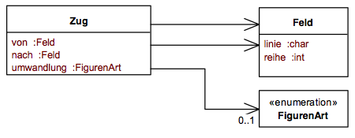
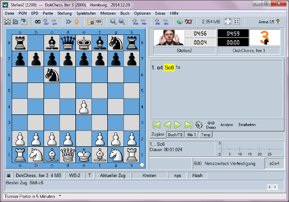

# DokChess <!-- omit in toc -->
<!-- markdownlint-disable MD024 MD033 MD036 MD055 -->

<!--
Dies ist die **Version 2.0** der ADF-Dokumentationsvorlage. Sie wurde von Dominik Rost und Johannes Schneider erstellt. Die Vorlage wird unter der Lizenz "[Creative Commons: Namensnennung - Weitergabe unter gleichen Bedingungen 4.0 International](https://creativecommons.org/licenses/by-sa/4.0/deed.de)" zur Verfügung gestellt.

In jedem Abschnitt dieser Vorlage stehen Hinweise, was man dort üblicherweise beschreibt. Diese Hinweise entfernen wir, nachdem wir die Abschnitte ausgefüllt haben - oder wir kommentieren sie mittels HTML-Kommentaren `<!--` (Kommentar-Anfang) und  (Kommentar-Ende) aus. 

Das hier ist ein Beispiel-Kommentar, der in der Vorschau / auf dem Git-Server nicht angezeigt wird. 

Dieses Dokument ist in [Markdown](https://de.wikipedia.org/wiki/Markdown) geschrieben, so dass wir es ganz einfach mit Texteditoren oder Entwicklungsumgebungen bearbeiten und in eine Versionskontrolle (z.B. Git) einpflegen können. Wenn wir ein Textverarbeitungsprogramm bevorzugen, können wir die HTML-Ansicht unter Beibehaltung der Überschriftebenen per Copy&Paste dorthin importieren.

Architekturdokumentation verwendet viele **Diagramme und Abbildungen**. Diese können wir in Markdown als Bilder einbinden. Viele Informationen zum Sichtenframework ADF und zur technischen Umsetzung mit dieser Vorlage (Einbindung über Diagrams.net mit passenden ADF-Elementen) finden wir auf der [Übersichtsseite zum Architecture Decomposition Framework](https://github.com/architecture-decomposition-framework/welcome-to-adf). Dort gibt es auch eine Anleitung zum [Architektur-Design mit dem ADF (auf Englisch)](https://github.com/architecture-decomposition-framework/welcome-to-adf/blob/main/adf-design/Design.md), der in den ADF-Architekturentwurfsprozess einführt und erfahrenen und weniger erfahrenen Softwarearchitekt:innen beim **Architektur-Design** helfen kann.

Zum **Umfang der Dokumentation**: Es gibt kein "one size fits it all" für Architekturdokumentationen. Deshalb können wir weitere Abschnitte hinzufügen, die uns fehlen, oder Abschnitte löschen, die für unser System nicht relevant sind. Auch eine andere Reihenfolge der Abschnitte ist möglich. Aus praktischen Aspekten ist es jedoch ratsam, die grundlegende Struktur der Architekturdokumentation einheitlich zu wählen, da man sich dann bei neuen Projekten, welche auch dieses Template benutzen, direkt zurechtfindet. Wir kennen dieses Prinzip einer einheitlichen Gliederung von Beipackzetteln bei Medikamenten oder von Spielanleitungen bei Gesellschaftsspielen.

Unser **erster Schritt** beim Anlegen und Ausfüllen einer Architekturdokumentation sollte immer sein, dass wir uns die **Zielgruppe der Dokumentation** überlegen. Als Beispiel: Eine Architekturdokumentation, welche dem Entwicklungsteam den beabsichtigten, Client-seitigen Caching-Mechanismus erläutert, unterscheidet sich in ihrer technischen Tiefe von einer Dokumentation, die dem Management erläutert, warum es aus Performance-Gründen wichtig ist, eine kostenpflichtige kommerzielle Technologie zuzukaufen. Die Zielgruppe kann man unter Punkt "1.5 Ziele des Dokuments" eintragen.

**Anschließend** unterscheidet sich das Ausfüllen der Vorlage dadurch, ob wir ein schon **bestehendes System dokumentieren** möchten **oder** die Dokumentation während des Architekturdesigns erstellen (vielleicht auch **begleitend zur Implementierung** im Rahmen agiler Vorgehensweise). Ersterer Fall tritt oft ein, wenn wir nachträglich eine Dokumentation als Deliverable abgeben müssen (aufgrund vertraglicher Abmachungen) oder wir feststellen, dass das System zu komplex geworden ist, um es allein aus dem Wissen der Entwickler:innen und dem Source-Code als Ganzes noch überblicken zu können. Wir arbeiten dann die Vorlage von vorne bis hinten durch. Im Optimalfall können wir eine (nahezu) vollständige Liste von Anforderungen und Architektur-Treiber in die entsprechenden Kapitel eintragen. Das Aufschreiben der Architekturkonzepte benötigt meist mehrere Iterationen, da wir diese schrittweise rekonstruieren müssen.

Ein nachträgliches Erstellen einer Dokumentation bringt nicht selten widersprüchliche oder inkonsistente Architekturentscheidungen zu Tage. **Architekturarbeit** sollten wir idealerweise **kontinuierlich** leisten. Wir empfehlen daher, **Architekturdokumentation** als ein **lebendes Artefakt** (*living artifact*) zu sehen und schrittweise weiterzuentwickeln. In diesem Fall

- füllen wir bei Projektbeginn die ersten drei Kapitel aus (ggf. nur stichpunkthaft),
- ergänzen Anforderungen und weitere Architekturtreiber soweit, wie wir sie als Basis für die Systemzerlegung und die Architekturkonzepte benötigen,
- dokumentieren technische Schulden und weitere Pläne in den Schlusskapiteln, wenn immer sie bekannt werden, und
- erweitern das Glossar sukzessive um Begriffe, die der Zielgruppe der Dokumentation nicht bekannt sein.

Durch eine Versionierung der Dokumentation (z.B. in einem Git-Repository) machen wir Änderungen nachvollziehbar.
-->

## Inhalt <!-- omit in toc -->

- [1. Einleitung](#1-einleitung)
  - [1.1. Geschäftskontext](#11-geschäftskontext)
  - [1.2. Systemübersicht](#12-systemübersicht)
  - [1.3. Stakeholder](#13-stakeholder)
  - [1.4. Randbedingungen (Constraints)](#14-randbedingungen-constraints)
    - [1.4.1. Technische Randbedingungen](#141-technische-randbedingungen)
    - [1.4.2. Organisatorische Randbedingungen](#142-organisatorische-randbedingungen)
    - [1.4.3. Konventionen](#143-konventionen)
  - [1.5. Ziele des Dokuments](#15-ziele-des-dokuments)
- [2. Systemkontext und Domäne](#2-systemkontext-und-domäne)
  - [2.1. System-Kontext-Abgrenzung](#21-system-kontext-abgrenzung)
  - [2.2. Domänenmodell](#22-domänenmodell)
- [3. Architekturtreiber (Funktion und Qualität)](#3-architekturtreiber-funktion-und-qualität)
  - [3.1. Wesentliche funktionale Anforderungen](#31-wesentliche-funktionale-anforderungen)
  - [3.2. Qualitätsattribute](#32-qualitätsattribute)
    - [3.2.1. Schneller Einstieg in das System (W01)](#321-schneller-einstieg-in-das-system-w01)
    - [3.2.2. Schnelles Zurechtfinden in der Dokumentation (W02)](#322-schnelles-zurechtfinden-in-der-dokumentation-w02)
    - [3.2.3. Einfaches Auffinden einer Modul-Implementierung (W03)](#323-einfaches-auffinden-einer-modul-implementierung-w03)
    - [3.2.4. Leichte Einbindung einer neuen Stellungsbewertung (W04)](#324-leichte-einbindung-einer-neuen-stellungsbewertung-w04)
    - [3.2.5. Implementierung der Bitboard-Repräsentation (W05)](#325-implementierung-der-bitboard-repräsentation-w05)
    - [3.2.6. Verwendung alternativer Frontends (K01)](#326-verwendung-alternativer-frontends-k01)
    - [3.2.7. Zeitverhalten der Engine im Spiel (E01)](#327-zeitverhalten-der-engine-im-spiel-e01)
    - [3.2.8. Zeitverhalten der Engine bei der Eröffnung (E02)](#328-zeitverhalten-der-engine-bei-der-eröffnung-e02)
    - [3.2.9. Unterstützung neuer Protokolle (P01)](#329-unterstützung-neuer-protokolle-p01)
- [4. Systemdekomposition](#4-systemdekomposition)
  - [4.1. Lösungsansatz und zentrale Architekturentscheidungen](#41-lösungsansatz-und-zentrale-architekturentscheidungen)
  - [4.2. Systemstruktur](#42-systemstruktur)
  - [4.3. Datenmodell](#43-datenmodell)
  - [4.4. Code-Organisation (Abbildung Laufzeit auf Entwicklungszeit)](#44-code-organisation-abbildung-laufzeit-auf-entwicklungszeit)
  - [4.5. Build-Prozess und -Struktur](#45-build-prozess-und--struktur)
  - [4.6. Deployment und Betrieb](#46-deployment-und-betrieb)
  - [4.7. Technologien](#47-technologien)
- [5. Architekturkonzepte](#5-architekturkonzepte)
  - [5.1. Abhängigkeiten zwischen Modulen](#51-abhängigkeiten-zwischen-modulen)
    - [5.1.1. Architekturtreiber](#511-architekturtreiber)
    - [5.1.2. Lösungsidee](#512-lösungsidee)
    - [5.1.3. Design-Entscheidungen](#513-design-entscheidungen)
    - [5.1.4. Verworfene Alternativen](#514-verworfene-alternativen)
  - [5.2. Verwendung unveränderlicher Datenstruktur zur Stellungsspeicherung](#52-verwendung-unveränderlicher-datenstruktur-zur-stellungsspeicherung)
    - [5.2.1. Architektur-Treiber](#521-architektur-treiber)
    - [5.2.2. Lösungsidee](#522-lösungsidee)
    - [5.2.3. Design-Entscheidungen](#523-design-entscheidungen)
    - [5.2.4. Verworfene Alternativen](#524-verworfene-alternativen)
  - [5.3. Benutzungsoberfläche](#53-benutzungsoberfläche)
    - [5.3.1. Architektur-Treiber](#531-architektur-treiber)
    - [5.3.2. Lösungsidee](#532-lösungsidee)
    - [5.3.3. Design-Entscheidungen](#533-design-entscheidungen)
    - [5.3.4. Verworfene Alternativen](#534-verworfene-alternativen)
  - [5.4. Plausibilisierung und Validierung](#54-plausibilisierung-und-validierung)
    - [5.4.1. Architektur-Treiber](#541-architektur-treiber)
    - [5.4.2. Lösungsidee](#542-lösungsidee)
    - [5.4.3. Design-Entscheidungen](#543-design-entscheidungen)
    - [5.4.4. Verworfene Alternativen](#544-verworfene-alternativen)
  - [5.5. Ausnahme- und Fehlerbehandlung](#55-ausnahme--und-fehlerbehandlung)
    - [5.5.1. Architektur-Treiber](#551-architektur-treiber)
    - [5.5.2. Lösungsidee](#552-lösungsidee)
    - [5.5.3. Design-Entscheidungen](#553-design-entscheidungen)
    - [5.5.4. Verworfene Alternativen](#554-verworfene-alternativen)
  - [5.6. Logging, Protokollierung, Tracing](#56-logging-protokollierung-tracing)
    - [5.6.1. Architektur-Treiber](#561-architektur-treiber)
    - [5.6.2. Lösungsidee](#562-lösungsidee)
    - [5.6.3. Design-Entscheidungen](#563-design-entscheidungen)
    - [5.6.4. Verworfene Alternativen](#564-verworfene-alternativen)
  - [5.7. Testbarkeit](#57-testbarkeit)
    - [5.7.1. Architektur-Treiber](#571-architektur-treiber)
    - [5.7.2. Lösungsidee](#572-lösungsidee)
    - [5.7.3. Design-Entscheidungen](#573-design-entscheidungen)
    - [5.7.4. Verworfene Alternativen](#574-verworfene-alternativen)
  - [5.9. Zugberechnungskonzept/Spielstrategiekonzept - KOMMT WEG ODER WIRD ÜBERARBEITET](#59-zugberechnungskonzeptspielstrategiekonzept---kommt-weg-oder-wird-überarbeitet)
    - [5.9.1. Architektur-Treiber](#591-architektur-treiber)
    - [5.9.2. Lösungsidee](#592-lösungsidee)
    - [5.9.3. Design-Entscheidungen](#593-design-entscheidungen)
    - [5.9.4. Verworfene Alternativen](#594-verworfene-alternativen)
- [6. Risiken und technische Schulden](#6-risiken-und-technische-schulden)
  - [6.1. Risiko: Anbindung an das Frontend schlägt fehl](#61-risiko-anbindung-an-das-frontend-schlägt-fehl)
  - [6.2. Risiko: Aufwand der Implementierung zu hoch](#62-risiko-aufwand-der-implementierung-zu-hoch)
  - [6.3. Risiko: Erreichen der Spielstärke scheitert](#63-risiko-erreichen-der-spielstärke-scheitert)
- [7. Ausblick und Pläne für die Zukunft](#7-ausblick-und-pläne-für-die-zukunft)
- [8. Glossar](#8-glossar)
  - [8.1. Das Schachspiel](#81-das-schachspiel)
  - [8.2. Begriffe](#82-begriffe)

## 1. Einleitung

DokChess ist eine voll funktionsfähige Schach-Engine.

Dieser Architekturüberblick lässt Euch die maßgeblichen Entwurfsentscheidungen nachvollziehen.
Er zeigt die Struktur der Lösung und das Zusammenspiel zentraler Elemente.
Die Gliederung der Inhalte erfolgt nach der ADF-Vorlage.

### 1.1. Geschäftskontext
<!--Jedes System ist in einen geschäftlichen Kontext eingebettet. Es ist wichtig, dass wir diesen Kontext kennen, um ein vollständiges Bild über das System zu erhalten und Entscheidungen verstehen zu können.

Im Text dieses Abschnittes sollten wir die folgenden Frage beantworten:

- Was sind Motivation und Kerntreiber für die Entwicklung des Systems?
- Was sind besondere Herausforderungen?
- Welche Geschäftsziele sollen mit dem System erreicht oder unterstützt werden?
- In welchen geschäftlichen oder Projekt-Kontext ist das System eingebettet?
- Welche Aufgabenstellung ergibt sich dadurch für das System?-->
  
<!-- EDIT: von der ursprünglichen arc42-Doku übernommen -->

Was ist DokChess?

- DokChess ist eine voll funktionsfähige Schach-Engine.
- Sie dient als einfach zugängliches und zugleich attraktives Fallbeispiel für Architekturentwurf, -bewertung und -dokumentation.
- Der verständliche Aufbau lädt zum Experimentieren und zum Erweitern der Engine ein.
- Ziel ist nicht die höchstmögliche Spielstärke – dennoch gelingen Partien, die Gelegenheitsspielern Freude bereiten.

### 1.2. Systemübersicht

<!--Wir beschreiben hier Merkmale, die man auch auf einem (fiktiven) Produktkarton für diese Software aufdrucken würde:

- Was ist die Kern-Idee hinter diesem System/ dieser Software?
- Was sind die wichtigsten Funktionalitäten des Systems?
- Was sind die wirklich wichtigen Qualitätseigenschaften des Systems?
- Was macht das System brauchbar?-->

<!-- EDIT: von der ursprünglichen arc42-Doku übernommen -->

Wesentliche Features:

- Vollständige Implementierung der FIDE-Schachregeln
- Unterstützt das Spiel gegen menschliche Gegner und andere Schachprogramme
- Beherrscht zentrale taktische Ideen, beispielsweise Gabel und Spieß
- Integration mit modernen grafischen Schach-Frontends

### 1.3. Stakeholder

<!--Ein Stakeholder ist eine Person oder Organisation, die (direkt oder indirekt) Einfluss auf die Anforderungen eines Systems hat oder die von dem System betroffen ist.

- Was sind die wichtigsten Stakeholder des Systems?
  - Interne und externe Stakeholder
  - Direkte Stakeholder wie: Nutzer, Betrieb, Entwickler, Tester, Support-Team, ...
  - Indirekte Stakeholder wie: Manager, Marketing, ...
- Was sind die jeweiligen Tätigkeiten und Verantwortlichkeiten der jeweiligen Stakeholder?
- Was sind ihre jeweiligen Anliegen? Das heißt, was ist ihnen im System wichtig und was ist ihre jeweilige Erwartungshaltung?-->
  
  <!-- EDIT: von der ursprünglichen arc42-Doku übernommen -->

Die folgende Tabelle stellt die Stakeholder von DokChess und ihre jeweilige Intention dar.

| Wer?                                    | Interesse, Bezug                                                                                                                                                                                                                                                                                                  |
| ----- | ----- |
| Softwarearchitektinnen und -architekten | <ul> <li>wollen ein Gefühl bekommen, wie Architekturdokumentation für ein konkretes System aussehen kann <li>möchten sich Dinge (z.B. Form, Notation) für Ihre tägliche Arbeit abgucken <li>gewinnen Sicherheit für Ihre eigenen Dokumentationsvorhaben <li>haben in der Regel keine tiefen Schachkenntnisse</ul> |
| Entwicklerinnen und Entwickler          | <ul> <li>nehmen auch Architekturaufgaben im Team wahr <li>bekommen beim Studium von DokChess Lust, selbst eine Schach-Engine zu implementieren <li>sind neugierig auf konkrete Anregungen, wie man das macht</ul>                                                                                                 |
| Stefan Zörner                           | <ul><li>benötigt attraktive Beispiele für sein Buch <li> will DokChess in Workshops und Vorträgen zu Softwareentwurf und -architektur als Anschauungsmaterial verwenden                                                                                                                                           |
| oose Innovative Informatik              | <ul><li>Schulungsunternehmen, Arbeitgeber von Stefan Zörner zum Zeitpunkt der Konzeption von DokChess<li>bietet Seminare, Workshops und Coaching zu Themen rund um Softwareentwicklung an</ul>                                                                                                                    |

### 1.4. Randbedingungen (Constraints)
<!--- Was sind wichtige Randbedingungen und Vorgaben, die nicht verändert, aber bei der Entwicklung berücksichtigt werden müssen? Zum Beispiel:
  - Randbedingungen aus der Domäne ("Um als Medizinprodukt zu gelten, muss das System X, Y, Z erfüllen")
  - Organisatorische Randbedingungen wie Prozesse, Teamstruktur/-größe, Sicherheitsrichtlinien, Open- oder Closed-Source-Strategien
  - Technische Randbedingungen ("Das System muss die vorhandene Oracle-Datenbank benutzen")
  - Rechtliche Randbedingungen ("Das System muss DSGVO-konform sein")
  - Kosten und Zeit ("Das System muss bis zum 2.2.2022 mit einem Budget von 222.222 € durchgeführt werden")
- Welche Auswirkungen auf Entwicklung, Qualitätssicherung und Betrieb kann man aus den Randbedingungen direkt ableiten?
- Gelten die Einschränkungen für das System, eine Produktfamilie, oder die ganze Firma?

Hinweis: Wir sollten die Randbedingungen immer wieder hinterfragen, denn

- sie sind oft nicht so fest, wie sie scheinen,
- sie schränken den Lösungsraum ein und
- sie können veraltet sein, wenn das Projekt schließlich beginnt.-->
  
<!-- EDIT: inhaltlich vom arc42Template übernommen, teilweise umsortiert (s. Kommentar weiter unten) -->

Beim Lösungsentwurf waren zu Beginn verschiedene Randbedingungen zu beachten, sie wirken in der Lösung fort. Dieser Abschnitt stellt sie dar und erklärt auch – wo nötig – deren Motivation.

#### 1.4.1. Technische Randbedingungen

| Randbedingung                                | Erläuterungen, Hintergrund                                                                                                                                                                                                                                                                                                                                  |
| ----- | ----- |
| Moderate Hardwareausstattung                 | Betrieb der Lösung auf einem marktüblichen Standard-Notebook, um sie im Rahmen von Seminaren und Konferenzen auf einem solchen zeigen zu können.                                                                                                                                                                                                            |
| Betrieb auf Windows Desktop Betriebssystemen | Standardausstattung von Notebooks bei Mitarbeitern des Schulungsunternehmens zum Zeitpunkt der Konzeption. Hohe Verbreitung dieser Betriebssysteme bei potenziell Interessierten (Zuhörer bei Vorträgen, Teilnehmer bei Seminaren). Unterstützung anderer Betriebssysteme (allen voran Linux und Mac OS X) wünschenswert, aber nicht zwingend erforderlich. |
| Implementierung in Java                      | Einsatz als Beispiel in Java-lastigen Seminaren und auf Java-Konferenzen.  Entwicklung unter Version Java SE 6 (DokChess 1.0), später Java SE 7 und Java SE 11. Die Engine soll auch auf neueren Java-Versionen, sobald verfügbar, laufen.                                                                                                                  |
| Fremdsoftware frei verfügbar                 | Falls zur Lösung Fremdsoftware hinzugezogen wird (z.B. grafisches Frontend), sollte diese idealerweise frei verfügbar und kostenlos sein. Die Schwelle der Verwendung wird auf diese Weise niedrig gehalten.|
| Entwicklungswerkzeuge <!-- EDIT: Dieser und die nächsten beiden Punkte von organisatorische RB hierher verschoben -->                 | Entwurf mit Stift und Papier, ergänzend Enterprise Architect. Arbeitsergebnisse zur Architekturdokumentation gesammelt im Confluence Wiki. Erstellung der Java-Quelltexte in Eclipse oder IntelliJ. Die Software muss jedoch auch, allein mit Gradle, also ohne IDE baubar sein.        |
| Konfigurations- und Versionsverwaltung | Zu Beginn (Version 1.0) Subversion bei SourceForge, später Git bei GitHub                                                                                                                                                                                                               |
| Testwerkzeuge und -prozesse            | JUnit im Annotationsstil sowohl für inhaltliche Richtigkeit als auch für Integrationstests und die Einhaltung von Effizienzvorgaben             |

#### 1.4.2. Organisatorische Randbedingungen

| Randbedingung                          | Erläuterungen, Hintergrund                                                                                                                                                                                                                                                              |
| ----- | ----- |
| Team                                   | Stefan Zörner, unterstützt durch Kollegen, Bekannte und Interessierte aus Workshops und Seminaren                                                                                                                                                                                       |
| Zeitplan                               | Beginn der Entwicklung Dezember 2010, erster lauffähiger Prototyp März 2011 (Abendvortrag beim Schulungsunternehmenin Hamburg), vorzeigbare Version Mai 2011 (Vortrag JAX-Konferenz in Mainz). Fertigstellung Version 1.0: Februar 2012 (Abgabe des Buchmanuskripts für die 1. Auflage) |
| Vorgehensmodell                        | Entwicklung risikogetrieben, iterativ und inkrementell. Zur Dokumentation der Architektur kommt ADF zum Einsatz. Eine Architekturdokumentation gegliedert nach dieser Vorlage ist zentrales Projektergebnis.
| Veröffentlichung als Open Source       | Die Quelltexte der Lösung oder zumindest Teile werden als Open Source verfügbar gemacht. Lizenz: GNU General Public License version 3.0 (GPLv3). Gehostet bei GitHub: <https://github.com/DokChess/>                                                                                      |

#### 1.4.3. Konventionen

| Konvention    | Erläuterungen, Hintergrund |
|-----|-----|
| Architekturdokumentation | Terminologie und Gliederung nach dem deutschen ADF-Template in der Version 2.0 |
| Kodierrichtlinien für Java | Java Coding Conventions von Sun/Oracle, geprüft mit Hilfe von CheckStyle |
| Sprache (Deutsch vs. Englisch) | Benennung von Dingen (Komponenten, Schnittstellen) in Diagrammen und Texten innerhalb dieser (deutschen) ADF-Architekturdokumentation in Deutsch. Verwendung deutscher Bezeichner für Klassen, Methoden etc. im Java-Quelltext (es sei denn, die Java-Kodierrichtlinien stehen dem im Wege). Hintergrund: Die Zielgruppe sind keine Schach-Experten, es soll keine zusätzliche Barriere durch englische (Schach-)begriffe erzeugt werden. |
| Schach-Spezifische Datenformate | Verwendung etablierter Standards für Schach-spezifische Notationen und Austauschformate innerhalb der Lösung. Themen: Züge, Stellungen, Partien, Eröffnungen, ... Keinesfalls sind eigene Formate zu entwickeln.  Prinzip: Offene Standards sind proprietären Formaten (wie sie ggf. kommerzielle Programme verwenden) vorzuziehen.

### 1.5. Ziele des Dokuments
<!--
- Was sind die Ziele des Dokuments?
- Für welche Stakeholder enthält das Dokument relevante Informationen und wo sind diese jeweils zu finden?
- Wie ist der Status des Systems und dieses Dokuments?
  - Beispiel: Diese Dokumentation ist eine Entwurf und beschreibt ein System, was sich noch in Planung befindet
  - Oder: Diese Dokumentation ist fertiggestellt und beschreibt die System-Version 2.3, welche seit 15.7.2020 in Betrieb ist.
-->

<!-- formuliert von JS -->
Diese Architekturdokumentation dient dem Überblick und Verständnis der DokChess-Engine und ihrer Architektur. Als Alternative zu der in Form der arc42-Vorlage geschriebenen [ursprünglichen Dokumentation](https://www.dokchess.de) bietet sie ein Beispiel für die Architekturdokumentation im [ADF](https://github.com/architecture-decomposition-framework/welcome-to-adf/) ("architecture decomposition framework")

<!-- EDIT: von der ursprünglichen arc42-Doku übernommen -->

Zielgruppe dieses Überblicks sind in erster Linie Softwarearchitektinnen und -architekten, die Anregungen und Beispiele suchen, wie sie Architekturentwürfe angemessen dokumentieren können. Darüber hinaus erhalten alle, die selbst ein Schachprogramm schreiben wollen, wertvolle Tipps und lernen en passant einiges über methodische Softwarearchitektur.

## 2. Systemkontext und Domäne

Dieser Abschnitt beschreibt das Umfeld von DokChess. Für welche Benutzer ist es da, und mit welchen Fremdsystemen interagiert es?

<!-- EDIT: von der ursprünglichen arc42-Doku übernommen -->

### 2.1. System-Kontext-Abgrenzung
<!--
- Wie ist das System in seinen Kontext eingebettet?
- Von welchen Rollen wird das System aus welchem Grund verwendet?
- Welche Nutzerschnittstellen bietet das System?
- Mit welchen externen Systemen interagiert das System?
- (Wie ist das System in seine Systemlandschaft integriert?)
- Auf welche Weise interagiert das System mit externen Systemen und welche Daten werden ausgetauscht?
- -->

In diesem Unterkapitel wird dargestellt, wie DokChess mit Fremdsystemen kommuniziert und welche Rolle jedes System spielt.


*Bild: System-Kontext-Abgrenzung (Functions@Runtime)*

<!-- EDIT: von der ursprünglichen arc42-Doku übernommen -->

- Menschlicher Gegner (Benutzer):
Schach wird zwischen zwei Gegnern gespielt, die abwechselnd ihre Figuren ziehen.
DokChess übernimmt die Rolle eines der Gegner, und tritt gegen einen menschlichen Gegner an.
Dazu müssen sich die beiden austauschen, beispielsweise über ihre Züge, oder über Remisangebote.

- Computergegner (Fremdsystem):
Alternativ zu einem menschlichen Gegner kann DokChess auch gegen eine andere Engine antreten.
Die Anforderungen bezüglich des Informationsaustausches sind die selben.

- XBoard Client (Fremdsystem):
Die "Anbindung" menschlicher Spieler erfolgt über ein grafisches Frontend, dessen Entwicklung nicht Teil von DokChess ist. Stattdessen kann jedes grafische Frontend verwendet werden, welches das sogenannte XBoard-Protokoll unterstützt. Hierzu zählen Xboard (bzw. Winboard unter Windows), Arena und Aquarium.

- Eröffnungen (Fremdsystem):
Zur Eröffnung, d.h. zur frühen Phase des Spiels, existiert umfangreiches Wissen in der Schachliteratur.
Dieses Wissen ist in Form von Bibliotheken und Datenbanken teils frei und teils auch kommerziell verfügbar.

- Polyglot Opening Book (Dateiformat):
Polyglot Opening Book ist ein binäres Dateiformat für Eröffnungsbibliotheken. DokChess erlaubt die optionale Anbindung solcher Bücher. Der Zugriff erfolgt ausschließlich lesend.

- Endspiele (Fremdsystem):
Wenn nur noch sehr wenige Figuren auf dem Brett stehen (z.B. nur die beiden Könige und eine Dame), kann analog zu Eröffnungsbibliotheken auf Endspielbibliotheken zurückgegriffen werden.
Diese beinhalten für jede mögliche Stellung mit dieser Figurenkonstellation die Aussage, ob das Spiel gewonnen, unentschieden oder verloren ist, sowie ggf. den nötigen nächsten Schritt zum Sieg.

### 2.2. Domänenmodell
<!--
Hinweis: Die Dokumentationsvorlage ist allgemein gehalten und geht nicht davon aus, dass man die Systemarchitektur anhand der Domänen partitioniert (wie z.B. bei Domain-Driven-Design üblich). Dennoch ist es sinnvoll, dass wir in diesem Kapitel verschiedene Geschäftsbereiche aufführen, welche vom System betroffen sind (und dies mit Kapitel [1.3. Stakeholder](#13-stakeholder) abzugleichen).

- Welche unterschiedlichen Domänen/Geschäftsbereiche werden im System behandelt?
- Welche Entitäten, also Kernelemente aus den geschäftlichen Domäne, gibt es, die im System eine Bedeutung haben und davon verarbeitet werden müssen?
- Wie hängen die Entitäten miteinander zusammen?
- Haben gewisse Entitäten in unterschiedlichen Domänen jeweils eine unterschiedliche Bedeutung?

Beispielsweise könnte ein E-Commerce-System die Geschäftsbereiche Beschaffung, Bestellung, Bezahlung abdecken, mit den Entitäten Beschaffer und Artikel im Bereich Beschaffung sowie Besteller und Artikel im Bereich Bestellung. Die Entität Artikel beschreibt prinzipiell dasselbe, hat aber in den Bereichen Beschaffung und Bestellung vielleicht unterschiedliche Eigenschaften (z.B. Einkaufspreis versus Verkaufspreis).
-->

<!-- EDIT: von der ursprünglichen arc42-Doku übernommen -->

DokChess lässt sich grob in folgende Domänen gliedern:

- Zug
- Stellung
- Spielregeln

Die Domänen sind über Schnittstellen abstrahiert und werden per Dependency Injection zusammengesteckt. Mehr über die Datenmodellierung findet man im Kapitel [4.3. Datenmodell](#43-datenmodell).

## 3. Architekturtreiber (Funktion und Qualität)

In den folgenden Kapiteln wird ein Überblick über die wichtigsten Anforderungen für das System gegeben, welche die Ausgestaltung der Architektur beeinflussen. Diese Anforderungen, genannt Architekturtreiber, umfassen funktionale Anforderungen und Qualitätsanforderungen (in diesem Kapitel beschrieben) sowie Geschäftsziele und Randbedingungen (bereits in Kapitel 1 beschrieben).

### 3.1. Wesentliche funktionale Anforderungen
<!--
- Was sind die wichtigsten funktionalen Anforderungen an das System?
- Was muss das System können?
- Ohne welche Funktionen wäre das System wertlos?
-->

Die wichtigsten funktionalen Anforderungen sind die folgenden:

| ID | Bereich | Beschreibung |
|----- | ----- | -----|
| F01 | Funktionale Eignung→Korrektheit | In einer Spielsituation hat die Engine einen oder mehrere regelkonforme Züge zur Auswahl. Sie antwortet mit einem dieser Züge. |
| F02 | Funktionale Eignung → Angemessenheit und Benutzbarkeit → Attraktivität | Ein schwacher Spieler zieht in einer Partie gegen die Engine eine Figur ungedeckt und frei von Sinn auf ein von der Engine angegriffenes Feld. Die Engine im Anschluss am Zug nimmt die „eingestellte“ Figur. |
| F03 | Funktionale Eignung → Angemessenheit und Benutzbarkeit → Attraktivität | Der Engine eröffnet sich eine Springergabel, um Dame oder Turm zu gewinnen. Die Engine gewinnt Dame (bzw. Turm) gegen Springer. |
| F04 | Funktionale Eignung → Angemessenheit | In einer Partie ergibt sich für die Engine ein Matt in zwei Zügen. Die Engine zieht sicher zum Sieg. |
| Z01 | Zuverlässigkeit → Fehlertoleranz und Benutzbarkeit → Fehlervermeidung | Der Engine wird im Spielverlauf ein unzulässiger Gegenzug präsentiert. Die Engine lehnt den Zug ab, erlaubt im Anschluss die Eingabe eines anderen Zugs und spielt fehlerfrei weiter. |
| Z02 | Zuverlässigkeit → Fehlertoleranz | Der Engine wird zum Spielbeginn eine unzulässige Stellung präsentiert. Die Engine erkennt die Situation und beendet das Spiel. |

### 3.2. Qualitätsattribute
<!--
- Was sind die Qualitätsanforderungen an das System, die einen treibenden Einfluss auf die Gestaltung der Architektur haben?
- Über welche Szenarios kann man überprüfen, ob das System die Qualitätsanforderungen erfüllt?
-->

Die folgende Tabelle beschreibt die zentralen Qualitätsziele von DokChess, wobei die Reihenfolge eine grobe Orientierung bezüglich der Wichtigkeit vorgibt.

| Qualitätsziel | Motivation und Erläuterung | Zugehörige Treiber |
| ----- | ----- | ----- |
| Zugängliches Beispiel (Analysierbarkeit) | Da DokChess in erster Linie als Anschauungsmaterial für Softwarearchitektur und -entwicklung dient, erschließen sich Entwurf und Implementierung rasch. | W01, W02, W03, W05 |
| Einladende Experimentierplattform (Änderbarkeit) | Alternative Algorithmen und Strategien, etwa zur Bewertung einer Schachstellung, können leicht implementiert und in die Lösung integriert werden. | W04, W05, P01 |
| Bestehende Frontends nutzen (Interoperabilität) | DokChess lässt sich mit angemessenem Aufwand in bestehende grafische Schach-Frontends einbinden. | K01 |
| Akzeptable Spielstärke (Funktionale Eignung) | DokChess spielt stark genug, um schwache Gegner sicher zu schlagen und Gelegenheitsspieler zumindest zu fordern. | F02, F03, F04 |
| Schnelles Antworten auf Züge (Effizienz) | Da DokChess in Seminaren und Vorträgen live demonstriert wird, erfolgt die Berechnung der Spielzüge rasch. | E01, E02 |

Die Qualitätsattribute weiter unten konkretisieren diese Qualitätsziele und dienen insbesondere auch dazu ihre Erreichung zu bewerten.

Qualitätsattribute werden als Architekturszenarios beschrieben. Status und Priorität sind weggelassen, weil das System fertiggestellt ist.

 <!-- omit in toc -->
<!-- 
- Priorität: Hoch (Hoch, Mittel, Niedrig)
- Status: Offen (Offen, Bereit, Umgesetzt). _Eventuell sind weitere Möglichkeiten sinnvoll. Die Menge der Zustände sollte am Anfang des Projekts definiert werden._
- Umgebung: _Kontext und/oder Ausgangssituation, die auf dieses Szenario zutrifft_
  - _ggf. Quantifizierung, Messbare Effekte, die die Umgebung betreffen_
- Stimulus: _Das Ereignis, der Auslöser oder die Bedingung, die sich in diesem Szenario ergeben_
  - _ggf. Quantifizierung, also messbare Effekte, die den Stimulus (Auslöser) betreffen_
- Antwort: _Die erwartete Reaktion des Systems auf das Szenario-Ereignis (Black-Box-Ansicht, die keine Einschränkungen für das Design vorsieht)_
  - _ggf. Quantifizierung, also messbare Effekte, die auf die Reaktion treffen und/oder messbare Indikatoren, dass das Szenario durch die Architektur umgesetzt wurde_

Als Tabelle:

| Kategorisierung  |                            |                     |
| ---------------- | -------------------------- | ------------------- |
| Szenario-Name    | _Name_                     |                     |
| Scenario ID      | _ID_                       |                     |
| Priorität        | _Hoch, Mittel, Niedrig_    |                     |
| Status           | _Offen, Bereit, Umgesetzt_ |                     |
| **Beschreibung** |                            | **Quantifizierung** |
| Umgebung         | _Beschreibung_             | _Beschreibung_      |
| Stimulus         | _Beschreibung_             | _Beschreibung_      |
| Antwort          | _Beschreibung_             | _Beschreibung_      |
 -->

#### 3.2.1. Schneller Einstieg in das System (W01)

| Kategorisierung  | | |
| ----- | ----- | ----- |
| Szenario-ID | W01 | |
| Qualitätsmerkmal | Wartbarkeit → Analysierbarkeit | |
| Priorität  | sehr hoch | |
| Status | umgesetzt | |
| **Beschreibung** | | **Quantifizierung** |
| Umgebung | Jemand mit Grundkenntnissen in UML und Schach möchte einen Einstieg in die Architektur von DokChess finden. | |
| Stimulus | Diese Person bekommt diese Dokumentation von DokChess zum Lesen. | |
| Antwort | Lösungsstrategie und Entwurf erschließen sich ihm beim ersten Durchlesen. | benötigte Zeit ≤ 15min |

#### 3.2.2. Schnelles Zurechtfinden in der Dokumentation (W02)

| Kategorisierung  | | |
| ----- | ----- | ----- |
| Szenario-ID | W02 | |
| Qualitätsmerkmal | Wartbarkeit → Analysierbarkeit | |
| Priorität  | sehr hoch | |
| Status | umgesetzt | |
| **Beschreibung** | | **Quantifizierung** |
| Umgebung | Ein Software-Architekt möchte ADF-Dokumentation anwenden. | |
| Stimulus | Diese Person sucht Beispielinhalt zu einem Kapitel. | |
| Antwort | Die Person findet ihn unverzüglich in der Dokumentation. | Suchdauer: wenige Sekunden |

#### 3.2.3. Einfaches Auffinden einer Modul-Implementierung (W03)

| Kategorisierung  | | |
| ----- | ----- | ----- |
| Szenario-ID | W03 | |
| Qualitätsmerkmal | Wartbarkeit → Analysierbarkeit | |
| Priorität  | sehr hoch | |
| Status | umgesetzt | |
| **Beschreibung** | | **Quantifizierung** |
| Umgebung | Eine erfahrene Java-Entwicklerin hat den Quelltext von DokChess auf ihrem Rechner ausgecheckt und in einer Entwicklungsumgebung geöffnet. | |
| Stimulus | Sie sucht die Implementierung eines im Entwurf beschriebenen Moduls. | |
| Antwort | Sie findet sie ohne Umwege oder fremde Hilfe im Quelltext. | Anzahl der konsultierten externen Dokumente: 0 |

#### 3.2.4. Leichte Einbindung einer neuen Stellungsbewertung (W04)

| Kategorisierung  | | |
| ----- | ----- | ----- |
| Szenario-ID | W04 | |
| Qualitätsmerkmal | Wartbarkeit → Erweiterbarkeit | |
| Priorität  | sehr hoch | |
| Status | umgesetzt | |
| **Beschreibung** | | **Quantifizierung** |
| Umgebung | Ein Entwickler implementiert eine neue Stellungsbewertung. | |
| Stimulus | Er bindet diese in den vorhandenen Code ein. | |
| Antwort | Die Einbindung ist erfolgreich ohne Änderung und ohne Übersetzung des vorhandenen Codes. | Anzahl geänderter oder neu compilierter Java-Klassen: 0 |

#### 3.2.5. Implementierung der Bitboard-Repräsentation (W05)

| Kategorisierung  | | |
| ----- | ----- | ----- |
| Szenario-ID | W05 | |
| Qualitätsmerkmal | Wartbarkeit → Analysierbarkeit | |
| Priorität  | hoch | |
| Status | umgesetzt | |
| **Beschreibung** | | **Quantifizierung** |
| Umgebung | Eine Entwicklerin hat sich mit der Architekturdokumentation und dem Code von DokChess vertraut gemacht und weiß, was eine Bitboard-Repräsentation eines Schachfelds ist. | Beschäftigung mit der Materie ≥ 2 Stunden |
| Stimulus | Die Entwicklerin möchte die bestehende, feldzentrierte Darstellung durch eine figurenzentrierte Bitboard-Repräsentation der Spielsituation austauschen. | |
| Antwort | Dies gelingt mit überschaubarem Aufwand. | Aufwand der Implementierung und Dokumentation ≤ 1 Woche   |

#### 3.2.6. Verwendung alternativer Frontends (K01)

| Kategorisierung  | | |
| ----- | ----- | ----- |
| Szenario-ID | K01 | |
| Qualitätsmerkmal | Kompatibilität → Interoperabilität | |
| Priorität  | hoch | |
| Status | umgesetzt | |
| **Beschreibung** | | **Quantifizierung** |
| Umgebung | Ein Benutzer will DokChess mit einem Schach-Frontend verwenden, das ein von der Lösung implementiertes Kommunikationsprotokoll unterstützt. | |
| Stimulus | Der Benutzer bindet DokChess mit einem Schach-Frontend ein. | |
| Antwort | Das Einbinden erfordert keinerlei Programmieraufwand, Konfiguration innerhalb des Frontend ist innerhalb von zehn Minuten durchgeführt und getestet | Programmieraufwand 0 min, Konfigurationszeit ≤ 10 min, Testzeit ≤ 10 min |

#### 3.2.7. Zeitverhalten der Engine im Spiel (E01)

| Kategorisierung  | | |
| ----- | ----- | ----- |
| Szenario-ID | E01 | |
| Qualitätsmerkmal | Effizienz → Zeitverhalten und Benutzbarkeit → Bedienbarkeit | |
| Priorität  | mittel | |
| Status | umgesetzt | |
| **Beschreibung** | | **Quantifizierung** |
| Umgebung | DokChess läuft auf einem Rechner. Keine anderen Anwendungen verursachen Prozessorlast und es ist genug freier Arbeitsspeicher vorhanden. | verfügbarer RAM ≥ 512MB |
| Stimulus | Ein Zug wird durchgeführt. | |
| Antwort | Die Engine antwortet in für den Spieler vertretbarer Zeit. | Antwortzeit der Engine ≤ 5 s |

#### 3.2.8. Zeitverhalten der Engine bei der Eröffnung (E02)

 Kategorisierung  | | |
| ----- | ----- | ----- |
| Szenario-ID | E02 | |
| Qualitätsmerkmal | Effizienz → Zeitverhalten und Benutzbarkeit → Bedienbarkeit | |
| Priorität  | mittel | |
| Status | umgesetzt | |
| **Beschreibung** | | **Quantifizierung** |
| Umgebung | DokChess läuft auf einem Rechner. Keine anderen Anwendungen verursachen Prozessorlast und es ist genug freier Arbeitsspeicher vorhanden. | verfügbarer RAM ≥ 512MB |
| Stimulus | Eine in ein grafisches Frontend integrierte Engine spielt schwarz, der menschliche Spieler zieht an. | |
| Antwort | Die Engine gibt dem Benutzer eine Rückmeldung, dass sie „denkt“ und antwortet innerhalb von vertretbarer Zeit. | Zeit für Fortschrittsindikator ≤ 5 s, Zeit bis Antwort ≤ 10 s |

#### 3.2.9. Unterstützung neuer Protokolle (P01)

| Kategorisierung  | | |
| ----- | ----- | ----- |
| Szenario-ID | P01 | |
| Qualitätsmerkmal | Übertragbarkeit → Anpassbarkeit | |
| Priorität  | sehr hoch | |
| Status | umgesetzt | |
| **Beschreibung** | | **Quantifizierung** |
| Umgebung | Eine Java-Programmiererin will DokChess mit einem Schach-Frontend verwenden, welches das Einbinden von Engines erlaubt, aber keines der implementierten Protokolle unterstützt. | |
| Stimulus | Die Java-Programmiererin implementiert das neue Protokoll. | |
| Antwort | Bei der Implementierung muss der bestehende Code nicht geändert werden. Die neue Engine kann, wie in der Dokumentation beschrieben, angebunden werden. | Aktivierung der Engine/des Protokolls auf Konfiguration oder wenige Code-Zeilen beschränkt. |

## 4. Systemdekomposition
<!--
In den Unterabschnitten dieses Kapitels beschreiben wir, wie die grundlegende Lösungsstrategie für das System ist, welche wichtigen Entscheidungen für das System getroffen wurden, wie das System nach Funktionalität, Daten und Deployment gegliedert ist und warum die Gliederung entsprechend gewählt wurde.
-->
<!-- EDIT: von der ursprünglichen arc42-Doku übernommen -->

### 4.1. Lösungsansatz und zentrale Architekturentscheidungen
<!--
- Was ist der grundsätzliche Lösungsansatz für das System? Und welche grundlegenden Architekturentscheidungen wurden getroffen? Z.B. lokale Desktop-Anwendung versus verteiltes Client-Server-System, monolithisches Deployment versus (Micro-)Service-Deployment
- Welche Architektur-Treiber wurden bei diesem Ansatz besonders priorisiert?
- Bei welchen Treibern wurden Kompromisse eingegangen? Welche Kompromisse?
-->
<!-- EDIT: von der ursprünglichen arc42-Doku übernommen -->

Die folgende Tabelle stellt die Qualitätsziele von DokChess passenden Architekturansätzen gegenüber, und erleichtert so einen Einstieg in die Lösung.

| Qualitätsziel | Dem zuträgliche Ansätze in der Architektur |
| ----- | ----- |
| Zugängliches Beispiel (Analysierbarkeit) | <ul><li>Architekturüberblick gegliedert nach ADF<li>Explizites, objektorientiertes Domänenmodell<li>Modul-, Klassen- und Methodennamen in Deutsch, um englische Schachbegriffe zu vermeiden<li>Ausführliche Dokumentation der öffentlichen Schnittstellen in javadoc</ul> |
| Einladende Experimentierplattform (Änderbarkeit) | <ul><li>verbreitete Programmiersprache Java, →&nbsp;**(a)**<li>Schnittstellen für Kernabstraktionen (z.B. Stellungsbewertung, Spielregeln)<li>Unveränderliche Objekte (Stellung, Zug, ...) erleichtern Implementierung vieler Algorithmen<li>„Zusammenstecken“ der Bestandteile mit Dependency Injection führt zu Austauschbarkeit, →&nbsp;**(b)**<li>Hohe Testabdeckung als Sicherheitsnetz</ul> |
| Bestehende Frontends nutzen (Interoperabilität)  | <ul><li>Verwendung des verbreiteten Kommunikationsprotokolls xboard, →&nbsp;**\(c\)**, <li>Einsatz des portablen Java, →&nbsp;**(a)**</ul> |
| Attraktive Spielstärke (Attraktivität) | <ul><li>Integration von Eröffnungsbibliotheken →&nbsp;**(d)**<li>Implementierung des Minimax-Algorithmus und einer geeigneter Stellungsbewertung, →&nbsp;**(e)**<li>Integrationstests mit Schachaufgaben für taktische Motive und Mattsituationen</ul> |
| Schnelles Antworten auf Züge (Effizienz) | <ul><li>Reactive Extensions für nebenläufige Berechnung mit neu gefundenen besseren Zügen als Events →&nbsp;**(f)**<li>Optimierung des Minimax durch Alpha-Beta-Suche, →&nbsp;**(e)**<li>Effiziente Implementierung des Domänenmodells<li>Integrationstests mit Zeitvorgaben</ul> |

Kleine Buchstaben in Klammern →&nbsp;**(x)** verorten einzelne Ansätze aus der Tabelle im folgenden schematischen Bild.


*Bild: Informelles Überblickbild für DokChess*

### 4.2. Systemstruktur
<!--
- Wie sieht die funktionale Dekomposition des Systems zur Laufzeit im Sinne von Komponenten aus?
- Welche Aufgaben haben die einzelnen Komponenten?
- Wie interagieren diese miteinander?
- Welche Daten werden zwischen den Komponenten ausgetauscht?

Die Autoren dieser Vorlage empfehlen, für die Zerlegung auf oberster Ebene und pro genauere Beschreibung eines System-Einzelteils Unterkapitel anzulegen.
-->

<!-- EDIT: eigener Text -->
DokChess ist funktional in einzelne Komponenten zerlegt, die im Zusammenspiel die benötigte Funktionalität umsetzen:


*Bild: Systemstruktur von DokChess (Functions@Runtime)*

<!-- EDIT: von der ursprünglichen arc42-Doku übernommen -->
| Subsystem | Kurzbeschreibung |
| ----- | ----- |
| XBoard-Protokoll | Realisiert die Kommunikation mit einem Client mit Hilfe des XBoard-Protokolls. |
| Spielregeln | Beinhaltet die Schachregeln und kann z.B. zu einer Stellung alle gültigen Züge ermitteln. |
| Engine | Beinhaltet die Ermittlung eines nächsten Zuges ausgehend von einer Spielsituation. |
| Eröffnung | Stellt Züge aus der Eröffnungsliteratur zu einer Spielsituation bereit. |

*Tabelle: Überblick über Subsysteme von DokChess*

<!-- EDIT: leicht überarbeitet, größtenteils von der ursprünglichen arc42-Doku übernommen -->
Die Komponente Xboard-Protokoll liest Befehle über die Standardeingabe ein, prüft sie gegen die Spielregeln und setzt sie für die Engine um.
Antworten der Engine (insbesondere ihre Züge) werden von dieser Komponente als Ereignisse entgegengenommen, gemäß Protokoll formatiert und über die Standardausgabe zurückgesendet.
Die Komponente XBoard-Protokoll treibt somit das ganze Spielgeschehen.

<!-- EDIT: eigener Text -->
Das folgende Sequenzdiagramm illustriert das Zusammenspiel der Komponenten am Beispiel der Zugermittlung:


*Bild: Beispielhaftes Zusammenspiel für eine Zugermittlung (Functions@Runtime)*

### 4.3. Datenmodell
<!--
- Wie sieht das grundlegende Datenmodell für das System (zur Laufzeit) aus?
- Welche Entitäten gibt es? Wie stehen diese in Bezug zu dem in [Kapitel 2.2](#22-domänenmodell) beschriebenen Domänenmodell?
- Welche Beziehungen gibt es zwischen den Entitäten?
- Welche Entitäten werden global im gesamten System verwendet? Welche sind speziell in einzelnen Systemteilen?
-->

<!-- EDIT: leicht überarbeitet, viele Teile von der ursprünglichen arc42-Doku übernommen -->

Die Interaktion zwischen den Komponenten (s. [4.2. Systemstruktur](#42-systemstruktur)) erfolgt über den Austausch von Instanzen fachlich motivierter Datenstrukturen. Die Datenstrukturen wurden als Java-Klassen modelliert (*Figur*, *Zug*, ...). Hier wurde bewusst eine bessere Verständlichkeit angestrebt, auf Kosten von Effizienz.
Gleichwohl erreicht DokChess eine akzeptable Spielstärke, wie ein Durchspielen der entsprechenden Szenarien zeigt ([Qualitätsattribute](#32-qualitätsattribute)).

Zentrales Element beim Entwurf der Datenstrukturen ist die Spielsituation: Welche Figuren gerade wo stehen und was sonst noch zur Stellung dazu gehört (z. B. wer am Zug ist).
Auch hier ging bei der Implementierung der fachlich motivierten Klasse dazu Lesbarkeit vor Effizienz.
Ein wichtiger Aspekt dabei: Wie alle anderen fachlichen Klassen ist auch sie unveränderlich (s. [5.5. Verwendung unveränderlicher Datenstruktur zur Stellungsspeicherung](#55-verwendung-unveränderlicher-datenstruktur-zur-stellungsspeicherung).

Als Aufruf- und Rückgabeparameter finden in allen Modulen dieselben Klassen Verwendung.

An dieser Stelle finden Sie einen groben Überblick über diese Datenstrukturen und deren Abhängigkeiten untereinander. Wir verzichten aus Gründen der Einfachheit dieser Dokumentation auf eine spezielle Laufzeitsicht (Data@Runtime) und geben direkt die Modellierung als UML-Klassendiagramme (Data@Devtime) an. Details sind in der Quelltextdokumentation (javadoc) enthalten. Die Klassen und Aufzählungstypen (enums) befinden sich im Paket *de.dokchess.allgemein*.

Eine Schachfigur ist gekennzeichnet durch Farbe (schwarz oder weiß) und Art (König, Dame, ...).
Im Domänenmodell von DokChess weiß eine Figur nicht, wo sie steht.
Die Klasse ist unveränderlich (immutable) wie alle anderen im Domänenmodell auch.


*Bild: Datenmodellierung einer Figur (Data@Devtime)*

Das Schachbrett besteht aus 8 x 8 Feldern die in 8 Reihen (1-8) und 8 Linien (a-h) angeordnet sind. Die Klasse *Feld* beschreibt ein ebensolches. Da ein Feld maximal von einer Figur besetzt sein kann, reicht für die Angabe eines Zuges, von wo nach wo gezogen wird. Einzige Ausnahme bildet die Umwandlung eines Bauern auf der gegnerischen Grundlinie, da der Spieler selbst entscheidet, in welche Figur er umwandelt (in der Regel, aber nicht zwingend, eine Dame). Rochadezüge werden als Königszüge über zwei Felder in die entsprechende Richtung repräsentiert.



*Bild: Datenmodellierung eines Zugs (Data@Devtime)*

Die Klasse *Stellung* stellt die aktuelle Situation auf dem Brett dar.
Vor allem sind das die Figuren auf dem Brett, das intern als zweidimensionales Array (8 x 8) implementiert ist.
Falls ein Feld unbesetzt ist, steht null im Array.
Zur Komplettierung der Spielsituation gehört die Information, wer am Zug ist, ob noch Rochaden möglich sind und ob en passant geschlagen werden kann.


*Bild: Die Klasse Stellung (Data@Devtime; Ausschnitt, Details wie Rochade fehlen)*

### 4.4. Code-Organisation (Abbildung Laufzeit auf Entwicklungszeit)
<!--
- Wie werden Komponenten (Laufzeit) auf Module (Entwicklungszeit) abgebildet (Runtime-to-devtime mapping)?
- Durch welche Code-Strukturen (z.B. Java-Klassen) werden die Module realisiert?
- Wie ist der Quellcode in Paketen organisiert?
- Welche Versionskontrolle wird eingesetzt? Welche Repositories gibt es für welchen Quellcode und welche Konfiguration?
-->

<!-- EDIT: überarbeitet, viele Teile von der ursprünglichen arc42-Doku übernommen -->

DokChess ist als Java-Programm mit main-Routine realisiert (Modul `Main`). Es zerfällt grob in folgende Teile:

- die in [4.3. Datenmodell](#43-datenmodell) beschriebenen Datenstrukturen (Paket "Allgemein")
- eine Implementierung der Schachregeln (Paket "Regeln")
- die eigentliche Engine, welche die Züge ermittelt (Paket "Engine")
- die Anbindung an eine grafische Benutzeroberfläche über das XBoard-Protokoll (Paket "XBoard")
- einen Adapter für ein konkretes Eröffnungsbibliotheksformat, nämlich Polyglot Opening Book (Paket "Eröffnung")

Diese Zerlegung ermöglicht es, Dinge wie das Kommunikationsprotokoll oder das Eröffnungsbibliotheksformat bei Bedarf auszutauschen. Alle Teile sind durch Schnittstellen abstrahiert, die Implementierungen werden per Dependency Injection zusammengesteckt, siehe [5.6. Erweiterbarkeitskonzept](#56-erweiterbarkeitskonzept-dependency-injection).
Die Zerlegung erlaubt es weiterhin die Software, allen voran die Schachalgorithmen, leicht automatisiert zu testen ([→ „Testbarkeit“](#51-testbarkeit)).

Auf dem folgenden Bild werden Inhalte und Zusammenspiel der Pakete dargestellt:


*Bild: DokChess Paketstruktur, Abbildung Komponenten auf Module (Functions@Devtime)*

Die Module im Paket `xboard` implementieren die Komponente XBoard-Protokoll (vgl. [4.2. Systemstruktur](#42-systemstruktur)). Diese Komponente treibt das ganze Spielgeschehen. Es enthält innerhalb der Main-Klasse auch die main-Methode, die das Programm startet.

Die folgende Tabelle liefert eine Übersicht über den Inhalt und Zweck der einzelnen Pakete.

| Paket | Ablageort | Zweck/Verantwortlichkeit | Schnittstelle |
| ----- | ----- | ----- | ----- |
| XBoard | `de.dokchess.xboard` | Dieses Paket realisiert die Kommunikation mit einem Client (z.B. einer grafischen Oberfläche) mit Hilfe des textbasierten [XBoard-Protokolls](#53-kommunikationskonzept-xboard-protokoll). | Java-Klassen: *XBoard*, *Main* |
| Regeln | `de.dokchess.regeln` | Dieses Paket beinhaltet die Spielregeln für Schach gemäß Internationalem Schachverband (FIDE). Es ermittelt zu einer Stellung alle gültigen Züge und entscheidet, ob ein Schach, ein Matt oder ein Patt vorliegt. | Java-Interface: *Spielregeln*, Default-Implementierung: *DefaultSpielregeln* |
| Engine | `de.dokchess.engine` | Dieses Paket beinhaltet die Ermittlung eines nächsten Zuges ausgehend von einer Spielsituation. Diese Situation wird von außen vorgegeben. Die Engine ist zustandsbehalten und spielt stets eine Partie zur gleichen Zeit. Die Default-Implementierung benötigt zum Arbeiten eine Implementierung der Spielregeln, die Eröffnungsbibliothek hingegen ist optional. | Java-Interface: *Engine*, Default-Implementierung: *DefaultEngine* |
| Eröffnung | `de.dokchess.eroeffnung` | Dieses Subsystem stellt Eröffnungsbibliotheken bereit und implementiert das Polyglot Opening Book-Format. Bei diesem Format handelt es sich gegenwärtig um das einzig geläufige, das nicht proprietär ist. Entsprechende Buchdateien und zugehörige Werkzeuge sind im Internet frei verfügbar. | Java-Interface: *Eroeffnungsbibliothek*, Implementierung: *polyglot.PolyglotOpeningBook* |

Die Dateien findet man (Java-typisch) in den Unterverzeichnissen von `src/main/java/` gefolgt vom Ablageort, wobei der Punkt durch einen Verzeichnistrenner ersetzt wird.

### 4.5. Build-Prozess und -Struktur
<!--
- Welche Deployment-Artefakte gibt es?
- Wie werden Module in Deployment-Artefakte verpackt?
- Wie werden die Deployment-Artefakte erstellt?
- Welche Stages gibt es? Was passiert in den einzelnen Stages?
-->

<!-- von DB und JS ergänzt -->
Der Quellcode liegt unter <https://github.com/DokChess/dokchess>.
Um die Deployment-JAR-Datei zu erstellen, kann der Gradle-Build-Befehl verwendet werden. Dabei wird ein *DokChess.jar* erzeugt, was den kompilierten Java-Quelltext sämtlicher Module und alle nötigen Abhängigkeiten („Über-jar“) enthält.

### 4.6. Deployment und Betrieb
<!--
- Wie sieht die Ausführungsumgebung des Systems aus?
- Wie wird das System zwischen Client und Backend aufgeteilt? Welche unterschiedlichen Nodes oder Ausführungsumgebungen gibt es für Client und Backend?
- Wie werden die Deployment-Artefakte auf die Ausführungsumgebung(en) gebracht?
- Welche Werkzeuge werden dafür verwendet?
- Wird das System bei einem Cloud-Provider betrieben?
- Wird eine Platform as a Service verwendet?
-->

<!-- EDIT: Kleine Anpassungen. Diagramm selbst erstellt. Ansonsten von der ursprünglichen arc42-Doku übernommen. -->

Das Diagramm im Bild unten zeigt den Einsatz von DokChess unter Windows ohne Eröffnungsbibliothek.
Als Frontend wird exemplarisch Arena verwendet.


*Bild: Deployment von DokChess auf einem Windows-PC (Deployment@Runtime)*

*DokChess.jar* enthält den kompilierten Java-Quelltext sämtlicher Module und alle nötigen Abhängigkeiten („Über-jar“).
Die Script-Datei dokchess.bat startet die Java Virtual Machine mit DokChess. Dort kann man optional als Parameter die zu verwendende Eröffnungsbibliothek-Datei im "Polyglot Opening Book"-Format angeben.
Alles liegt auf dem Rechner in einem gemeinsamen Verzeichnis, da *dokchess.bat* die jar-Datei relativ anspricht.

Innerhalb von Arena wird die Skript-Datei im (deutschen) Menü unter "Motoren|Neuen Motor installieren..." bekannt gemacht.
Es erscheint eine Dateiauswahl, deren Dateityp sich auf \*.bat-Dateien einschränken lässt. Anschließend ist als Motoren-Typ "Winboard" auszuwählen.
Bei anderen Schach-Frontends erfolgt das Bekanntmachen einer Engine ähnlich, vgl. deren Dokumentation.

Offene Punkte

Einige Frontends unter Windows erlauben lediglich das Einbinden einer \*.exe-Datei als Engine.
In diesem Fall müsste DokChess geeignet gewrappt werden.

### 4.7. Technologien
<!--
- Was sind die wichtigsten verwendeten Technologien für die Ausführung und Entwicklung des Systems?
- Welche Entscheidungen haben dazu geführt, das sie verwendet werden?
- Welche Frameworks und wiederverwendbare Bibliotheken werden eingesetzt? Warum?
-->
<!-- EDIT: selbst formuliert -->

Die [technischen Randbedingungen](#141-technische-randbedingungen) geben weitgehend einen Technologiestack vor: Die Entwicklung findet mit Java (mindestens Version 11) unter Verwendung eines Build-Management-Tools statt, damit die Software sowohl von der Kommandozeile aus gebaut werden kann als auch von gängigen Entwicklungsumgebungen wie Eclipse oder IntelliJ. Der Source-Code wird unter eine Git-Versionskontrolle gestellt und mit JUnit getestet. Fremdsoftware muss frei verfügbar sein. 

Für die Integration von Eröffnungsbibliotheken wurde das Dateiformat „Polyglot Opening Book“ implementiert, da es gegenwärtig das einzig geläufige, nicht-proprietäre Format ist, für das es eine frei zugängliche Dokumentation gibt.

## 5. Architekturkonzepte

In diesem Kapitel beschreiben wir, wie Sie die von den Architekturtreibern geforderten Funktions- und Qualitätsziele erreichen.

### 5.1. Abhängigkeiten zwischen Modulen
<!-- EDIT: leicht überarbeitet, größtenteils von der der ursprünglichen arc42-Doku übernommen -->

#### 5.1.1. Architekturtreiber

DokChess soll zum Experimentieren und zum Erweitern der Engine einladen ([Anforderungen](#3-architekturtreiber-funktion-und-qualität)).

#### 5.1.2. Lösungsidee

Wir koppeln die Module über Schnittstellen nur lose aneinander.
Module sind Implementierungen von Java-Schnittstellen. Java-Klassen, welche Teile benötigen, signalisieren dies über entsprechende Methoden *set«Module»(«Interface» ...)*.
Sie kümmern sich nicht selbst um das Auflösen einer Abhängigkeit, indem sie beispielsweise Exemplare mit new bauen, oder eine Factory bemühen.
Stattdessen löst der Verwender die Abhängigkeiten auf, indem er passende Implementierungen erzeugt und über die Setter-Methoden zusammensteckt ([Dependency Injection](https://martinfowler.com/articles/injection.html), kurz DI).

Dies ermöglicht die Verwendung alternativer Implementierungen innerhalb des Rahmens DokChess und das Hinzufügen von Funktionalität über das Decorator-Pattern [Gamma+94]. Auch Lösungsansätze aspektorientierter Programmierung (AOP), die auf Dynamic Proxies basieren, sind auf Java Interfaces leicht anwendbar. Nicht zuletzt wirkt sich dieser Umgang mit Abhängigkeiten positiv auf die Testbarkeit ([→ Konzept 5.1](#51-testbarkeit)) aus.

#### 5.1.3. Design-Entscheidungen

Die Module werden im Quelltext hart verdrahtet, allerdings nur in Unit-Tests und Glue-Code (z.B. der Main-Klasse). Um experimentierfreudigen Anwendern bezüglich einer konkreten DI-Implementierung freie Wahl zu lassen, findet insbesondere keine annotationsgetriebene Konfiguration statt.

#### 5.1.4. Verworfene Alternativen

DokChess verzichtet auf die Verwendung eines speziellen DI Frameworks. Da die Java-Module reine POJOs (Plain old Java objects) sind, steht einer Konfiguration beispielsweise mit dem [Spring Framework](https://projects.spring.io/spring-framework/) oder CDI (Contexts and Dependency Injection for the Java EE Platform) nichts im Wege.

### 5.2. Verwendung unveränderlicher Datenstruktur zur Stellungsspeicherung

#### 5.2.1. Architektur-Treiber

- [W03](#323-einfaches-auffinden-einer-modul-implementierung-w03) (Leichte Einbindung einer neuen Stellungsbewertung)
- [E01](#327-zeitverhalten-der-engine-im-spiel-e01) (Zeitverhalten der Engine im Spiel)
- [E02](#328-zeitverhalten-der-engine-bei-der-eröffnung-e02) (Zeitverhalten der Engine bei der Eröffnung)
- Betroffene Risiken ([Aufwand der Implementierung zu hoch](#62-risiko-aufwand-der-implementierung-zu-hoch))

#### 5.2.2. Lösungsidee

Eine Stellung verändert sich im Verlauf einer Partie durch das Ausführen von Zügen. Darüber hinaus führt die Engine im Rahmen ihrer Analyse mögliche Züge aus, zieht Antworten des Gegners, bewertet das Resultat und verwirft Züge wieder. Dabei entsteht ein Baum, der je nach Tiefe viele tausend verschiedene Stellungen beinhaltet.

Je nachdem, ob die Stellung als Datenstruktur unveränderlich ist oder nicht, sind Algorithmen einfacher oder schwieriger zu implementieren, und ihre Ausführung ist unterschiedlich effizient.

Mit Verwendung der unveränderlichen Stellung (Unveränderlich ("immutable"), d.h. eine Methode zum Ausführen eines Zuges liefert die neue Stellung (Kopie der alten, anschließend Zug ausgeführt) als ebenfalls unveränderliches Objekt zurück.)

```java
Stellung s = new Stellung();
Stellung neueStellung = s.fuehreZugAus(e2e4) // s bleibt unveraendert
...
```

wird die Stellung beim Ausführen eines Zuges kopiert, das Original  wird aber nicht verändert. Damit entfällt die Implementierung des Zurücknehmens von Zügen. Verwender können sich die alte Stellung als Wert merken. Das spart Aufwand in der Umsetzung.
dadurch wird der Treiber [W03](#323-einfaches-auffinden-einer-modul-implementierung-w03) umgesetzt.

#### 5.2.3. Design-Entscheidungen

Aufgrund des Risikos, die Ziele bezüglich der Spielstärke in akzeptabler Rechenzeit (Attraktivität, Effizienz) nicht zu erreichen, wurden Prototypen beider Varianten(Veränderlich und Unveränderlich) implementiert und im Rahmen einer Mattsuche (Matt in 3 Zügen) mit Minimax-Algorithmus verglichen. Mit Option 2 dauerte die Suche 30% länger, vorausgesetzt, man implementiert das Kopieren effizient. Sie lag aber noch deutlich innerhalb des Geforderten([E01-02Bedienbarkeit](#31-wesentliche-funktionale-anforderungen)).

#### 5.2.4. Verworfene Alternativen

Die offensichtliche Alternative ist die Verwendung veränderlicher Datenstrukturen. Im Folgenden stellen wir diese Alternative vor und begründen, warum wir uns für eine unveränderliche Stellung entschieden haben.

- **Option (1)**: Die Stellung ist veränderlich. Einzelne Methoden der Schnittstelle verändern den Zustand, führen beispielsweise Züge aus oder nehmen sie zurück.

  ```java
  // Pseudocode
  Stellung s = new Stellung(); // Anfangsstellung, weiss am Zug
  s.fuehreZugAus(e2e4);        // Koenigsbauer zwei Felder vor, danach schwarz am Zug
  s.nimmLetztenZugZurueck();   // anschliessend wieder auf Anfang
  ...
  ```

- **Option (2)**: Die Stellung ist unveränderlich ("immutable").

Die folgende Tabelle fasst Stärken und Schwächen der beiden Optionen zusammen, sie werden im Folgenden weiter ausgeführt.

| &nbsp;                               | (1) veränderlich | (2) unveränderlich |
| ------------------------------------ | ---------------- | ------------------ |
| Implementierungsaufwand              | (-) höher        | (+) geringer       |
| Effizienz (Speicherverbrauch)        | (+) sparsamer    | (-) Bedarf höher   |
| Effizienz (Zeitverhalten)            | (o) neutral      | (-) schlechter     |
| Eignung für nebenläufige Algorithmen | (-) schlecht     | (+) gut            |

*Tabelle: Stärken und Schwächen der beiden Optionen*

Zu den einzelnen Bewertungen:

- Option (1): Veränderliche Stellung
  - (+) Positiv: Wir müssen die Stellung mit ihrem umfangreichen Zustand nicht bei jedem Zug kopieren.
Das spart Speicher und Rechenzeit, und es schont den Garbage Collector. 
  - Für Analysealgorithmen ist allerdings Funktionalität zu implementieren, die ausgeführte Züge zurücknimmt („undo“). Dieses Zurücknehmen kostet ebenfalls Zeit, daher die neutrale Bewertung (o) beim Zeitverhalten.
  - (-) Negativ: Die Implementierung des Zurücknehmens ist aufwändig.
Sie muss nicht nur geschlagene Figuren wieder hinstellen.
Die Rochade-Regel und En passant erfordern zusätzlich eine gesonderte Behandlung.
Das Command-Pattern [Gamma+94] bietet sich als Option an. Auch die Verwendung durch Algorithmen ist aufwändiger, da diese das Zurücknehmen von Zügen explizit aufrufen müssen.
  - Veränderbarer Zustand hat Nachteile bezüglich Nebenläufigkeit.
- Option (2): Unveränderliche Stellung
  - (+) Positiv: Einfache Implementierung. Unveränderliche Objekte bieten signifikante Vorteile bei nebenläufigen Algorithmen ([E01-02Bedienbarkeit](#31-wesentliche-funktionale-anforderungen)).
  - (-) Negativ: Das Kopieren des Zustandes für jede neue Stellung kostet Zeit. Da es in Analysesituationen um sehr viele Stellungen geht, in Summe potentiell viel Zeit. Das Kopieren des Zustandes für jede neue Stellung kostet darüber hinaus Speicher. Die Implementierung von Suchalgorithmen mit Backtracking vermeidet zwar, dass komplette Spielbäume auf dem Heap landen. Nichts desto trotz ist der Speicherbedarf höher, und der Garbage Collector hat viel mehr zu tun. Beide Punkte wirken sich negativ auf die Effizienz aus.

**Entscheidung**: Die Entscheidung fiel Anfang 2011 auf die unveränderliche Stellung (Option 2) aufgrund der Vorteile bezüglich einfacher Implementierung und Aussicht auf die leichtere Ausnutzung von Nebenläufigkeit. Die Nachteile der Option 2 beziehen sich ausschließlich auf Effizienz.

### 5.3. Benutzungsoberfläche

#### 5.3.1. Architektur-Treiber

- [K01](#326-verwendung-alternativer-frontends-k01) (Verwendung alternativer Frontends)
- [P01](#329-unterstützung-neuer-protokolle-p01) (Unterstützung neuer Protokolle)
- [Randbedingungen](#14-randbedingungen-constraints) (Betrieb der Frontends zumindest auf Windows-Desktop-Betriebssystemen.Unterstützung frei verfügbarer Frontends)
- Betroffene Risiken([Anbindung an das Frontend schlägt fehl](#61-risiko-anbindung-an-das-frontend-schlägt-fehl))

bzw.

- Randbedingungen
- Betrieb der Frontends zumindest auf Windows-Desktop-Betriebssystemen
- Unterstützung frei verfügbarer Frontends
- Bevorzugung etablierter (Schach-)Standards ([→ 2.3 Konventionen](#23-konventionen))
- Maßgeblich betroffene Qualitätsmerkmale ([→ 1.2 Qualitätsziele](#12-qualitätsziele))
- Qualitätsziel: Bestehende Frontends nutzen (Interoperabilität)
- Qualitätsziel: Einladende Experimentierplattform (Änderbarkeit)
- Anpassbarkeit (an zukünftige Schach-Software)
- Betroffene Risiken
- Anbindung an das Frontend schlägt fehl ([→ 11.1](#111-risiko-anbindung-an-das-frontend-schlägt-fehl))

#### 5.3.2. Lösungsidee

DokChess verfügt selbst über keine grafische Oberfläche, sondern agiert über das XBoard-Protokoll mit der Außenwelt ([→ Entscheidung 9.1](#91-wie-kommuniziert-die-engine-mit-der-außenwelt)). Im Folgenden wird dies kurz skizziert.

Das Protokoll ist textbasiert, ein Starten von DokChess in einer Kommandozeile (Unix-Shell, Windows-Eingabeaufforderung, ...) erlaubt eine Interaktion mit der Engine, wenn man die wichtigsten XBoard-Kommandos beherrscht (siehe Bild in [Abschnitt 4](#4-lösungsstrategie)).
Die folgende Tabelle zeigt einen Beispieldialog, alle Kommandos werden mit einer neuen Zeile abgeschlossen). Standardmäßig spielt eine Engine schwarz, man kann das über die Protokollbefehl "white" ändern.

| Client -> DokChess | DokChess -> Client | Bemerkung |
|--------------------|--------------------|-----------|
| *xboard*           | &nbsp;             | Client will XBoard-Protokoll verwenden (erforderlich, da Engines teilweise andere, teileweise sogar mehrere Protokolle verstehen) |
| &nbsp;             | (neue&nbsp;Zeile)       | &nbsp; |
| *protover&nbsp;2*       | &nbsp;             | Protokollversion 2 |
| &nbsp;             | *feature&nbsp;done=1*   | zeilenweise Mitteilung über zusätzliche Features der Engine (hier: keine) |
| *e2e4*             | &nbsp;             | Weiß zieht Bauer e2-e4 |
| &nbsp;             | *move&nbsp;b8c6*        | Schwarz (DokChess) zieht Springer b8-c6 |
| *quit*             | &nbsp;             | Der Client beendet das Spiel (DokChess terminiert) |

*Tabelle: Beispielkommunikation zwischen einem Client und DokChess (XBoard)*

Das Protokoll selbst ist in [Mann+2009] detailliert beschrieben, für die Implementierung in DokChess ist das Subsystem XBoard-Protokoll zuständig ([→ Bausteinsicht 5.2](#52-xboard-protokoll-blackbox)).

Die typische Verwendung von DokChess ist das Vorschalten eines grafischen Schachfrontends wie Arena (siehe Bild unten), das die Züge der anderen Seite – in der Regel eines Menschen – über eine komfortable Oberfläche entgegennimmt und diese in Form von XBoard-Kommandos wie in der Tabelle oben an DokChess weitergibt (Spalte "Client -> DokChess") und die Antworten (Spalte "DokChess -> Client") grafisch umsetzt.
Die andere Seite kann auch eine andere Schach-Engine sein.



*Bild: DokChess im Schach-Frontend Arena unter Windows*

#### 5.3.3. Design-Entscheidungen

Die Entscheidung fiel Anfang 2011 zugunsten des XBoard-Protokolls. Die Struktur von DokChess erlaubt es, alternative Kommunikationsprotokolle (UCI oder andere) hinzuzufügen, ohne die Engine selbst dafür verändern zu müssen, siehe hierzu Abhängigkeiten in der ([Bausteinsicht](#51-ebene-1)).

Das präferierte Frontend unter Windows ist Arena.
Es ist frei verfügbar und vom Leistungsumfang WinBoard überlegen. Es besitzt gute Debug-Möglichkeiten, kann zum Beispiel die Kommunikation zwischen Frontend und Engine live in einem Fenster darstellen.
Arena unterstützt beide Protokolle.

#### 5.3.4. Verworfene Alternativen

Anfang 2011 wurden folgende Schach-Frontends untersucht:

- Arena Chess GUI (frei verfügbar, läuft unter Windows)
- Fritz for Fun (kommerziell, Anbieter ChessBase GmbH, läuft unter Windows)
- Winboard/XBoard (Open Source, läuft unter Windows, Max OS X, \*nix)

Als Ergebnis wurden zwei Kommunikationsprotokolle als Optionen identifiziert:

- Option 1: UCI Protocol (Universal Chess Interface, Details siehe [hier](https://www.chessprogramming.org/UCI))
- Option 2: XBoard Protocol (auch bekannt als Winboard, und als Chess Engine Communication Protocol, , Details siehe [hier](https://www.chessprogramming.org/Chess_Engine_Communication_Protocol))

Keines der beiden Protokolle ist formal spezifiziert, aber beide sind öffentlich dokumentiert.

Beide Protokolle sind textbasiert, die Kommunikation zwischen Frontend und Engine erfolgt über stdin/stdout. Das Frontend startet die Engine jeweils in einem separaten Prozess.

Die folgende Tabelle zeigt, welches der untersuchten Frontend welches Protokoll implementiert.

*Tabelle: Protokolle und Frontends*

| &nbsp;           | Arena 3 | Fritz for Fun | Winboard/XBoard |
|------------------|---------|---------------|-----------------|
| UCI-Protokoll    | Ja      | Ja            | \-              |
| XBoard-Protokoll | Ja      | \-            | Ja              |

Grundsätzlich lassen sich die Qualitätsziele unter den gegebenen Randbedingungen von beiden Protokollen erreichen.
Je nachdem, welches Protokoll wir implementieren, unterstützen wir unterschiedliche Frontends.

Mit der Entscheidung für das XBoard-Protokoll unterstützen wir zusätzlich zu Windows weitere Betriebssysteme (insbesondere Mac OS X und Linux) mit einem frei verfügbaren Frontend unterstützt. Da so ein größerer Kreis Interessierter die Engine verwenden kann, gab dies letztendlich den Ausschlag.

### 5.4. Plausibilisierung und Validierung

#### 5.4.1. Architektur-Treiber

#### 5.4.2. Lösungsidee

DokChess ist, vereinfacht ausgedrückt, ein Algorithmus, es antwortet auf Züge des Gegners mit eigenen Zügen. Für die Überprüfung von Eingaben sind zwei Kanäle relevant: das XBoard-Protokoll für interaktive Benutzereingaben des Gegners sowie Eröffnungsbibliotheken in Form von Dateien.

Eingaben, die über das XBoard-Protokoll eingehen, werden vom entsprechenden Subsystem geparst. Unbekannte oder nicht implementierte Kommandos meldet DokChess mit dem XBoard-Kommando "Error" an den Client zurück.

Im Falle eines Zugkommandos wird mit Hilfe des Spielregeln-Subsystem überprüft, ob der Zug regelkonform ist. Unzulässige Züge meldet DokChess mit dem XBoard-Kommando "Illegal move" an den Client zurück.
Bei Verwendung eines grafischen Frontends sollte dieser Fall nicht auftreten, da diese typischerweise nur gültige Züge absetzen. Der Fall ist eher für die Interaktion per Kommandozeile relevant (siehe [5.3. Benutzungsoberfläche](#53-benutzungsoberfläche)).

#### 5.4.3. Design-Entscheidungen

Beim Aufbau einer Stellung überprüft DokChess die Einhaltung des Protokolls, nicht aber, ob die Position zulässig ist. Im Extremfall kann das dazu führen, dass das Engine-Subsystem im Spielverlauf Fehler wirft (z.B. wenn man keine Könige auf das Brett stellt).

Bei den Eröffnungsbibliotheken prüft DokChess lediglich, ob es die Datei öffnen und einlesen kann. Im Fehlerfall (konkret z.B.: Datei nicht gefunden) wird eine Exception geworfen (s. [5.5. Ausnahme- und Fehlerbehandlung](#55-ausnahme--und-fehlerbehandlung)).
Beim Einlesen quittiert das Eröffnung-Subsystem von ihm erkannte Probleme (z.B. ungültiges Format) ebenfalls mit einem Laufzeitfehler.
Inhaltlich prüft es die Bibliothek jedoch nicht. Falls beispielsweise unzulässige Züge für eine Stellung hinterlegt sind, wird das nicht erkannt. Für die Qualität der Bibliothek ist der Anwender selbst verantwortlich (siehe [2.1. System-Kontext-Abgrenzung](#21-system-kontext-abgrenzung)).
Im Extremfall antwortet die Engine mit einem ungültigen Zug.

#### 5.4.4. Verworfene Alternativen

Zu diesem Konzept sind keine alternativen Lösungsansätze dokumentiert.

### 5.5. Ausnahme- und Fehlerbehandlung

#### 5.5.1. Architektur-Treiber

#### 5.5.2. Lösungsidee

DokChess verfügt über keine eigene Oberfläche. Es muss Probleme daher über das XBoard-Protokoll nach außen signalisieren.

Ein grafisches Frontend visualisiert sie in der Regel in einem Fehler-Dialog oder einer Alert-Box, das folgende Bild zeigt das für das Schachfrontend Arena.


*Bild: DokChess-Fehlermeldung visualisiert durch Arena: Datei nicht gefunden*

DokChess arbeitet dann "normal" weiter, wobei der Anwender selbst entscheidet, ob ein Fortfahren in der konkreten Situation sinnvoll ist. Beispielsweise könnte er ohne Eröffnungsbibliothek weiterspielen.

#### 5.5.3. Design-Entscheidungen

Die XBoard-Komponente fängt sämtliche Exceptions und kommuniziert sie über das XBoard-Protokoll nach außen (Kommando "tellusererror").

Die Methoden der DokChess-Subsysteme werfen dazu Runtime Exceptions, im Falle des Engine-Subsystems bei asynchroner Zugermittlung zusätzlich Fehlernachrichten (*onError*). Eigene Erweiterungen (beispielsweise eine eigene Zugauswahl) müssen entsprechend implementiert sein, Checked Exceptions (zum Beispiel *java.io.IOException*) etwa sind geeignet zu verpacken.

Die wenigen erwarteten Exceptions bei DokChess zeigt das javadoc der entsprechenden Methoden und Konstruktoren an. Probleme beim Einlesen einer Eröffnungsbibliothek etwa, oder beim Versuch der Zugermittlung innerhalb der Engine bei ungültiger Stellung (falls erkannt). Alle übrigen Exceptions wären Programmierfehler (bitte melden Sie solche Fälle unter <https://github.com/DokChess/>).

#### 5.5.4. Verworfene Alternativen

Zu diesem Konzept sind keine alternativen Lösungsansätze dokumentiert.

### 5.6. Logging, Protokollierung, Tracing
<!--
Nach demselben Schema wie bei Konzept #1 beschreiben wir hier weitere Lösungskonzepte.
-->
#### 5.6.1. Architektur-Treiber

Für Verbesserungen und Erweiterungen von DokChess durch Dritte sind die vorhandenen Analysemöglichkeiten von Interesse, insbesondere bei Fehlverhalten.

- [W03](#323-einfaches-auffinden-einer-modul-implementierung-w03) (Implementierung der Bitboard-Repräsentation)
- [W04](#324-leichte-einbindung-einer-neuen-stellungsbewertung-w04) (Leichte Einbindung einer neuen Stellungsbewertung)

#### 5.6.2. Lösungsidee
<!-- EDIT: von der ursprünglichen arc42-Doku übernommen -->

Für die Kommunikation zwischen Client und DokChess über das XBoard-Protokoll besteht neben der interaktiven Bedienung über eine Shell ([→ 8.3 Benutzungsoberfläche](#83-benutzungsoberfläche)) oft die Möglichkeit, den Client die Konversation protokollieren zu lassen. Gängige Schachfrontends erlauben dies über das Schreiben von Log-Dateien und/oder die simultane Anzeige eines Protokollfensters während des Spiels. Das folgende Bild zeigt diese Funktionalität exemplarisch für Arena.


*Bild: Protokollfenster zum XBoard-Protokoll in Arena*

Solche Werkzeuge sind von unschätzbarem Wert, wenn die Engine hängt und unklar ist, was auf dem XBoard-Protokoll gelaufen ist.

#### 5.6.3. Design-Entscheidungen

Auf die Implementierung eines Kommunikationsprotokoll-Tracings innerhalb von DokChess wird verzichtet, weil diese Funktionalität bereits Teil verfügbarer XBoard-Clients ist.

Innerhalb von DokChess gibt es zudem keine feinkörnigen Logging-Ausgaben.
Die Funktionalität des Systems selbst lässt sich gut mit Unit-Tests überprüfen.
Das gilt insbesondere für die korrekte Implementierung der Spielregeln, für die Spielweise der Engine (siehe [5.7. Testbarkeit](#57-testbarkeit)) und auch für eigene Erweiterungen.

#### 5.6.4. Verworfene Alternativen
<!-- EDIT: von der ursprünglichen arc42-Doku übernommen -->
Da es keine feinkörnigen Logging-Ausgaben gibt, kommen Lösungen wie log4j nicht zum Einsatz.
Auf diese Weise wird eine Abhängigkeit zu einer Fremdbibliothek, die sich durch den ganzen Quelltext ziehen würde, vermieden und der Code nicht durch diesen Aspekt verschmutzt.

### 5.7. Testbarkeit
<!--
Wir benutzten als Überschrift den konkreten Namen des Lösungskonzepts, z.B. "Mandantenkonzept", "Skalierbarkeit", "Logging", "Testbarkeit", "Internationalisierung", "Monitoring", "Konfiguration", "Offline-Fähigkeit und Datensynchronisation".
-->

#### 5.7.1. Architektur-Treiber
<!--
- Welche Treiber werden von diesem Konzept angesprochen/umgesetzt?

Es genügt, wenn wir Referenzen auf die Treiber einfügen (z.B. die Scenario-ID).
-->
- [Z01](#31-wesentliche-funktionale-anforderungen) (Ablehnung eines unzulässigen Zugs durch die Engine)
- [Z02](#31-wesentliche-funktionale-anforderungen) (Erkennung unzulässiger Stellungen)
- [Randbedingugnen](#14-randbedingungen-constraints) (Testwerkzeuge und -prozesse -> JUnit)

#### 5.7.2. Lösungsidee

<!--
- Welche Idee verfolgen wir mit diesem Konzept?

Wir illustrieren die Idee mit Architektur-Sichten und entsprechendem Begleittext.
-->

<!-- EDIT: von der ursprünglichen arc42-Doku übernommen -->
Die Lösung von diesem Konzept wird dadurch umgesetzt, dass die Funktionalität der einzelnen Module von DokChess durch umfangreiche Unit-Tests sichergestellt wird. Dadurch werden die Treiber
[Z01](#31-wesentliche-funktionale-anforderungen) und [Z02](#31-wesentliche-funktionale-anforderungen) umgesetzt.
In der Quelltextstruktur ist neben dem Ordner src/main, wo die Java-Quelltexte der Module abgelegt sind, ein Ordner *src/test* zu finden.
Er enthält ein Spiegelbild der Paketstruktur, und in den entsprechenden Paketen Unit-Tests zu den Klassen, die mit [JUnit 4](https://junit.org/junit4/) realisiert sind.

Reine Unit-Tests, die einzelne Klassen prüfen, heißen wie die Klasse selbst, nur hinten mit Test.
Darüber hinaus gibt es Tests, die das Zusammenspiel von Modulen prüfen, und im Extremfall das ganze System. Mit Hilfe solcher Tests wird die korrekte Spielweise von DokChess überprüft, unter anderem mit Hilfe von Mattaufgaben.
Unterhalb von *src/integTest* liegen aufwändigere, länger laufende Integrationstests. Hierzu zählt etwa das Durchspielen ganzer Partien, was noch Mal die Umsetzung von den Treibern [Z01](#31-wesentliche-funktionale-anforderungen) und [Z02](#31-wesentliche-funktionale-anforderungen) sicherstellt.

#### 5.7.3. Design-Entscheidungen
<!--
- Welche grundsätzlichen Design-Entscheidungen haben wir für dieses Lösungskonzept getroffen? Z.B. Architekturstil(e), Technologien, Frameworks, Strategien
-->
<!-- EDIT: von der ursprünglichen arc42-Doku übernommen -->

Viele Tests erfordern das Vorlegen einer Stellung als Eingabe.
Hier kommt die Forsyth-Edwards-Notation (kurz FEN) zum Einsatz. Diese Notation erlaubt die Angabe einer kompletten Spielsituation als kompakte Zeichenkette ohne Zeilenumbruch und ist daher wie geschaffen für den Einsatz in automatisierten Test.
Die Grundstellung wird in FEN beispielsweise so notiert:

```text
  "rnbqkbnr/pppppppp/8/8/8/8/PPPPPPPP/RNBQKBNR w KQkq - 0 1"
```

Kleine Buchstaben stehen für schwarze, große für weiße Figuren, es werden die englischen Bezeichnungen (Rook für Turm, Pawn für Bauer, ...) verwendet.


*Bild: Beispielstellung (weiß am Zug ist matt)*

Die Spielsituation in Bild oben mit weiß vor dem 79. Zug, wobei 30 Halbzüge lang keine Figur geschlagen und kein Bauer bewegt wurde, sähe in FEN so aus:

```text
  "6r1/6pp/7r/1B5K/1P3k2/N7/3R4/8 w - - 30 79"
```

und liest sich "6 Felder frei, schwarzer Turm, Feld frei, neue Reihe ...".

Details zur Notation sind beispielsweise bei Wikipedia nachzulesen. Die Klasse Stellung verfügt über einen Konstruktor, der eine Zeichenkette in FEN akzeptiert. Die *toString*-Methode der Klasse liefert ebenfalls FEN.

Neben Tests auf korrekte Funktionalität wird auch überprüft, ob die geforderten Antwortzeiten für exemplarische Spielsituationen eingehalten werden können ([Z01](#31-wesentliche-funktionale-anforderungen) und [Z02](#31-wesentliche-funktionale-anforderungen)). Dies erfolgt mit der *@Test*-Annotation und deren Timeout-Parameter. Der Erfolg dieser Tests hängt von der eingesetzten Hardware ab.

#### 5.7.4. Verworfene Alternativen
<!--
- Welche alternative(n) Lösung(en) haben wir diskutiert und verworfen?
- Warum wurden sie verworfen?
-->
Die [technischen Randbedingungen](#141-technische-randbedingungen) fordern bereits den Einsatz von JUnit, daher wurden hierzu keine Alternativen dokumentiert.

### 5.9. Zugberechnungskonzept/Spielstrategiekonzept - KOMMT WEG ODER WIRD ÜBERARBEITET

#### 5.9.1. Architektur-Treiber

- [F01](#31-wesentliche-funktionale-anforderungen) (Mehrere regelkonforme Züge zur Auswahl)
- [F02](#31-wesentliche-funktionale-anforderungen) (Spielstärke)
- [F03](#31-wesentliche-funktionale-anforderungen) (Springergabel)
- [F04](#31-wesentliche-funktionale-anforderungen) (Matt in zwei Zügen)
- [E01](#327-zeitverhalten-der-engine-im-spiel-e01) (Zeitverhalten der Engine im Spiel)
- [E02](#328-zeitverhalten-der-engine-bei-der-eröffnung-e02) (Zeitverhalten der Engine im Spiel)
- Betroffene Risiken ([Erreichen der Spielstärke scheitert](#63-risiko-erreichen-der-spielstärke-scheitert))

#### 5.9.2. Lösungsidee
<!-- EDIT: von der ursprünglichen arc42-Doku übernommen -->

Eine wichtige Aufgabe von DokChess ist eine hohe Spielstärke zu erreichen, weiter unten wird es anhand einem Beispielzugermittlung beschrieben.

Nach Aufbau des XBoard-Protokolls startet der Client (weiß) über die Angabe eines Zuges eine Partie.
Das Sequenzdiagramm im Bild unten zeigt eine exemplarische Interaktion auf Subsystem-Ebene von der Eingabe "e2e4" (weißer Bauer e2-e4) bis zur Antwort von DokChess, also der Ausgabe "move b8c6" (schwarzer Springer b8-c6, [„Nimzowitsch-Verteidigung“](https://de.wikipedia.org/wiki/Nimzowitsch-Verteidigung)).


*Bild: Beispielhaftes Zusammenspiel für eine Zugermittlung (Functions@Runtime)*

Zunächst validiert das XBoard-Protokoll-Subsystem die Eingabe unter Zuhilfenahme der Spielregeln. Der Zug wird im Beispiel als zulässig erkannt und auf der (zustandsbehafteten) Engine ausgeführt (Nachricht "ziehen"). Anschließend fordert das XBoard-Protokoll-Subsystem die Engine auf, ihren Zug zu ermitteln. Da eine Zugberechnung sehr lange dauern kann, DokChess aber weiter auf Eingaben reagieren können soll, erfolgt der Aufruf asynchron. Die Engine meldet sich mit möglichen Zügen zurück.

Zunächst prüft die Engine, ob die Eröffnungsbibliothek etwas hergibt.
Im Beispiel ist das nicht der Fall.
Die Engine muss ihren Zug selbst berechnen. Sie greift dazu auf die Spielregeln zurück, und ermittelt alle gültigen Züge als Kandidaten.([F01Korrektheit](#31-wesentliche-funktionale-anforderungen))
Anschließend untersucht und bewertet es diese, und meldet nach und nach immer bessere Züge (aus Sicht der Engine bessere) an den Aufrufer (das XBoard-Protokoll-Subsystem) zurück. Hierbei kommt das Observer-Pattern (Implementierung mit Reactive Extensions) zum Einsatz([F02, F03, F04Angemessenheit](#31-wesentliche-funktionale-anforderungen)).

Das Beispieldiagramm zeigt zwei gefundene Züge (Bauer e7-e5, Springer b8-c6) und am Ende die Nachricht, dass die Suche abgeschlossen ist, die Engine also keine besseren Züge mehr liefert.
Das XBoard-Protokoll-Subsystem führt den letzten Zug auf der Engine aus und setzt ihn anschließend in eine Zeichenkette auf der Standardausgabe gemäß XBoard-Protokoll um: "move b8c6".

#### 5.9.3. Design-Entscheidungen
<!-- EDIT: von der ursprünglichen arc42-Doku übernommen -->

Für die Spielstrategie im weiteren Partieverlauf ist ein klassischer [Minimax­-Algorithmus](https://de.wikipedia.org/wiki/Minimax-Algorithmus) mit fester Suchtiefe im Spielbaum verantwortlich.
Dessen Basis-Implementierung ist nicht nebenläufig, die Bewertung einer Stellung an einem Terminalknoten im Spielbaum basiert ausschließlich auf dem Material. Diese einfachen Implementierungen erfüllen unter den gegebenen Randbedingungen bereits die Qualitätsszenarien ([E01Bedienbarkeit](#31-wesentliche-funktionale-anforderungen)), ([E02Bedienbarkeit](#31-wesentliche-funktionale-anforderungen)).

Eine [Alpha­-Beta­-Suche](https://de.wikipedia.org/wiki/Alpha-Beta-Suche) illustriert den einfachen Austausch von Algorithmen. Spielstärke und/oder Effizienz verbessern sich durch die bei gleicher Rechenzeit tiefere Suche im Baum erheblich ([E01Bedienbarkeit](#31-wesentliche-funktionale-anforderungen)), ([E02Bedienbarkeit](#31-wesentliche-funktionale-anforderungen)). Die unveränderlichen Datenstrukturen in DokChess erleichtern auch das Implementieren nebenläufiger Algorithmen;

#### 5.9.4. Verworfene Alternativen
<!-- EDIT: von der ursprünglichen arc42-Doku übernommen -->

Als Alternative wurde die nebenläufige Implementierung von [Minimax­-Algorithmus](https://de.wikipedia.org/wiki/Minimax-Algorithmus) untersucht. Da aber  die nicht nebenläufige Implementierungen unter den gegebenen Randbedingungen bereits die Qualitätsszenarien erfüllen, es wurde entschieden für eine einfache Implementierung. Damit konnten wir die Implementierungszeit sparren.

## 6. Risiken und technische Schulden

<!--
- Welche Design-Entscheidungen sind am riskantesten, etwa weil sie auf Annahmen basieren, die wir nicht genau überprüft haben oder überprüfen konnten? Oder weil sie unbekannte Lösungskonzepte oder Technologien einsetzen?
- Welche Entscheidungen der Vergangenheit haben sich als unpassend herausgestellt und sollten revidiert werden?
- Welche Technologien sind mittlerweile veraltet?
-->

<!-- EDIT: von der ursprünglichen arc42-Doku übernommen -->

Die folgenden Risiken wurden zu Beginn des Vorhabens als Probleme, die auftreten können, identifiziert.
Sie beeinflussten die Planung der ersten drei Iterationen maßgeblich.
Seit Abschluss der dritten Iteration gelten sie als beherrscht.
Dieser Architekturüberblick zeigt die Risiken inklusive der damaligen Eventualfallplanung weiterhin, wegen ihres großen Einflusses auf die Lösung.

### 6.1. Risiko: Anbindung an das Frontend schlägt fehl

Es liegt keinerlei Wissen über die Anbindung einer Engine an ein vorhandenes Schach-Frontend vor.
Vorhandene Open Source Engines sind in C programmiert und werden als ausführbare Programme (unter Windows z.B. \*.exe) geliefert.
Da wir DokChess in Java entwickeln, taugen sie nur bedingt zur Inspiration.
Über Kommunikationsprotokolle ist überhaupt nichts bekannt.

Falls es uns nicht gelingt, eine funktionierende Anbindung zu realisieren, können wir die Lösung nicht mit bestehenden Frontends verwenden.
Damit fehlt nicht nur ein wichtiges Feature ([vgl. Verwendung alternativer Frontends](#326-verwendung-alternativer-frontends-k01)), sondern die Lösung ist als Ganzes, insbesondere auch als Fallbeispiel, unglaubwürdig.

#### Eventualfallplanung <!-- omit in toc -->

Wir könnten ein einfaches textuelles User-Interface realisieren, um mit der Engine zu interagieren.
Aufwändiger wäre die Implementierung eines eigenen grafischen Frontends.

#### Risikominderung <!-- omit in toc -->

Durch einen Proof of concept erreichen wir hier frühestmöglich Sicherheit.

### 6.2. Risiko: Aufwand der Implementierung zu hoch

Es liegt keinerlei Erfahrung mit der Schachprogrammierung vor.
Gleichzeitig wirken die Spielregeln, die wir komplett realisieren sollen ([vgl. Geschäftskontext](#11-geschäftskontext)), umfangreich und kompliziert.
Die Figurenarten ziehen unterschiedlich, hinzu kommen Spezialregeln wie Patt und Umwandlung.
Bei Rochade und en passant ist die Partiehistorie, und nicht nur die aktuelle Situation auf dem Brett relevant.

Die Programmierung der Algorithmen ist ebenfalls nicht-trivial.
Für die Anbindung von Eröffnungsbibliotheken und Endspieldatenbanken ist eine umfangreiche Recherche erforderlich.

Die Implementierung von DokChess verläuft nebenher in der freien Zeit.
Es ist unklar, ob die Zeit reicht, um innerhalb des Zeitplans ([Organisatorische Randbedingungen](#14-randbedingungen-constraints)) vorzeigbare Ergebnisse zu präsentieren.

#### Eventualfallplanung <!-- omit in toc -->

Falls zu den Vorträgen in März und Mai 2011 keine lauffähige Fassung vorliegt, könnte eine Live-Demonstration entfallen.
Den kostenlosen Abendvortrag beim Schulungsunternehmen im März könnten wir sogar komplett absagen (Schaden: Imageverlust).

#### Risikominderung <!-- omit in toc -->

Wir reduzieren den Aufwand dadurch, dass wir folgende Spielregeln zunächst nicht implementieren:

- 50-Züge-Regel
- Stellungswiederholung

Das Fehlen hat geringe Konsequenzen bezüglich der Spielstärke, und keine bezüglich der Korrektheit des Spiels der Engine.

Die Anbindung von Eröffnungsbibliotheken und Endspieldatenbanken priorisieren wir niedrig und stellen es hinten an.

### 6.3. Risiko: Erreichen der Spielstärke scheitert

Die [Qualitätsziele](#3-architekturtreiber-funktion-und-qualität) fordern sowohl eine akzeptable Spielstärke wie auch eine einfache, leicht zugängliche Lösung.
Zudem gibt es Anforderungen bezüglich Effizienz.
Es ist unsicher, ob die anvisierte Java-Lösung mit objektorientiertem Domänenmodell und einfacher Zugauswahl diese konkurrierenden Ziele erreichen kann.

Das Risiko manifestiert sich durch zu schlechte Spielstärke, zu lange Wartezeiten oder beides.
Insbesondere bei Live-Vorführungen in Vorträgen wäre das unschön, da die Zuhörer die Lösung dann gar nicht als solche wahrnehmen (sondern als Spielerei).

Unklar ist, ab wann eine Spielstärke als unangemessen schwach angesehen würde.

#### Eventualfallplanung <!-- omit in toc -->

In Vorträgen könnten wir auf Teile der Live-Demonstration verzichten.
Gegebenenfalls zeigen wir im Vorfeld gespielte Partien.

#### Risikominderung <!-- omit in toc -->

Mit Hilfe geeigneter [Szenarien](#32-qualitätsattribute) konkretisieren wir die Qualitätsziele.
Im Anschluss entwickeln wir mit Hilfe von Schachliteratur (konkret Schachaufgaben) Testfälle (Unit- und Integrationstests), die präzisieren, welche Spielstärke wir erwarten.
So können wir zumindest früh ermitteln, wo die Engine steht.

## 7. Ausblick und Pläne für die Zukunft
<!--
- Welche Verbesserungsmöglichkeiten gibt es?
- Welche Weiterentwicklungen sind geplant?
-->
Im DokChess sind folgende Verbesserungen möglich:

Im Modul Zugsuche gibt es viel Spielraum für Verbesserungen,der bewusst nicht ausgeschöpft wurde, da DokChess ja zum Experimentieren einladen soll.

Im Modul Infrastruktur Windows erlauben einige Frontends unter Windows lediglich das Einbinden einer *.exe-Datei als Engine. In diesem Fall müsste DokChess geeignet gewrappt werden.

Im Modul **Spielregeln** sind die folgenden Spielregeln bisher nicht implementiert:

- 50-Züge-Regel
- Stellungswiederholung

Im Modul **XBoard-Protokoll** werden folgende Features nicht unterstützt:

- Zeitkontrolle
- Permanent Brain (Denken, auch während die andere Seite denkt)
- Remis-Angebote und Aufgabe der anderen Seite
- Schach-Varianten (alternative Regeln, z.B. Schach960)

Im Modul **Eröffnung** werden folgende Features nicht unterstützt:

- Die Möglichkeiten zur Auswahl eines Zuges aus der Eröffnungsbibliothek im Fall von mehreren Kandidaten sind beschränkt (der erste, der am häufigsten gespielte, per Zufall).
- Die Implementierung kann nicht mit mehreren Bibliotheksdateien zur gleichen Zeit umgehen – sie also nicht mischen – um das Wissen zu vereinen.

Weiterentwicklungen sind nicht geplannt.

## 8. Glossar
<!-- EDIT: von der ursprünglichen arc42-Doku übernommen -->
Das folgende Glossar erklärt Begriffe aus der Schachwelt, die über den Wortschatz von Wenig- oder Gelegenheitsspielern hinausgehen, sowie Begriffe aus dem Computerschach.

### 8.1. Das Schachspiel

> "Das Schachspiel wird zwischen zwei Gegnern gespielt, die ihre Figuren auf einem quadratischen Spielbrett, 'Schachbrett' genannt, ziehen."
>
> aus den Schachregeln der FIDE

Das folgende Glossar erklärt Begriffe aus der Schachwelt, die über den Wortschatz von Wenig- oder Gelegenheitsspielern hinausgehen, sowie Begriffe aus dem Computerschach.

Details finden Sie in den [Schachregeln der FIDE](http://www.bsv-spielausschuss.de/FIDE_Schachregeln).

Namen der Schachfiguren


Schachbrett-Geometrie

> "Das Schachbrett besteht aus einem 8 x 8 Gitter von 64 gleich großen Quadraten, die abwechselnd hell und dunkel sind (die 'weißen' und die 'schwarzen' Felder)."
>
> aus den Schachregeln der FIDE


<!--
Hier definieren wir Begriffe, die der Zielgruppe beim Lesen des Dokuments unklar sein könnten. Der Umfang und Detailgrad variiert dabei stark je nach Wissenstand der Zielgruppe. Z.B. muss man erfahrenen Entwickler:innen nicht erklären, was eine NoSQL-Datenbank ist, dem Management aber eher schon. Umgekehrt gibt es vielleicht Fachbegriffe, die den Fachabteilungen geläufig sind, die für Architekten und Entwickler jedoch unbekannt sind.

_Begriff_: Definition, zum Beispiel:

_CQRS_: Command-Query-Responsibility-Segregation ist ein Vorgehensmuster, welches unterschiedliche Datenmodelle und Schnittstellen für schreibende und lesenden Datenzugriffe verwendet. Weitere Informationen findet man in [Martin Fowlers Blogeintrag zu dem Thema (englisch)](https://martinfowler.com/bliki/CQRS.html).
-->

### 8.2. Begriffe

| Begriff               | Erklärung                                                                                                                                                                                                                 |
| --------------------- | ------------------------------------------------------------------------------------------------------------------------------------------------------------------------------------------------------------------------- |
|Ein Bitboard (Bitmap Board) | Ein Bitboard ist eine Datenstruktur zur Darstellung einer Spielsituation (Stellung), die häufig Verwendung in Computerprogrammen für Brettspiele findet, insbesondere bei Schachprogrammen.|
| 50-Züge-Regel         | Regel im Schach, die besagt, dass ein Spieler ein *Remis* reklamieren kann, wenn 50 Züge lang kein Bauer bewegt und keine Figur geschlagen wurde.                                                                         |
| Alpha-Beta-Suche      | Deutliche Verbesserung des *Minimax-Algorithmus*, in dem Teile des Suchbaumes "weggeschnitten" werden können, ohne dabei zu einem anderen Ergebnis zu kommen.                                                             |
| Einstellen            | Anfängerfehler im Schach. Eine eigene Figur wird eingestellt, wenn sie auf ein vom Gegner angegriffenes Feld gezogen wird und von diesem gefahrlos geschlagen werden kann.                                                |
| Endspiel              | Als Endspiel bezeichnet man im Schach die Endphase einer Partie. Sie ist dadurch gekennzeichnet, dass nur noch wenige Figurenarten auf dem Brett sind.                                                                    |
| Engine                | Auch Schach-Engine. Bezeichnung für den Teil des Schachprogramms, der die Züge berechnet. Typischerweise hat eine Engine keine grafische Benutzeroberfläche.                                                              |
| en passant            | Spezieller Bauernzug im Schach. Wenn ein Bauer zwei Felder vorgeht und ein gegnerischer Bauer ihn hätte schlagen können, wäre er nur eins vorgegangen, darf dieser en passant schlagen.                                   |
| Eröffnung             | Erste Phase einer Schachpartie. Das Erfahrungswissen hierzu füllt viele Bücher und umfangreiche Datenbanken.                                                                                                              |
| FEN                   | Forsyth-Edwards-Notation. Kompakte Darstellung einer Schachstellung als Zeichenkette. Wird von vielen Schach-Werkzeugen unterstützt. Einsatz in DokChess in Unit- und Integrationstests. Erläuterung siehe z.B. Wikipedia |
| FIDE                  | Fédération Internationale des Échecs, Internationaler Schachverband.                                                                                                                                                      |
| Gabel                 | Taktikmotiv im Schach, bei dem eine Figur zwei (oder mehr) gegnerische Figuren gleichzeitig bedroht.                                                                                                                      |
| Halbzug               | Aktion (Spielzug) eines einzelnen Spielers. Im Gegensatz zur Folge von weißem und schwarzem Zug, die z.B. beim Nummerieren als Zug gezählt wird.                                                                          |
| Matt                  | Auch Schachmatt. Ende einer Schachpartie, bei dem der König des am Zug befindlichen Spielers angegriffen ist und dieser keinen gültigen Zug hat (dem Angriff also nicht ausweichen kann). Der Spieler hat verloren.       |
| Minimax-Algorithmus   | Algorithmus zur Ermittlung des besten Zuges unter der Berücksichtigung aller Optionen beider Spieler.                                                                                                                     |
| Patt                  | Ende einer Schachpartie, bei dem der am Zug befindliche Spieler keinen gültigen Zug hat, sein König aber nicht angegriffen ist. Das Spiel wird *Remis* gewertet.                                                          |
| Polyglot Opening Book | Binäres Dateiformat für Eröffnungsbibliotheken. Anders als bei vielen anderen Formaten ist eine Dokumentation des Formates frei zugänglich.                                                                               |
| Remis                 | Ein Unentschieden im Schach. Es gibt verschiedene Möglichkeiten dazu, eine ist das *Patt*.                                                                                                                                |
| Rochade               | Spezieller Spielzug im Schach, bei dem der eigene König und ein eigener Turm zugleich bewegt werden. Dazu müssen verschiedene Voraussetzungen erfüllt sein.                                                               |
| Schach960             | Eine von Bobby Fischer entwickelte Schachvariante, bei die Anfangsstellung aus 960 Möglichkeiten ausgelost wird. Auch als Fischer-Random-Chess bekannt.                                                                   |
| Spieß                 | Taktikmotiv im Schach, bei dem eine geradlinig ziehende Figur mit zwei gegnerischen Figuren auf einer Reihe, Linie oder Diagonalen steht und die vordere der beiden zum Wegziehen zwingt.                                 |
| Springergabel         | Besonders häufige Form der *Gabel* mit einem Springer als angreifende Figur.                                                                                                                                              |
| Stellungswiederholung | Regel im Schach, die besagt, dass ein Spieler ein *Remis* reklamieren kann, wenn dieselbe Stellung mindestens zum dritten Mal auftritt.                                                                                   |
| Umwandlung            | Regel im Schach, nach der ein Bauer, der die gegnerische Grundlinie erreicht, sofort in Dame, Turm, Läufer oder Springer umgewandelt wird.                                                                                |
| WinBoard-Protokoll    | siehe *XBoard-Protokoll*                                                                                                                                                                                                  |
| XBoard-Protokoll      | Textbasiertes Protokoll zur Kommunikation zwischen Schach-Frontends und *Engines*. Auch als "Winboard" oder (seltener) als "Chess Engine Communication Protocol" bezeichnet.                                              |
