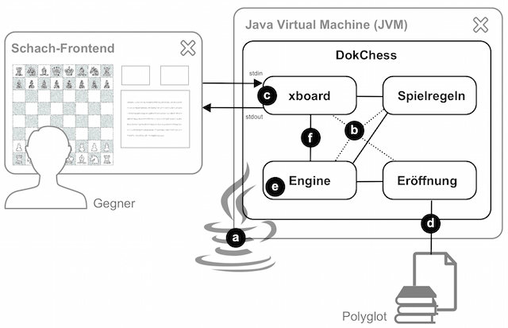
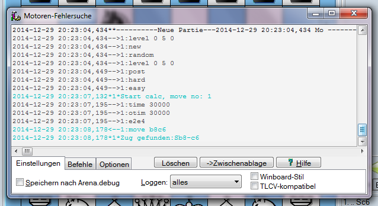
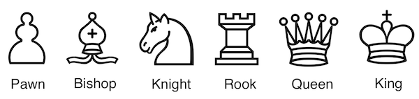
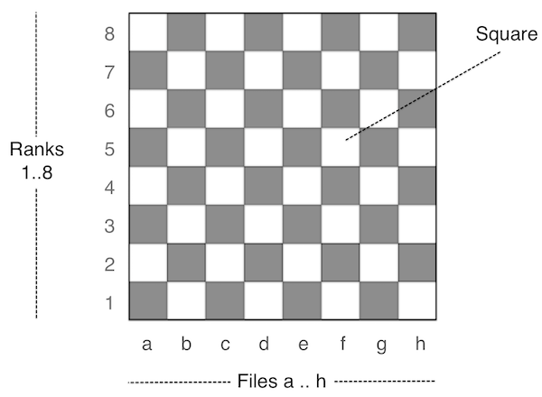

> "Eines Tages werden Computer uns alle überflüssig machen."
>
> Robert (“Bobby”) Fisher (US-amerikanischer Schachspieler, Schachweltmeister 1972–1975), 1975

## DokChess

DokChess ist eine voll funktionsfähige Schach-Engine.

Dieser Architekturüberblick lässt Euch die maßgeblichen Entwurfsentscheidungen nachvollziehen.
Er zeigt die Struktur der Lösung und das Zusammenspiel zentraler Elemente.
Die Gliederung der Inhalte erfolgt nach der arc42-Vorlage.

Zielgruppe dieses Überblicks sind in erster Linie Softwarearchitektinnen und -architekten, die Anregungen und Beispiele suchen, wie sie Architekturentwürfe angemessen dokumentieren können.
Darüber hinaus erhalten alle, die selbst ein Schachprogramm schreiben wollen, wertvolle Tipps und lernen en passant einiges über methodische Softwarearchitektur.

- [DokChess](#dokchess)
- [1. Einführung und Ziele](#1-einführung-und-ziele)
  - [1.1 Aufgabenstellung](#11-aufgabenstellung)
  - [1.2 Qualitätsziele](#12-qualitätsziele)
- [1.3 Stakeholder](#13-stakeholder)
- [2. Randbedingungen](#2-randbedingungen)
  - [2.1 Technische Randbedingungen](#21-technische-randbedingungen)
  - [2.2 Organisatorische Randbedingungen](#22-organisatorische-randbedingungen)
  - [2.3 Konventionen](#23-konventionen)
- [3. Kontextabgrenzung](#3-kontextabgrenzung)
  - [3.1 Fachlicher Kontext](#31-fachlicher-kontext)
  - [3.2 Technischer- oder Verteilungskontext](#32-technischer--oder-verteilungskontext)
- [4. Lösungsstrategie](#4-lösungsstrategie)
  - [4.1 Einstieg in die Lösungsstrategie](#41-einstieg-in-die-lösungsstrategie)
  - [4.2 Der Aufbau von DokChess](#42-der-aufbau-von-dokchess)
  - [4.3 Spielstrategie](#43-spielstrategie)
  - [4.4 Die Anbindung](#44-die-anbindung)
- [5. Bausteinsicht](#5-bausteinsicht)
  - [5.1	Ebene 1](#51ebene-1)
  - [5.2 XBoard-Protokoll (Blackbox)](#52-xboard-protokoll-blackbox)
  - [5.3	Spielregeln (Blackbox)](#53spielregeln-blackbox)
  - [5.4 Engine (Blackbox)](#54-engine-blackbox)
  - [5.5 Eröffnung (Blackbox)](#55-eröffnung-blackbox)
  - [5.6 Ebene 2: Engine (Whitebox)](#56-ebene-2-engine-whitebox)
  - [5.7 Zugsuche (Blackbox)](#57-zugsuche-blackbox)
  - [5.8 Stellungsbewertung  (Blackbox)](#58-stellungsbewertung--blackbox)
- [6. Laufzeitsicht](#6-laufzeitsicht)
  - [6.1 Zugermittlung Walkthrough](#61-zugermittlung-walkthrough)
- [7. Verteilungssicht](#7-verteilungssicht)
  - [7.1 Infrastruktur Windows](#71-infrastruktur-windows)
- [8. Querschnittliche Konzepte](#8-querschnittliche-konzepte)
  - [8.1 Querschnittliche Konzepte](#81-querschnittliche-konzepte)
  - [8.1 Abhängigkeiten zwischen Modulen](#81-abhängigkeiten-zwischen-modulen)
  - [8.2 Schach-Domänenmodell](#82-schach-domänenmodell)
  - [8.3	Benutzungsoberfläche](#83benutzungsoberfläche)
  - [8.4 Plausibilisierung und Validierung](#84-plausibilisierung-und-validierung)
  - [8.5 Ausnahme- und Fehlerbehandlung](#85-ausnahme--und-fehlerbehandlung)
  - [8.6 Logging, Protokollierung, Tracing](#86-logging-protokollierung-tracing)
  - [8.7 Testbarkeit](#87-testbarkeit)
- [9. Entscheidungen](#9-entscheidungen)
  - [9.1 Wie kommuniziert die Engine mit der Außenwelt?](#91-wie-kommuniziert-die-engine-mit-der-außenwelt)
  - [9.2 Sind Stellungsobjekte veränderlich oder nicht?](#92-sind-stellungsobjekte-veränderlich-oder-nicht)
- [10. Qualitätsanforderungen](#10-qualitätsanforderungen)
  - [10.1 Qualitätsbaum](#101-qualitätsbaum)
  - [10.2 Qualitätsszenarien](#102-qualitätsszenarien)
- [11. Risiken und technische Schulden](#11-risiken-und-technische-schulden)
  - [11.1 Risiko: Anbindung an das Frontend schlägt fehl](#111-risiko-anbindung-an-das-frontend-schlägt-fehl)
  - [11.2 Risiko: Aufwand der Implementierung zu hoch](#112-risiko-aufwand-der-implementierung-zu-hoch)
  - [11.3 Risiko: Erreichen der Spielstärke scheitert](#113-risiko-erreichen-der-spielstärke-scheitert)
- [12. Glossar](#12-glossar)
  - [12.1 Glossar](#121-glossar)
  - [12.2 Begriffe](#122-begriffe)
  
## 1. Einführung und Ziele

Dieser Abschnitt führt in die Aufgabenstellung ein und skizziert die Ziele, die DokChess verfolgt.

### 1.1 Aufgabenstellung

Was ist DokChess?

- DokChess ist eine voll funktionsfähige Schach-Engine.
- Sie dient als einfach zugängliches und zugleich attraktives Fallbeispiel für Architekturentwurf, -bewertung und -dokumentation.
- Der verständliche Aufbau lädt zum Experimentieren und zum Erweitern der Engine ein.
- Ziel ist nicht die höchstmögliche Spielstärke – dennoch gelingen Partien, die Gelegenheitsspielern Freude bereiten.

Wesentliche Features:

- Vollständige Implementierung der FIDE-Schachregeln
- Unterstützt das Spiel gegen menschliche Gegner und andere Schachprogramme
- Beherrscht zentrale taktische Ideen, beispielsweise Gabel und Spieß
- Integration mit modernen grafischen Schach-Frontends

### 1.2 Qualitätsziele

Die folgende Tabelle beschreibt die zentralen Qualitätsziele von DokChess, wobei die Reihenfolge eine grobe Orientierung bezüglich der Wichtigkeit vorgibt.

| Qualitätsziel                                   | Motivation und Erläuterung |
|-------------------------------------------------|----------------------------|
| Zugängliches Beispiel (Analysierbarkeit)        | Da DokChess in erster Linie als Anschauungsmaterial für Softwarearchitektur und -entwicklung dient, erschließen sich Entwurf und Implementierung rasch.|
| Einladende Experimentierplattform (Änderbarkeit)| Alternative Algorithmen und Strategien, etwa zur Bewertung einer Schachstellung, können leicht implementiert und in die Lösung integriert werden. |
| Bestehende Frontends nutzen (Interoperabilität) | DokChess lässt sich mit angemessenem Aufwand in bestehende grafische Schach-Frontends einbinden.|
| Akzeptable Spielstärke (Funktionale Eignung)    |DokChess spielt stark genug, um schwache Gegner sicher zu schlagen und Gelegenheitsspieler zumindest zu fordern.|
| Schnelles Antworten auf Züge (Effizienz)        |Da DokChess in Seminaren und Vorträgen live demonstriert wird, erfolgt die Berechnung der Spielzüge rasch.|

Die [Qualitätsszenarien in Abschnitt 10](#10-qualitätsanforderungen) konkretisieren diese Qualitätsziele und dienen insbesondere auch dazu ihre Erreichung zu bewerten.

## 1.3 Stakeholder

Die folgende Tabelle stellt die Stakeholder von DokChess und ihre jeweilige Intention dar.

| Wer?                | Interesse, Bezug           |
|---------------------|----------------------------|
| Softwarearchitektinnen und -architekten | <ul> <li>wollen ein Gefühl bekommen, wie Architekturdokumentation für ein konkretes System aussehen kann <li>möchten sich Dinge (z.B. Form, Notation) für Ihre tägliche Arbeit abgucken <li>gewinnen Sicherheit für Ihre eigenen Dokumentationsvorhaben <li>haben in der Regel keine tiefen Schachkenntnisse</ul>|
| Entwicklerinnen und Entwickler | <ul> <li>nehmen auch Architekturaufgaben im Team wahr <li>bekommen beim Studium von DokChess Lust, selbst eine Schach-Engine zu implementieren <li>sind neugierig auf konkrete Anregungen, wie man das macht</ul>|
|Stefan Zörner|	<ul><li>benötigt attraktive Beispiele für sein Buch <li> will DokChess in Workshops und Vorträgen zu Softwareentwurf und -architektur als Anschauungsmaterial verwenden|
|oose Innovative Informatik|<ul><li>Schulungsunternehmen, Arbeitgeber von Stefan Zörner zum Zeitpunkt der Konzeption von DokChess<li>bietet Seminare, Workshops und Coaching zu Themen rund um Softwareentwicklung an</ul>|

## 2. Randbedingungen

Beim Lösungsentwurf waren zu Beginn verschiedene Randbedingungen zu beachten, sie wirken in der Lösung fort. Dieser Abschnitt stellt sie dar und erklärt auch – wo nötig – deren Motivation.

### 2.1 Technische Randbedingungen

| Randbedingung | Erläuterungen, Hintergrund |
|---------------|----------------------------|
| Moderate Hardwareausstattung | Betrieb der Lösung auf einem marktüblichen Standard-Notebook, um sie im Rahmen von Seminaren und Konferenzen auf einem solchen zeigen zu können.|
| Betrieb auf Windows Desktop Betriebssystemen | Standardausstattung von Notebooks bei Mitarbeitern des Schulungsunternehmens zum Zeitpunkt der Konzeption. Hohe Verbreitung dieser Betriebssysteme bei potenziell Interessierten (Zuhörer bei Vorträgen, Teilnehmer bei Seminaren). Unterstützung anderer Betriebssysteme (allen voran Linux und Mac OS X) wünschenswert, aber nicht zwingend erforderlich.
| Implementierung in Java | Einsatz als Beispiel in Java-lastigen Seminaren und auf Java-Konferenzen.  Entwicklung unter Version Java SE 6 (DokChess 1.0), später Java SE 7 und Java SE 11. Die Engine soll auch auf neueren Java-Versionen, sobald verfügbar, laufen.
| Fremdsoftware frei verfügbar | Falls zur Lösung Fremdsoftware hinzugezogen wird (z.B. grafisches Frontend), sollte diese idealerweise frei verfügbar und kostenlos sein. Die Schwelle der Verwendung wird auf diese Weise niedrig gehalten. |

### 2.2 Organisatorische Randbedingungen

| Randbedingung | Erläuterungen, Hintergrund |
|---------------|----------------------------|
| Team | Stefan Zörner, unterstützt durch Kollegen, Bekannte und Interessierte aus Workshops und Seminaren |
| Zeitplan | Beginn der Entwicklung Dezember 2010, erster lauffähiger Prototyp März 2011 (Abendvortrag beim Schulungsunternehmenin Hamburg), vorzeigbare Version Mai 2011 (Vortrag JAX-Konferenz in Mainz). Fertigstellung Version 1.0: Februar 2012 (Abgabe des Buchmanuskripts für die 1. Auflage)
| Vorgehensmodell | Entwicklung risikogetrieben, iterativ und inkrementell. Zur Dokumentation der Architektur kommt arc42 zum Einsatz. Eine Architekturdokumentation gegliedert nach dieser Vorlage ist zentrales Projektergebnis. |
| Entwicklungswerkzeuge | Entwurf mit Stift und Papier, ergänzend Enterprise Architect. Arbeitsergebnisse zur Architekturdokumentation gesammelt im Confluence Wiki. Erstellung der Java-Quelltexte in Eclipse oder IntelliJ. Die Software muss jedoch auch, allein mit Gradle, also ohne IDE baubar sein. |
| Konfigurations- und Versionsverwaltung | Zu Beginn (Version 1.0) Subversion bei SourceForge, später Git bei GitHub |
| Testwerkzeuge und -prozesse | JUnit im Annotationsstil sowohl für inhaltliche Richtigkeit als auch für Integrationstests und die Einhaltung von Effizienzvorgaben |
| Veröffentlichung als Open Source | Die Quelltexte der Lösung oder zumindest Teile werden als Open Source verfügbar gemacht. Lizenz: GNU General Public License version 3.0 (GPLv3). Gehostet bei GitHub: https://github.com/DokChess/ |

### 2.3 Konventionen

| Konvention    | Erläuterungen, Hintergrund |
|---------------|----------------------------|
|Architekturdokumentation | Terminologie und Gliederung nach dem deutschen arc42-Template in der Version 6.0 |
| Kodierrichtlinien für Java | Java Coding Conventions von Sun/Oracle, geprüft mit Hilfe von CheckStyle |
| Sprache (Deutsch vs. Englisch)	| Benennung von Dingen (Komponenten, Schnittstellen) in Diagrammen und Texten innerhalb dieser (deutschen) arc42-Architekturdokumentation in Deutsch. Verwendung deutscher Bezeichner für Klassen, Methoden etc. im Java-Quelltext (es sei denn, die Java-Kodierrichtlinien stehen dem im Wege). Hintergrund: Die Zielgruppe sind keine Schach-Experten, es soll keine zusätzliche Barriere durch englische (Schach-)begriffe erzeugt werden. |
| Schach-Spezifische Datenformate | Verwendung etablierter Standards für Schach-spezifische Notationen und Austauschformate innerhalb der Lösung. Themen: Züge, Stellungen, Partien, Eröffnungen, ... Keinesfalls sind eigene Formate zu entwickeln.  Prinzip: Offene Standards sind proprietären Formaten (wie sie ggf. kommerzielle Programme verwenden) vorzuziehen.

## 3. Kontextabgrenzung

Dieser Abschnitt beschreibt das Umfeld von DokChess. Für welche Benutzer ist es da, und mit welchen Fremdsystemen interagiert es?

### 3.1 Fachlicher Kontext

Bild: Fachlicher Kontext von DokChess

-----

Menschlicher Gegner (Benutzer)
Schach wird zwischen zwei Gegnern gespielt, die abwechselnd ihre Figuren ziehen.
DokChess übernimmt die Rolle eines der Gegner, und tritt gegen einen menschlichen Gegner an.
Dazu müssen sich die beiden austauschen, beispielsweise über ihre Züge, oder über Remisangebote.

Computergegner (Fremdsystem)
Alternativ zu einem menschlichen Gegner kann DokChess auch gegen eine andere Engine antreten.
Die Anforderungen bezüglich des Informationsaustausches sind die selben.

Eröffnungen (Fremdsystem)
Zur Eröffnung, d.h. zur frühen Phase des Spiels, existiert umfangreiches Wissen in der Schachliteratur.
Dieses Wissen ist in Form von Bibliotheken und Datenbanken teils frei und teils auch kommerziell verfügbar.

Im Rahmen von DokChess wird keine solche Bibliothek erstellt.
Stattdessen wird (optional) eine angebunden, um in der Frühphase ein auf Wissen basiertes Spiel zur ermöglichen, wie es menschliche Spieler erwarten.

Endspiele (Fremdsystem)
Wenn nur noch sehr wenige Figuren auf dem Brett stehen (z.B. nur die beiden Könige und eine Dame), kann analog zu Eröffnungsbibliotheken auf Endspielbibliotheken zurückgegriffen werden.
Diese beinhalten für jede mögliche Stellung mit dieser Figurenkonstellation die Aussage, ob das Spiel gewonnen, unentschieden oder verloren ist, sowie ggf. den nötigen nächsten Schritt zum Sieg.

Im Rahmen von DokChess wird keine solche Bibliothek erstellt.
Stattdessen kann (optional) eine angebunden werden, um klar gewonnene Spiele auch sicher nach Hause zu bringen, oder das Wissen aus den Bibliotheken für Analysen und Stellungsbewertungen zu nutzen.

### 3.2 Technischer- oder Verteilungskontext

Bild: Technische Interaktion zwischen DokChess und den Beteiligten

-----

XBoard Client (Fremdsystem)
Die "Anbindung" menschlicher Spieler erfolgt über ein grafisches Frontend, dessen Entwicklung nicht Teil von DokChess ist. Stattdessen kann jedes grafische Frontend verwendet werden, welches das sogenannte XBoard-Protokoll unterstützt. Hierzu zählen Xboard (bzw. Winboard unter Windows), Arena und Aquarium.

Polyglot Opening Book (Fremdsystem)
Polyglot Opening Book ist ein binäres Dateiformat für Eröffnungsbibliotheken. DokChess erlaubt die optionale Anbindung solcher Bücher. Der Zugriff erfolgt ausschließlich lesend.

-----

Zu Endspielen
Von der Implementierung einer Anbindung von Endspieldatenbanken (z.B. Nalimov Endgame Tablebases) wurde aus Aufwandsgründen Abstand genommen, siehe Risiken in Abschnitt 11. Der Entwurf ist aber offen für entsprechende Erweiterungen.

## 4. Lösungsstrategie

Dieser Abschnitt enthält einen stark verdichteten Architekturüberblick. Eine Gegenüberstellung der wichtigsten Ziele und Lösungsansätze.

### 4.1 Einstieg in die Lösungsstrategie

Die folgende Tabelle stellt die Qualitätsziele von DokChess (siehe [Abschnitt 1.2](#12-qualitätsziele)) passenden Architekturansätzen gegenüber, und erleichtert so einen Einstieg in die Lösung.

| Qualitätsziel | Dem zuträgliche Ansätze in der Architektur |
|---------------|--------------------------------------------|
Zugängliches Beispiel (Analysierbarkeit) | <ul><li>Architekturüberblick gegliedert nach arc42<li>Explizites, objektorientiertes Domänenmodell<li>Modul-, Klassen- und Methodennamen in Deutsch, um englische Schachbegriffe zu vermeiden<li>Ausführliche Dokumentation der öffentlichen Schnittstellen in javadoc</ul> |
| Einladende Experimentierplattform (Änderbarkeit)|<ul><li>verbreitete Programmiersprache Java, →&nbsp;**(a)**<li>Schnittstellen für Kernabstraktionen (z.B. Stellungsbewertung, Spielregeln)<li>Unveränderliche Objekte (Stellung, Zug, ...) erleichtern Implementierung vieler Algorithmen<li>„Zusammenstecken“ der Bestandteile mit Dependency Injection führt zu Austauschbarkeit, →&nbsp;**(b)**<li>Hohe Testabdeckung als Sicherheitsnetz</ul>|
|Bestehende Frontends nutzen (Interoperabilität)|<ul><li>Verwendung des verbreiteten Kommunikationsprotokolls xboard, →&nbsp;**\(c\)**, <li>Einsatz des portablen Java, →&nbsp;**(a)**</ul>|
|Attraktive Spielstärke (Attraktivität)|<ul><li>Integration von Eröffnungsbibliotheken →&nbsp;**(d)**<li>Implementierung des Minimax-Algorithmus und einer geeigneter Stellungsbewertung, →&nbsp;**(e)**<li>Integrationstests mit Schachaufgaben für taktische Motive und Mattsituationen</ul>|
| Schnelles Antworten auf Züge (Effizienz) |<ul><li>Reactive Extensions für nebenläufige Berechnung mit neu gefundenen besseren Zügen als Events →&nbsp;**(f)**<li>Optimierung des Minimax durch Alpha-Beta-Suche, →&nbsp;**(e)**<li>Effiziente Implementierung des Domänenmodells<li>Integrationstests mit Zeitvorgaben</ul>|

Kleine Buchstaben in Klammern →&nbsp;**(x)** verorten einzelne Ansätze aus der Tabelle im folgenden schematischen Bild.
Der restliche Abschnitt 4 führt in wesentliche Architekturaspekte ein und verweist auf weitere Informationen.

*Bild: Informelles Überblicksbild für DokChess*

### 4.2 Der Aufbau von DokChess

DokChess ist als Java-Programm mit main-Routine realisiert. Es zerfällt grob in folgende Teile:

* eine Implementierung der Schachregeln
* die eigentliche Engine, welche die Züge ermittelt
* die Anbindung an eine grafische Benutzeroberfläche über das XBoard-Protokoll
* einen Adapter für ein konkretes Eröffnungsbibliotheksformat (Polyglot Opening Book)

Diese Zerlegung ermöglicht es, Dinge wie das Kommunikationsprotokoll oder das Eröffnungsbibliotheksformat bei Bedarf auszutauschen. Alle Teile sind durch Schnittstellen abstrahiert, die Implementierungen werden per Dependency Injection zusammengesteckt ([→ 5. Bausteinsicht](#5-bausteinsicht), [→ Konzept 8.1 „Abhängigkeiten zwischen Modulen"](#81-abhängigkeiten-zwischen-modulen).
Die Zerlegung erlaubt es weiterhin die Software, allen voran die Schachalgorithmen, leicht automatisiert zu testen ([→ Konzept 8.7 „Testbarkeit“](#87-testbarkeit).

Die Interaktion zwischen Algorithmen­Teilen erfolgt über den Austausch fachlich motivierter Datenstrukturen, realisiert als Klassen (_Figur_, _Zug_, ... [→ Konzept 8.2 „Schach­Domänenmodell“](#82-schach-domänenmodell)).
Hier wurde bewusst eine bessere Verständlichkeit angestrebt, auf Kosten von Effizienz.
Gleichwohl erreicht DokChess eine akzeptable Spielstärke, wie ein Durchspielen der entsprechenden Szenarien zeigt ([→ 10. Qualitätsszenarien](#10-qualitätsanforderungen)).

Zentrales Element beim Entwurf der Datenstrukturen ist die Spielsituation: Welche Figuren gerade wo stehen und was sonst noch zur Stellung dazu gehört (z. B. wer am Zug ist).
Auch hier ging bei der Implementierung der fachlich motivierten Klasse dazu Lesbarkeit vor Effizienz.
Ein wichtiger Aspekt dabei: Wie alle anderen fachlichen Klassen ist auch sie unveränderlich ([→ Entscheidung 9.2 „Sind Stellungsobjekte veränderlich oder nicht?“](#92-sind-stellungsobjekte-veränderlich-oder-nicht)).

### 4.3 Spielstrategie

Für die Integration von Eröffnungsbibliotheken wurde das Dateiformat „Polyglot Opening Book“ implementiert ([→ Bausteinsicht 5.5 “Eröffnung“](#55-eröffnung-blackbox)), DokChess antwortet dadurch zu Beginn mit „Buchwissen“.

Für die Spielstrategie im weiteren Partieverlauf ist ein klassischer [Minimax­-Algorithmus](https://de.wikipedia.org/wiki/Minimax-Algorithmus) mit fester Suchtiefe im Spielbaum verantwortlich.
Dessen Basis-Implementierung ist nicht nebenläufig, die Bewertung einer Stellung an einem Terminalknoten im Spielbaum basiert ausschließlich auf dem Material ([→ Bausteinsicht Ebene 2, 5.6 “Engine“](#56-ebene-2-engine-whitebox)). Diese einfachen Implementierungen erfüllen unter den gegebenen Randbedingungen bereits die Qualitätsszenarien.

Eine [Alpha­-Beta­-Suche](https://de.wikipedia.org/wiki/Alpha-Beta-Suche) illustriert den einfachen Austausch von Algorithmen. Spielstärke und/oder Effizienz verbessern sich durch die bei gleicher Rechenzeit tiefere Suche im Baum erheblich. Die unveränderlichen Datenstrukturen in DokChess erleichtern auch das Implementieren nebenläufiger Algorithmen; ein paralleler Minimax ist ebenfalls als Beispiel enthalten.

### 4.4 Die Anbindung

DokChess besitzt keine grafische Benutzeroberfläche; die Kommunikation erfolgt stattdessen über die Standardein­- und -­ausgabe.
Als Kommunikationsprotokoll kommt das textbasierte XBoard-­Protokoll zum Einsatz ([→ Entscheidung 9.1 „Wie kommuniziert die Engine mit der Außenwelt?“](#91-wie-kommuniziert-die-engine-mit-der-außenwelt))).
DokChess lässt sich interaktiv per Kommandozeile bedienen, wenn man die XBoard­-Kommandos kennt und die Engine-Antworten zu deuten weiß ([→ Konzept 8.3 „Benutzungsoberfläche“](#83-benutzungsoberfläche)), siehe folgendes Bild.

Die eigentliche Engine von DokChess wird dabei über einen reaktiven Ansatz („Reactive Extensions“) angebunden ([→ 6. Laufzeitsicht, „Zugermittlung Walkthrough“](#61-zugermittlung-walkthrough)).
DokChess bleibt so auch während der Zugermittlung ansprechbar, ein Benutzer kann zum Beispiel ein sofortiges Ziehen erzwingen.

Die Integration von DokChess in ein UI erfolgt unter Windows über eine Batch­-Datei (_\*.bat_), welche die Java Virtual Machine (JVM) unter Angabe der Klasse mit _main_ Methode startet ([→ 7. Verteilungssicht](#7-verteilungssicht)).

## 5. Bausteinsicht

Dieser Abschnitt beschreibt die Zerlegung von DokChess in Module, wie sie sich auch in der Paketstruktur des Java-Quelltextes widerspiegelt.
Module der ersten Zerlegungsebene bezeichnen wir in DokChess als Subsysteme.
Die [→ Bausteinsicht, Ebene 1](#51-ebene-1) stellt sie inklusive ihrer Schnittstellen dar.

Für das Subsystem Engine enthält dieser Überblick auch eine detailliertere Zerlegung in [→ Ebene 2](#52-xboard-protokoll-blackbox).

### 5.1	Ebene 1

DokChess zerfällt wie in Bild unten dargestellt in vier Subsysteme. Die gestrichelten Pfeile stellen fachliche Abhängigkeiten der Subsysteme untereinander dar ("x -> y" für "x ist abhängig von y"). Die Kästchen auf der Membran des Systems sind Interaktionspunkte mit Außenstehenden
([→ 3.2 Kontextabgrenzung](#32-technischer--oder-verteilungskontext)).

*Bild: DokChess, Bausteinsicht, Ebene 1*

----

| Subsystem | Kurzbeschreibung |
|-----------|------------------|
| [XBoard-Protokoll](#52-xboard-protokoll-blackbox) | Realisiert die Kommunikation mit einem Client mit Hilfe des XBoard-Protokolls. |
| [Spielregeln](#53-spielregeln-blackbox) | Beinhaltet die Schachregeln und kann z.B. zu einer Stellung alle gültigen Züge ermitteln. |
| [Engine](#54-engine-blackbox)) | Beinhaltet die Ermittlung eines nächsten Zuges ausgehend von einer Spielsituation. |
| [Eröffnung](#55-eröffnung-blackbox) | Stellt Züge aus der Eröffnungsliteratur zu einer Spielsituation bereit.|
*Tabelle: Überblick über Subsysteme von DokChess*

Abschnitt [→ 6.1 Zugermittlung Walkthrough](#61-zugermittlung-walkthrough) erklärt exemplarisch das Zusammenspiel der Subsysteme zur Laufzeit.

### 5.2 XBoard-Protokoll (Blackbox)

Zweck/Verantwortlichkeit

Dieses Subsystem realisiert die Kommunikation mit einem Client (z.B. einer grafischen Oberfläche) mit Hilfe des textbasierten XBoard-Protokolls ([→ Entscheidung 9.1](#91-wie-kommuniziert-die-engine-mit-der-außenwelt)).
Das Subsystem liest Befehle über die Standardeingabe ein, prüft sie gegen die Spielregeln und setzt sie für die Engine um.
Antworten der Engine (insbesondere ihre Züge) werden vom Subsystem als Ereignisse entgegengenommen, gemäß Protokoll formatiert und über die Standardausgabe zurückgesendet.
Das Subsystem treibt somit das ganze Spielgeschehen. Es enthält auch die main-Methode.

Schnittstellen

Das Subsystem stellt seine Funktionalität über die Java-Klassen _de.dokchess.xboard.XBoard_ und _de.dokchess.xboard.Main_ bereit:

*Bild: Klassen XBoard und Main*

----

| Methode | Kurzbeschreibung |
|---------|------------------|
| setEingabe | Setzt die Protokoll-Eingabe per Dependency Injection ([→ Konzept 8.1](#81-abhängigkeiten-zwischen-modulen)). Typischerweise ist das die Standardeingabe (stdin), automatische Tests z.B. verwenden eine andere Quelle. |
| setAusgabe | Setzt die Protokoll-Ausgabe. Typischerweise ist das die Standardausgabe (stdout), automatische Tests verwenden eine andere Senke.
| setSpielregeln | Setzt eine Implementierung der Spielregeln, [→ 5.3 Spielregeln (Blackbox)](#53-spielregeln-blackbox)
| setEngine | Setzt eine Implementierung der Engine, [→ 5.4 Engine (Blackbox)](#54-engine-blackbox) |
| spielen | Startet die eigentliche Kommunikation (Eingabe/Verarbeitung/Ausgabe) in einer Endlosschleife, bis zum Beenden-Kommando.|
*Tabelle: Methoden der Klasse XBoard*

Ablageort / Datei
Die Implementierung liegt unterhalb der Pakete   
_de.dokchess.xboard..._

Offene Punkte
Die Implementierung des Protokolls ist unvollständig.
Sie reicht aber für die an DokChess gestellten Anforderungen aus.
Insbesondere werden folgende Features nicht unterstützt:

* Zeitkontrolle
* Permanent Brain (Denken, auch während die andere Seite denkt)
* Remis-Angebote und Aufgabe der anderen Seite
* Schach-Varianten (alternative Regeln, z.B. Schach960)

### 5.3	Spielregeln (Blackbox)

Zweck/Verantwortlichkeit
Dieses Subsystem beinhaltet die Spielregeln für Schach gemäß Internationalem Schachverband (FIDE). Es ermittelt zu einer Stellung alle gültigen Züge und entscheidet, ob ein Schach, ein Matt oder ein Patt vorliegt.

Schnittstelle
Das Subsystem stellt seine Funktionalität über das Java-Interface _de.dokchess.regeln.Spielregeln_ bereit.

Default-Implementierung der Schnittstelle ist die Klasse  
_de.dokchess.regeln.DefaultSpielregeln_.

*Bild: Schnittstelle Spielregeln*

----

| Methode | Kurzbeschreibung |
|---------|------------------|
| liefereGrundaufstellung | Liefert die Grundaufstellung der Figuren zu Beginn einer Partie. Weiß ist am Zug.|
| liefereGueltigeZuege | Liefert zu einer Stellung die Menge aller gültigen Züge für den aktuellen Spieler. Der Spieler am Zug wird aus der Stellung ermittelt. Im Falle eines Matt oder Patt wird eine leere Collection zurückgeliefert, das Ergebnis ist also nie null.|
| aufSchachPruefen | Püft, ob der König der angegebenen Farbe angegriffen ist, also im Schach steht. |
| aufMattPruefen | Prüft, ob die übergebene Stellung ein Matt ist, also der aktuelle Spieler im Schach steht und kein Zug ihn aus diesem Angriff führt. Eine solche Spielsituation ist für den Spieler am Zug verloren ("Schach Matt").|
| aufPattPruefen | Prüft, ob die übergebene Stellung ein Patt ist, also der aktuelle Spieler keinen gültigen Zug hat, aber nicht im Schach steht. Eine solche Spielsituation wird Remis gewertet.|
*Tabelle: Methoden der Schnittstelle Spielregeln*

----

[Konzept 8.2 („Schach-Domänenmodell“)](#82-schach-domänenmodell) beschreibt die in der Schnittstelle verwendeten Aufruf- und Rückgabeparameter (_Zug_, _Stellung_, _Farbe_).
Weitere Details entnehmen Sie der Quelltextdokumentation (javadoc).

Ablageort / Datei
Die Implementierung liegt unterhalb der Pakete _de.dokchess.regeln..._

Offene Punkte
Abgesehen vom Patt kann das Subsystem kein Remis erkennen. Insbesondere sind die folgenden Spielregeln bisher nicht implementiert ([→ Risiko 11.2 „Aufwand der Implementierung“](#112-risiko-aufwand-der-implementierung-zu-hoch)):

* 50-Züge-Regel
* Stellungswiederholung
  
### 5.4 Engine (Blackbox)

Zweck/Verantwortlichkeit
Dieses Subsystem beinhaltet die Ermittlung eines nächsten Zuges ausgehend von einer Spielsituation. Diese Situation wird von außen vorgegeben. Die Engine ist zustandsbehaftet und spielt stets eine Partie zur gleichen Zeit. Die Default-Implementierung benötigt zum Arbeiten eine Implementierung der Spielregeln, die Eröffnungsbibliothek hingegen ist optional.

Schnittstellen
Das Subsystem stellt seine Funktionalität über das Java-Interface _de.dokchess.engine.Engine_ bereit. Default-Implementierung ist die Klasse _de.dokchess.engine.DefaultEngine_.

*Bild: Schnittstelle Engine, Implementierung*

| Methode | Kurzbeschreibung |
|---------|------------------|
|figurenAufbauen | Setzt den Zustand der Engine auf die angegebene Stellung. Falls aktuell eine Zugermittlung läuft, wird diese abgebrochen.|
| ermittleDeinenZug | Startet die Ermittlung eines Zuges für die aktuelle Spielsituation. Liefert Zugkandidaten asynchron über ein Observable zurück ([→ Laufzeitsicht 6.1](#61-zugermittlung-walkthrough)). Die Engine führt die Züge nicht aus.|
| ziehen | Führt den angegebenen Zug aus, d.h. ändert den Zustand der Engine. Falls aktuell eine Zugermittlung läuft, wird diese abgebrochen.|
| schliessen | Schließt die Engine. Die Methode erlaubt es Ressourcen frei zu geben. Im Anschluss sind keine Zugermittlungen mehr zulässig.|
*Tabelle: Methoden der Schnittstelle Engine*

----

| Methode | Kurzbeschreibung |
|---------|------------------|
| setSpielregeln | Setzt eine Implementierung der Spielregeln, [→ 5.3 Spielregeln (Blackbox)](#53-spielregeln-blackbox)|
| setEroeffnungsbibliothek | Setzt eine (optionale) Eröffnungsbibliothek, deren Züge gegenüber eigenen Überlegungen präferiert werden. [→ 5.5 Eröffnung (Blackbox)](#55-eröffnung-blackbox)|
*Tabelle: Methoden der Klasse DefaultEngine (zusätzlich zu Engine)*

----

[Konzept 8.2 („Schach-Domänenmodell“)](#82-schach-domänenmodell) beschreibt die in der Schnittstelle verwendeten Aufruf- und Rückgabeparameter (_Zug_, _Stellung_).
Details zum Engine-Subsystem finden Sie in der Whitebox-Sicht in [Abschnitt 5.6](#56-ebene-2-engine-whitebox).

Ablageort / Datei
Die Implementierung sowie Unit-Tests liegen unterhalb der Pakete _de.dokchess.engine..._

### 5.5 Eröffnung (Blackbox)

Zweck/Verantwortlichkeit
Dieses Subsystem stellt Eröffnungsbibliotheken bereit und implementiert das Polyglot Opening Book-Format.
Bei diesem Format handelt es sich gegenwärtig um das einzig geläufige, das nicht proprietär ist.
Entsprechende Buchdateien und zugehörige Werkzeuge sind im Internet frei verfügbar.

Schnittstellen
Das Subsystem stellt seine Funktionalität über das Java-Interface _de.dokchess.eroeffnung.Eroeffnungsbibliothek_ bereit. Als Implementierung liegt die Klasse _de.dokchess.eroeffnung.polyglot.PolyglotOpeningBook_ vor.

*Bild: Schnittstelle Eroeffnungsbibliothek, Implementierung PolyglotOpeningBook*

----

| Methode | Kurzbeschreibung |
|---------|------------------|
| liefereZug | Liefert zur angegebenen Stellung einen aus der Bibliothek bekannten Zug, oder null |
*Tabelle: Methoden der Schnittstelle Eroeffnungsbibliothek*

PolyglotOpeningBook
Die Klasse PolyglotOpeningBook ist ein Adapter zum Polyglot Opening Book-Dateiformat.
Implementierung der Eroeffnungsbibliothek, die eine Binärdatei im entsprechenden Format einliest und einen Zug zur angegebenen Stellung zurückliefert, falls es einen gibt.

| Methode | Kurzbeschreibung |
|---------|------------------|
| PolyglotOpeningBook | Konstruktor, erwartet die einzulesende Datei.|
| setAuswahlModus | Setzt den Modus zur Auswahl eines Zuges, falls es in der Bibliothek für die Stellung mehr als einen Kandidaten gibt.|

*Tabelle: Methoden der Klasse PolyglotOpeningBook (zusätzlich zur Schnittstelle)*

----

[Konzept 8.2 („Schach-Domänenmodell“)](#82-schach-domänenmodell) beschreibt die in der Schnittstelle verwendeten Aufruf- und Rückgabeparameter (_Zug_, _Stellung_).

Ablageort / Datei
Die Implementierung, Unit-Tests und Testdaten für das Polyglot Opening Book-Fomat liegen unterhalb der Pakete _de.dokchess.eroeffnung..._

Offene Punkte

* Die Möglichkeiten zur Auswahl eines Zuges aus der Eröffnungsbibliothek im Fall von mehreren Kandidaten sind beschränkt (der erste, der am häufigsten gespielte, per Zufall).
* Die Implementierung kann nicht mit mehreren Bibliotheksdateien zur gleichen Zeit umgehen – sie also nicht mischen – um das Wissen zu vereinen.

### 5.6 Ebene 2: Engine (Whitebox)

Die Engine zerfällt wie in der folgenden Abbildung dargestellt in Zugsuche und Stellungsbewertung.
Falls vorhanden wird die Ermittlung des Zuges zunächst an die Eröffnungsbibliothek delegiert.
Nur wenn diese keinen Rat weiß, kommt die Zugsuche zum Einsatz.

*Bild: Subsystem Engine, Bausteinsicht, Ebene 2*

----

| Modul | Kurzbeschreibung |
|-------|------------------|
| [Zugsuche](#57-zugsuche-blackbox) | Ermittelt zu einer Stellung den unter bestimmten Bedingungen optimalen Zug.|
| [Stellungsbewertung](#53-spielregeln-blackbox) | Bewertet eine Stellung aus Sicht eines Spielers.|
*Tabelle: Module des Subsystems Engine*

### 5.7 Zugsuche (Blackbox)

Zweck/Verantwortlichkeit
Das Modul ermittelt zu einer Stellung den unter bestimmten Bedingungen optimalen Zug.
Theoretisch gäbe es im Schach einen generell optimalen Zug.
Die hohe Anzahl der möglichen Züge und die damit verbundene schier unglaubliche Anzahl zu bewertender Spielsituationen macht es in der Praxis aber unmöglich, ihn zu bestimmen.
Gängige Algorithmen wie der Minimax begnügen sich daher damit, den "Spielbaum" nur bis zu einer bestimmten Tiefe zu explorieren.

Schnittstellen
Das Modul stellt seine Funktionalität über die Schnittstelle _de.dokchess.engine.suche.Suche_ zur Verfügung.

Der Minimax-Algorithmus liegt in der Klasse _de.dokchess.engine.suche.MinimaxAlgorithmus_ vor.
Die Klasse _MinimaxParalleleSuche_ nutzt den Algorithmus und implementiert gleichzeitig die Schnittstelle _Suche_.
Sie untersucht mehrere Teilbäume parallel; wenn sie einen besseren Zug findet erhält der Aufrufer eine Nachricht onNext über das Observer-Pattern.
Den Abschluss der Suche signalisiert die Suche über die Nachricht _onComplete_.

*Bild: Schnittstelle Suche, Klassen MinimaxAlgorithmus und MinimaxParalleleSuche*

| Methode | Kurzbeschreibung |
|---------|------------------|
| zugSuchen | Startet eine Suche nach einem Zug für die angegebene Stellung. Liefert nach und nach bessere Züge als Ereignisse an den übergebenen Observer. Das Ende der Suche (keinen besseren Zug mehr gefunden) wird ebenfalls an den Observer signalisiert.|
| sucheAbbrechen | Bricht die aktuelle Suche ab.|
| schliessen | Schließt die Suche vollständig. Anschließend dürfen keine Züge mehr damit ermittelt werden.|
*Tabelle: Methoden der Schnittstelle Suche*

| Methode | Kurzbeschreibung |
|---------|------------------|
| setSpielregeln | Setzt eine Implementierung der Spielregeln über Dependency Injection, [→ 5.3 Spielregeln (Blackbox)](#53-spielregeln-blackbox) |
| setBewertung | Setzt die Bewertungsfunktion, anhand derer die Stellungen bei Erreichen der maximalen Suchtiefe bewertet werden. [→ 5.8 Stellungsbewertung (Blackbox)](#57-zugsuche-blackbox)|
| setTiefe | Setzt die maximale Suchtiefe in Halbzügen, d.h. bei 4 zieht jeder Spieler zweimal.|
| ermittleBestenZug | Ermittelt zur übergebenen Stellung den optimalen Zug gemäß Minimax und vorgegebener Stellungsbewertung bei fester Suchtiefe. Die Methode blockiert und ist deterministisch.|
*Tabelle: Methoden der Klasse MinimaxAlgorithmus*

Ablageort / Datei
Die Implementierung liegt unterhalb der Pakete _de.dokchess.engine.suche..._

### 5.8 Stellungsbewertung  (Blackbox)

Zweck/Verantwortlichkeit
Das Modul bewertet eine Stellung aus Sicht eines Spielers.
Ergebnis ist eine Zahl, wobei 0 eine ausgeglichene Situation beschreibt, eine positive Zahl einen Vorteil für den Spieler, eine negative einen Nachteil.
Je höher der Betrag, desto größer der Vor- bzw. Nachteil.
Das Modul ermöglicht es so, Stellungen miteinander zu vergleichen.

Schnittstellen
Das Modul stellt seine Funktionalität über die Schnittstelle _de.dokchess.engine.bewertung.Bewertung_ bereit, _de.dokchess.engine.bewertung.ReineMaterialBewertung_ ist eine sehr einfache Implementierung.
Die Schnittstelle enthält Konstanten für typische Bewertungen.

*Bild: Schnittstelle Bewertung, Klasse ReineMaterialBewertung*

| Methode | Kurzbeschreibung |
|---------|------------------|
| bewerteStellung | Liefert zur gegebenen Stellung eine Bewertung aus Sicht der angegebenen Spielerfarbe. Je höher, desto besser.|
*Tabelle: Methoden der Schnittstelle Bewertung*

ReineMaterialBewertung
Die Implementierung berücksichtigt ausschließlich die vorhandenen Figuren (Material).
Jede Figurenart enthält einen Wert (Bauer 1, Springer 3, ..., Dame 9), die Figuren auf dem Brett werden entsprechend aufsummiert. Eigene Figuren zählen positiv, gegnerische negativ.
Entsprechend ist bei ausgeglichenem Material das Ergebnis 0, verliert man z.B. eine Dame, sinkt der Wert um 9.

Ablageort / Datei
Die Implementierung liegt unterhalb der Pakete _de.dokchess.engine.bewertung..._

Offene Punkte
Bei der reinen Materialbewertung spielt es keine Rolle, wo die Figur steht.
Ein Bauer in Startposition ist genau so viel wert, wie einer kurz vor der Umwandlung.
Und ein Springer am Rand entspricht einem Springer im Zentrum.
Hier ist viel Spielraum für Verbesserungen, der bewusst nicht ausgeschöpft wurde, da DokChess ja zum Experimentieren einladen soll.

## 6. Laufzeitsicht

Diese Sicht visualisiert im Gegensatz zur statischen Bausteinsicht dynamische Aspekte. Wie spielen die Teile zusammen?

### 6.1 Zugermittlung Walkthrough

Nach Aufbau des XBoard-Protokolls startet der Client (weiß) über die Angabe eines Zuges eine Partie.
Das Sequenzdiagramm im Bild unten zeigt eine exemplarische Interaktion auf Subsystem-Ebene von der Eingabe "e2e4" (weißer Bauer e2-e4) bis zur Antwort von DokChess, also der Ausgabe "move b8c6" (schwarzer Springer b8-c6, [„Nimzowitsch-Verteidigung“](https://de.wikipedia.org/wiki/Nimzowitsch-Verteidigung)).

*Bild: Beispielhaftes Zusammenspiel für eine Zugermittlung*

Zunächst validiert das XBoard-Protokoll-Subsystem die Eingabe unter Zuhilfenahme der Spielregeln ([→ 8.4 „Plausibilisierung und Validierung“](#84-plausibility-checks-and-validation)).
Der Zug wird im Beispiel als zulässig erkannt und auf der (zustandsbehafteten) Engine ausgeführt (Nachricht "ziehen").
Anschließend fordert das XBoard-Protokoll-Subsystem die Engine auf, ihren Zug zu ermitteln.
Da eine Zugberechnung sehr lange dauern kann, DokChess aber weiter auf Eingaben reagieren können soll, erfolgt der Aufruf asynchron.
Die Engine meldet sich mit möglichen Zügen zurück.

Zunächst prüft die Engine, ob die Eröffnungsbibliothek etwas hergibt.
Im Beispiel ist das nicht der Fall.
Die Engine muss ihren Zug selbst berechnen. Sie greift dazu auf die Spielregeln zurück, und ermittelt alle gültigen Züge als Kandidaten.
Anschließend untersucht und bewertet es diese, und meldet nach und nach immer bessere Züge (aus Sicht der Engine bessere) an den Aufrufer (das XBoard-Protokoll-Subsystem) zurück. Hierbei kommt das Observer-Pattern (Implementierung mit Reactive Extensions) zum Einsatz.

Das Beispieldiagramm zeigt zwei gefundene Züge (Bauer e7-e5, Springer b8-c6) und am Ende die Nachricht, dass die Suche abgeschlossen ist, die Engine also keine besseren Züge mehr liefert.
Das XBoard-Protokoll-Subsystem führt den letzten Zug auf der Engine aus und setzt ihn anschließend in eine Zeichenkette auf der Standardausgabe gemäß XBoard-Protokoll um: "move b8c6".

## 7. Verteilungssicht

Diese Sicht beschreibt den Betrieb von DokChess.
Als Java-Programm ist es relativ anspruchslos, wenn man es nur per Kommandozeile bedienen will.
Das ist allerdings frei von Komfort und erfordert ein physisches Schachbrett mit Koordinaten, falls der Anwender nicht blind spielen kann.
Es folgt daher eine Beschreibung, wie DokChess im Zusammenspiel mit einem grafischen Frontend konfiguriert wird.

### 7.1 Infrastruktur Windows

Das Verteilungsdiagramm im Bild unten zeigt den Einsatz von DokChess unter Windows ohne Eröffnungsbibliothek.
Als Frontend wird exemplarisch Arena verwendet ([→ Entscheidung 9.1 „Wie kommuniziert die Engine mit der Außenwelt?“](#91-wie-kommuniziert-die-engine-mit-der-außenwelt)).

*Bild:	Deployment von DokChess auf einem Windows-PC*

Software-Voraussetzungen auf dem PC:

* Java Runtime Environment SE 11 (oder höher)
* Die JVM (javaw.exe) muss im Pfad liegen, ansonsten ist dokchess.bat anzupassen
* Arena (siehe http://www.playwitharena.de)

_DokChess.jar_ enthält den kompilierten Java-Quelltext sämtlicher Module und alle nötigen Abhängigkeiten („Über-jar“).
Die Script-Datei dokchess.bat startet die Java Virtual Machine mit DokChess.
Beides liegt auf dem Rechner in einem gemeinsamen Verzeichnis, da _dokchess.bat_ die jar-Datei relativ anspricht.

Innerhalb von Arena wird die Skript-Datei im (deutschen) Menü unter "Motoren|Neuen Motor installieren..." bekannt gemacht.
Es erscheint eine Dateiauswahl, deren Dateityp sich auf \*.bat-Dateien einschränken lässt. Anschließend ist als Motoren-Typ "Winboard" auszuwählen.
Bei anderen Schach-Frontends erfolgt das Bekanntmachen einer Engine ähnlich, vgl. deren Dokumentation.

Offene Punkte
Einige Frontends unter Windows erlauben lediglich das Einbinden einer \*.exe-Datei als Engine.
In diesem Fall müsste DokChess geeignet gewrappt werden.

## 8. Querschnittliche Konzepte

Dieser Abschnitt beschreibt allgemeine Strukturen und Aspekte, die systemweit gelten. Darüber hinaus stellt er verschiedene technische Lösungskonzepte vor.

### 8.1 Querschnittliche Konzepte

Dieser Abschnitt beschreibt allgemeine Strukturen und Aspekte, die systemweit gelten. Darüber hinaus stellt er verschiedene technische Lösungskonzepte vor.

### 8.1 Abhängigkeiten zwischen Modulen

DokChess soll zum Experimentieren und zum Erweitern der Engine einladen ([→ 1. Aufgabenstellung](#1-einführung-und-ziele)). Die Module sind daher über Schnittstellen lose gekoppelt.
Module sind Implementierungen von Java-Schnittstellen. Java-Klassen, welche Teile benötigen, signalisieren dies über entsprechende Methoden _set«Module»(«Interface» ...)_.
Sie kümmern sich nicht selbst um das Auflösen einer Abhängigkeit, indem sie beispielsweise Exemplare mit new bauen, oder eine Factory bemühen.
Stattdessen löst der Verwender die Abhängigkeiten auf, indem er passende Implementierungen erzeugt und über die Setter-Methoden zusammensteckt ([Dependency Injection](https://martinfowler.com/articles/injection.html), kurz DI).

Dies ermöglicht die Verwendung alternativer Implementierungen innerhalb des Rahmens DokChess und das Hinzufügen von Funktionalität über das Decorator-Pattern [Gamma+94]. Auch Lösungsansätze aspektorientierter Programmierung (AOP), die auf Dynamic Proxies basieren, sind auf Java Interfaces leicht anwendbar. Nicht zuletzt wirkt sich dieser Umgang mit Abhängigkeiten positiv auf die Testbarkeit ([→ Konzept 8.7](#87-testbarkeit)) aus.

DokChess verzichtet auf die Verwendung eines speziellen DI Frameworks.
Die Module werden im Quelltext hart verdrahtet, allerdings nur in Unit-Tests und Glue-Code (z.B. der Main-Klasse). Um experimentierfreudigen Anwendern bezüglich einer konkreten DI-Implementierung freie Wahl zu lassen, findet insbesondere keine annotationsgetriebene Konfiguration statt.

Da die Java-Module reine POJOs (Plain old Java objects) sind, steht einer Konfiguration beispielsweise mit dem [Spring Framework](https://projects.spring.io/spring-framework/) oder CDI (Contexts and Dependency Injection for the Java EE Platform) nichts im Wege.

### 8.2 Schach-Domänenmodell

> "Das Schachspiel wird zwischen zwei Gegnern gespielt, die abwechselnd ihre Figuren auf einem quadratischen Spielbrett, Schachbrett genannt, ziehen."
>
> (Zitat aus den FIDE-Regeln)

Die verschiedenen Systemteile tauschen schachspezifische Daten aus.
Hierzu zählen vor allem die Situation auf dem Brett (Stellung), sowie gegnerische und eigene Züge.
Als Aufruf- und Rückgabeparameter finden in allen Modulen dieselben Klassen Verwendung.

An dieser Stelle finden Sie einen groben Überblick über diese Datenstrukturen und deren Abhängigkeiten untereinander.
Details sind in der Quelltextdokumentation (javadoc) enthalten.
Die Klassen und Aufzählungstypen (enums) befinden sich im Paket _de.dokchess.allgemein_.

Eine Schachfigur ist gekennzeichnet durch Farbe (schwarz oder weiß) und Art (König, Dame, ...).
Im Domänenmodell von DokChess weiß eine Figur nicht, wo sie steht.
Die Klasse ist unveränderlich (immutable) wie alle anderen im Domänenmodell auch.

 und eine Art \(z.B. Bauer\)")

*Bild: Eine Figur hat eine Farbe (z.B. weiß) und eine Art (z.B. Bauer)*

Das Schachbrett besteht aus 8 x 8 Feldern die in 8 Reihen (1-8) und 8 Linien (a-h) angeordnet sind. Die Klasse _Feld_ beschreibt ein ebensolches. Da ein Feld maximal von einer Figur besetzt sein kann, reicht für die Angabe eines Zuges, von wo nach wo gezogen wird. Einzige Ausnahme bildet die Umwandlung eines Bauern auf der gegnerischen Grundlinie, da der Spieler selbst entscheidet, in welche Figur er umwandelt (in der Regel, aber nicht zwingend, eine Dame). Rochadezüge werden als Königszüge über zwei Felder in die entsprechende Richtung repräsentiert.

*Bild: Ein Zug geht von einem Feld zu einem Feld*

Die Klasse _Stellung_ stellt die aktuelle Situation auf dem Brett dar.
Vor allem sind das die Figuren auf dem Brett, das intern als zweidimensionales Array (8 x 8) implementiert ist.
Falls ein Feld unbesetzt ist, steht null im Array.
Zur Komplettierung der Spielsituation gehört die Information, wer am Zug ist, ob noch Rochaden möglich sind und ob en passant geschlagen werden kann.

")

*Bild: Die Klasse Stellung (Ausschnitt, Details wie Rochade fehlen)*

Die Klasse _Stellung_ ist ebenfalls unveränderlich, die Methode _fuehreZugAus()_ liefert eine neue Stellung mit der veränderten Spielsituation zurück ([→ Entscheidung 9.2 „Sind Stellungsobjekte veränderlich oder nicht?“](#92-sind-stellungsobjekte-veränderlich-oder-nicht)).

### 8.3	Benutzungsoberfläche

DokChess verfügt selbst über keine grafische Oberfläche, sondern agiert über das XBoard-Protokoll mit der Außenwelt ([→ Entscheidung 9.1](#91-wie-kommuniziert-die-engine-mit-der-außenwelt)). Im Folgenden wird dies kurz skizziert.

Das Protokoll ist textbasiert, ein Starten von DokChess in einer Kommandozeile (Unix-Shell, Windows-Eingabeaufforderung, ...) erlaubt eine Interaktion mit der Engine, wenn man die wichtigsten XBoard-Kommandos beherrscht (siehe Bild in [Abschnitt 4](#4-lösungsstrategie)).
Die folgende Tabelle zeigt einen Beispieldialog, alle Kommandos werden mit einer neuen Zeile abgeschlossen). Standardmäßig spielt eine Engine schwarz, man kann das über die Protokollbefehl "white" ändern.

| Client -> DokChess | DokChess -> Client | Bemerkung |
|--------------------|--------------------|-----------|
| _xboard_           | &nbsp;             | Client will XBoard-Protokoll verwenden (erforderlich, da Engines teilweise andere, teileweise sogar mehrere Protokolle verstehen) |
| &nbsp;             | (neue&nbsp;Zeile)       | &nbsp; |
| _protover&nbsp;2_       | &nbsp;             |	Protokollversion 2 |
| &nbsp;             | _feature&nbsp;done=1_   | zeilenweise Mitteilung über zusätzliche Features der Engine (hier: keine) |
| _e2e4_             | &nbsp;             | Weiß zieht Bauer e2-e4 |
| &nbsp;             | _move&nbsp;b8c6_        | Schwarz (DokChess) zieht Springer b8-c6 |
| _quit_             | &nbsp;             | Der Client beendet das Spiel (DokChess terminiert) |

*Tabelle: Beispielkommunikation zwischen einem Client und DokChess (XBoard)*

Das Protokoll selbst ist in [Mann+2009] detailliert beschrieben, für die Implementierung in DokChess ist das Subsystem XBoard-Protokoll zuständig ([→ Bausteinsicht 5.2](#52-xboard-protokoll-blackbox)).

Die typische Verwendung von DokChess ist das Vorschalten eines grafischen Schachfrontends wie Arena (siehe Bild unten), das die Züge der anderen Seite – inder Regel eines Menschen – über eine komfortable Oberfläche entgegennimmt und diese in Form von XBoard-Kommandos wie in der Tabelle oben an DokChess weitergibt (Spalte "Client -> DokChess") und die Antworten (Spalte "DokChess -> Client") grafisch umsetzt.
Die andere Seite kann auch eine andere Schach-Engine sein.

*Bild: DokChess im Schach-Frontend Arena unter Windows*

### 8.4 Plausibilisierung und Validierung

DokChess ist, vereinfacht ausgedrückt, ein Algorithmus, es antwortet auf Züge des Gegners mit eigenen Zügen. Für die Überprüfung von Eingaben sind zwei Kanäle relevant: das XBoard-Protokoll für interaktive Benutzereingaben des Gegners sowie Eröffnungsbibliotheken in Form von Dateien.

Eingaben, die über das XBoard-Protokoll eingehen, werden vom entsprechenden Subsystem geparst. Unbekannte oder nicht implementierte Kommandos meldet DokChess mit dem XBoard-Kommando "Error" an den Client zurück.

Im Falle eines Zugkommandos wird mit Hilfe des Spielregeln-Subsystem überprüft, ob der Zug regelkonform ist. Unzulässige Züge meldet DokChess mit dem XBoard-Kommando "Illegal move" an den Client zurück.
Bei Verwendung eines grafischen Frontends sollte dieser Fall nicht auftreten, da diese typischerweise nur gültige Züge absetzen. Der Fall ist eher für die Interaktion per Kommandozeile relevant ([→ 8.3 „Benutzungsoberfläche“](/08_konzepte/03_benutzungsoberflaeche/)).

Beim Aufbau einer Stellung überprüft DokChess die Einhaltung des Protokolls, nicht aber, ob die Position zulässig ist. Im Extremfall kann das dazu führen, dass das Engine-Subsystem im Spielverlauf Fehler wirft (z.B. wenn man keine Könige auf das Brett stellt).

Bei den Eröffnungsbibliotheken prüft DokChess lediglich, ob es die Datei öffnen und einlesen kann. Im Fehlerfall (konkret z.B.: Datei nicht gefunden) wird eine Exception geworfen ([→ 8.5](/08_konzepte/05_fehlerbehandlung/)).
Beim Einlesen quittiert das Eröffnung-Subsystem von ihm erkannte Probleme (z.B. ungültiges Format) ebenfalls mit einem Laufzeitfehler.
Inhaltlich prüft es die Bibliothek jedoch nicht. Falls beispielsweise unzulässige Züge für eine Stellung hinterlegt sind, wird das nicht erkannt. Für die Qualität der Bibliothek ist der Anwender selbst verantwortlich (siehe [→ 3. Kontextabgrenzung](/03_kontextabgrenzung/)).
Im Extremfall antwortet die Engine mit einem ungültigen Zug.

### 8.5 Ausnahme- und Fehlerbehandlung

DokChess verfügt über keine eigene Oberfläche. Es muss Probleme daher nach außen signalisieren.

Die Methoden der DokChess-Subsysteme werfen dazu Runtime Exceptions, im Falle des Engine-Subsystems bei asynchroner Zugermittlung zusätzlich Fehlernachrichten (_onError_). Eigene Erweiterungen (beispielsweise eine eigene Zugauswahl) müssen entsprechend implementiert sein, Checked Exceptions (zum Beispiel _java.io.IOException_) etwa sind geeignet zu verpacken.

Die wenigen erwarteten Exceptions bei DokChess zeigt das javadoc der entsprechenden Methoden und Konstruktoren an. Probleme beim Einlesen einer Eröffnungsbibliothek etwa, oder beim Versuch der Zugermittlung innerhalb der Engine bei ungültiger Stellung (falls erkannt). Alle übrigen Exceptions wären Programmierfehler (bitte melden Sie solche Fälle unter https://github.com/DokChess/).

Das XBoard-Subsystem fängt sämtliche Exceptions und kommuniziert sie über das XBoard-Protokoll nach außen (Kommando "tellusererror"). Ein grafisches Frontend visualisiert sie in der Regel in einem Fehler-Dialog oder einer Alert-Box, das folgende Bild zeigt das für das Schachfrontend Arena.

*Bild: DokChess-Fehlermeldung visualisiert durch Arena: Datei nicht gefunden*

DokChess arbeitet dann "normal" weiter, wobei der Anwender selbst entscheidet, ob ein Fortfahren in der konkreten Situation sinnvoll ist. Beispielsweise könnte er ohne Eröffnungsbibliothek weiterspielen.

### 8.6 Logging, Protokollierung, Tracing

Für Verbesserungen und Erweiterungen von DokChess durch Dritte sind die vorhandenen Analysemöglichkeiten von Interesse, insbesondere bei Fehlverhalten.

Die Funktionalität selbst lässt sich gut mit Unit-Tests überprüfen.
Das gilt insbesondere für die korrekte Implementierung der Spielregeln, für die Spielweise der Engine ([→ 8.7 „Testbarkeit“](#87-testbarkeit)) und auch für eigene Erweiterungen.

Innerhalb von DokChess gibt es daher keine feinkörnigen Logging-Ausgaben; Lösungen wie log4j kommen nicht zum Einsatz.
Auf diese Weise wird eine Abhängigkeit zu einer Fremdbibliothek, die sich durch den ganzen Quelltext ziehen würde, vermieden und der Code nicht durch diesen Aspekt verschmutzt.

Für die Kommunikation zwischen Client und DokChess über das XBoard-Protokoll besteht neben der interaktiven Bedienung über eine Shell ([→ 8.3 Benutzungsoberfläche](#83-benutzungsoberfläche)) oft die Möglichkeit, den Client die Konversation protokollieren zu lassen. Gängige Schachfrontends erlauben dies über das Schreiben von Log-Dateien und/oder die simultane Anzeige eines Protokollfensters während des Spiels. Das folgende Bild zeigt diese Funktionalität exemplarisch für Arena.

*Bild: Protokollfenster zum XBoard-Protokoll in Arena*

Solche Werkzeuge sind von unschätzbarem Wert, wenn die Engine hängt und unklar ist, was auf dem XBoard-Protokoll gelaufen ist. Aufgrund ihrer Verfügbarkeit wurde auf die Implementierung eines Kommunikationsprotokoll-Tracings innerhalb von DokChess verzichtet.

### 8.7 Testbarkeit

Nichts ist peinlicher für eine Engine als ein unzulässiger Zug.

Die Funktionalität der einzelnen Module von DokChess wird durch umfangreiche Unit-Tests sichergestellt.
In der Quelltextstruktur ist neben dem Ordner src/main, wo die Java-Quelltexte der Module abgelegt sind, ein Ordner _src/test_ zu finden.
Er enthält ein Spiegelbild der Paketstruktur, und in den entsprechenden Paketen Unit-Tests zu den Klassen, die mit [JUnit 4](https://junit.org/junit4/) realisiert sind.

Reine Unit-Tests, die einzelne Klassen prüfen, heißen wie die Klasse selbst, nur hinten mit Test.
Darüber hinaus gibt es Tests, die das Zusammenspiel von Modulen prüfen, und im Extremfall das ganze System. Mit Hilfe solcher Tests wird die korrekte Spielweise von DokChess überprüft, unter anderem mit Hilfe von Mattaufgaben.
Unterhalb von _src/integTest_ liegen aufwändigere, länger laufende Integrationstests. Hierzu zählt etwa das Durchspielen ganzer Partien.

Viele Tests erfordern das Vorlegen einer Stellung als Eingabe. 
Hier kommt die Forsyth-Edwards-Notation (kurz FEN) zum Einsatz. Diese Notation erlaubt die Angabe einer kompletten Spielsituation als kompakte Zeichenkette ohne Zeilenumbruch und ist daher wie geschaffen für den Einsatz in automatisierten Test.
Die Grundstellung wird in FEN beispielsweise so notiert:

    "rnbqkbnr/pppppppp/8/8/8/8/PPPPPPPP/RNBQKBNR w KQkq - 0 1"

Kleine Buchstaben stehen für schwarze, große für weiße Figuren, es werden die englischen Bezeichnungen (Rook für Turm, Pawn für Bauer, ...) verwendet.

*Bild: Beispielstellung (weiß am Zug ist matt)*

Die Spielsituation in Bild oben mit weiß vor dem 79. Zug, wobei 30 Halbzüge lang keine Figur geschlagen und kein Bauer bewegt wurde, sähe in FEN so aus:

    "6r1/6pp/7r/1B5K/1P3k2/N7/3R4/8 w - - 30 79"

und liest sich "6 Felder frei, schwarzer Turm, Feld frei, neue Reihe ...".

Details zur Notation sind beispielsweise bei Wikipedia nachzulesen. Die Klasse Stellung verfügt über einen Konstruktor, der eine Zeichenkette in FEN akzeptiert. Die _toString_-Methode der Klasse liefert ebenfalls FEN.

Neben Tests auf korrekte Funktionalität wird auch überprüft, ob die geforderten Antwortzeiten für exemplarische Spielsituationen eingehalten werden können. Dies erfolgt mit der _@Test_-Annotation und deren Timeout-Parameter. Der Erfolg dieser Tests hängt von der eingesetzten Hardware ab.

## 9. Entscheidungen

Dieser Abschnitt lässt Euch zwei besonders interessante Entscheidungen beim Entwurf von DokChess im Detail nachvollziehen.

### 9.1 Wie kommuniziert die Engine mit der Außenwelt?

Zur Fragestellung

Als zentrale Anforderung muss DokChess mit vorhandenen Schach-Frontends zusammenarbeiten. Wie erfolgt die Anbindung?

Es sind eine ganze Reihe grafische Oberflächen speziell zum Spiel gegen Schach-Programme verfügbar. Darüber hinaus gibt es für Schachinteressierte Softwarelösungen mit größerem Leistungsumfang. Neben dem Spiel „Mensch gegen Maschine“ bieten sie weitere Funktionalität, etwa zur Analyse von Partien. Mit der Zeit werden neue Schach-Programme hinzukommen – und andere gegebenenfalls vom Markt verschwinden.

Je nachdem, wie die Anbindung an solche Programme realisiert wird, kann DokChess mit bestimmten Oberflächen kommunizieren oder auch nicht. Die Frage hat Einfluss auf die Interoperabilität von DokChess mit bestehender und auf die Anpassbarkeit an zukünftige Schach-Software.

Relevante Einflussfaktoren

* Randbedingungen
 * Betrieb der Frontends zumindest auf Windows-Desktop-Betriebssystemen
 * Unterstützung frei verfügbarer Frontends
 * Bevorzugung etablierter (Schach-)Standards ([→ 2.3 Konventionen](#23-konventionen))
* Maßgeblich betroffene Qualitätsmerkmale ([→ 1.2 Qualitätsziele](#12-qualitätsziele))
 * Qualitätsziel: Bestehende Frontends nutzen (Interoperabilität)
 * Qualitätsziel: Einladende Experimentierplattform (Änderbarkeit)
 * Anpassbarkeit (an zukünftige Schach-Software)
* Betroffene Risiken
 * Anbindung an das Frontend schlägt fehl ([→ 11.1](#111-risiko-anbindung-an-das-frontend-schlägt-fehl))

Annahmen

* Die Untersuchung weniger verfügbarer Frontends führt zu allen interessanten Integrationsoptionen.

Betrachtete Alternativen

Anfang 2011 wurden folgende Schach-Frontends untersucht:

* Arena Chess GUI (frei verfügbar, läuft unter Windows)
* Fritz for Fun (kommerziell, Anbieter ChessBase GmbH, läuft unter Windows)
* Winboard/XBoard (Open Source, läuft unter Windows, Max OS X, \*nix)

Als Ergebnis wurden zwei Kommunikationsprotokolle als Optionen identifiziert:

* Option 1: UCI Protocol (Universal Chess Interface, Details siehe [hier](https://www.chessprogramming.org/UCI))
* Option 2: XBoard Protocol (auch bekannt als Winboard, und als Chess Engine Communication Protocol, , Details siehe [hier](https://www.chessprogramming.org/Chess_Engine_Communication_Protocol))

Keines der beiden Protokolle ist formal spezifiziert, aber beide sind öffentlich dokumentiert.

Beide Protokolle sind textbasiert, die Kommunikation zwischen Frontend und Engine erfolgt über stdin/stdout. Das Frontend startet die Engine jeweils in einem separaten Prozess.

Die folgende Tabelle zeigt, welches der untersuchten Frontend welches Protokoll implementiert.

*Tabelle: Protokolle und Frontends*

| &nbsp;           | Arena 3 | Fritz for Fun | Winboard/XBoard |
|------------------|---------|---------------|-----------------|
| UCI-Protokoll    | Ja      | Ja            | \-              |
| XBoard-Protokoll | Ja      | \-            | Ja              |

Entscheidung

Grundsätzlich lassen sich die Qualitätsziele unter den gegebenen Randbedingungen von beiden Protokollen erreichen. 
Je nachdem, welches Protokoll wir implementieren, unterstützen wir unterschiedliche Frontends.

Die Entscheidung fiel Anfang 2011 zugunsten des XBoard-Protokolls. Die Struktur von DokChess erlaubt es, alternative Kommunikationsprotokolle (UCI oder andere) hinzuzufügen, ohne die Engine selbst dafür verändern zu müssen, siehe hierzu Abhängigkeiten in der ([Bausteinsicht](#51-ebene-1)).
Das präferierte Frontend unter Windows ist Arena.
Es ist frei verfügbar und vom Leistungsumfang WinBoard überlegen. Es besitzt gute Debug-Möglichkeiten, kann zum Beispiel die Kommunikation zwischen Frontend und Engine live in einem Fenster darstellen.
Arena unterstützt beide Protokolle.

Mit der Entscheidung für das XBoard-Protokoll unterstützen wir zusätzlich zu Windows weitere Betriebssysteme (insbesondere Mac OS X und Linux) mit einem frei verfügbaren Frontend unterstützt. Da so ein größerer Kreis Interessierter die Engine verwenden kann, gab dies letztendlich den Ausschlag.

### 9.2 Sind Stellungsobjekte veränderlich oder nicht?

Zur Fragestellung

Spielsituationen auf dem Schachbrett (Stellungen) müssen für verschiedene DokChess-Module bereitgestellt und zwischen ihnen ausgetauscht werden. Gestalten wir die zugehörige Datenstruktur veränderlich oder unveränderlich (immutable)?

Eine Stellung verändert sich im Verlauf einer Partie durch das Ausführen von Zügen. Darüber hinaus führt die Engine im Rahmen ihrer Analyse mögliche Züge aus, zieht Antworten des Gegners, bewertet das Resultat und verwirft Züge wieder. Dabei entsteht ein Baum, der je nach Tiefe viele tausend verschiedene Stellungen beinhaltet.

Je nachdem, ob die Stellung als Datenstruktur unveränderlich ist oder nicht, sind Algorithmen einfacher oder schwieriger zu implementieren, und ihre Ausführung ist unterschiedlich effizient.

Von der Schnittstelle der Stellung hängen sämtliche Module ab; eine nachträgliche Änderung beträfe ganz DokChess.

Relevante Einflussfaktoren

* Randbedingungen ([→ 2.1 „Technische Randbedingungen“](#21-technische-randbedingungen))
 * Implementierungssprache Java
 * moderate Hardwareausstattung
* Maßgeblich betroffene Qualitätsmerkmale ([→ 1.2 „Qualitätsziele“](#12-qualitätsziele))
 * Qualitätsziel: Einladende Experimentierplattform (Änderbarkeit)
 * Qualitätsziel: Akzeptable Spielstärke (Funktionale Eignung)
 * Qualitätsziel: Schnelles Antworten auf Züge (Effizienz)
* Betroffene Risiken
 * Aufwand der Implementierung zu hoch ([→ 11.2](#112-risiko-aufwand-der-implementierung-zu-hoch))
 * Erreichen der Spielstärke scheitert ([→ 11.3](#113-risiko-erreichen-der-spielstärke-scheitert))

Annahmen

* Es ist möglich, eine Datenstruktur mit ausformuliertem Objektmodell (also Klassen Feld, Figur, Zug etc.) effizient genug zu implementieren, um die geforderte Spielstärke bei angemessener Antwortzeit zu liefern.
* In Zukunft sollen mit der Datenstruktur auch nebenläufige Algorithmen realisiert werden können.

Betrachtete Alternativen

Ausgangspunkt sind fachlich motivierte Klassen für Feld, Figur und Zug ([→ 8.2 „Schach-Domänenmodell“](#82-schach-domänenmodell)).
Die Klassen sind unveränderlich als Wertobjekte realisiert (Feld e4 bleibt nach Erzeugung stets e4).

Für die Stellung betrachten wir zwei Alternativen:

* **Option (1)**: Die Stellung ist veränderlich. Einzelne Methoden der Schnittstelle verändern den Zustand, führen beispielsweise Züge aus oder nehmen sie zurück.

<pre>// Pseudocode
Stellung s = new Stellung(); // Anfangsstellung, weiss am Zug
s.fuehreZugAus(e2e4);        // Koenigsbauer zwei Felder vor, danach schwarz am Zug
s.nimmLetztenZugZurueck();   // anschliessend wieder auf Anfang
...
</pre>

* **Option (2)**: Die Stellung ist unveränderlich ("immutable"), d.h. eine Methode zum Ausführen eines Zuges liefert die neue Stellung (Kopie der alten, anschließend Zug ausgeführt) als ebenfalls unveränderliches Objekt zurück.

<pre>Stellung s = new Stellung();
Stellung neueStellung = s.fuehreZugAus(e2e4) // s bleibt unveraendert
...
</pre>

Die folgende Tabelle fasst Stärken und Schwächen der beiden Optionen zusammen, sie werden im Folgenden weiter ausgeführt.

*Tabelle: Stärken und Schwächen der beiden Optionen*

| &nbsp;          | (1) veränderlich | (2) unveränderlich  |
|-----------------|------------------|---------------------|
| Implementierungsaufwand | (-) höher | (+) geringer |
| Effizienz (Speicherverbrauch) | (+) sparsamer | (-) Bedarf höher |
| Effizienz (Zeitverhalten) | (o) neutral | (-) schlechter |
| Eignung für nebenläufige Algorithmen | (-) schlecht | (+) gut |

Option (1): Veränderliche Stellung

(+) Positiv

Wir müssen die Stellung mit ihrem umfangreichen Zustand nicht bei jedem Zug kopieren. 
Das spart Speicher und Rechenzeit, und es schont den Garbage Collector. Für Analysealgorithmen ist allerdings Funktionalität zu implementieren, die ausgeführte Züge zurücknimmt („undo“). Dieses Zurücknehmen kostet ebenfalls Zeit, daher die neutrale Bewertung (o) beim Zeitverhalten.

(-) Negativ

Die Implementierung des Zurücknehmens ist aufwändig.
Sie muss nicht nur geschlagene Figuren wieder hinstellen.
Die Rochade-Regel und En passant erfordern zusätzlich eine gesonderte Behandlung.
Das Command-Pattern [Gamma+94] bietet sich als Option an. Auch die Verwendung durch Algorithmen ist aufwändiger, da diese das Zurücknehmen von Zügen explizit aufrufen müssen.

Veränderbarer Zustand hat Nachteile bezüglich Nebenläufigkeit.

Option (2): Unveränderliche Stellung

(+) Positiv

Beim Ausführen eines Zuges wird die Stellung kopiert, das Original nicht verändert. Damit entfällt die Implementierung des Zurücknehmens von Zügen. Verwender können sich die alte Stellung als Wert merken. Das spart verglichen mit Option (1) Aufwand in der Umsetzung.
Unveränderliche Objekte bieten signifikante Vorteile bei nebenläufigen Algorithmen.

(-) Negativ

Das Kopieren des Zustandes für jede neue Stellung kostet Zeit. Da es in Analysesituationen um sehr viele Stellungen geht, in Summe potentiell viel Zeit.

Das Kopieren des Zustandes für jede neue Stellung kostet darüber hinaus Speicher. Die Implementierung von Suchalgorithmen mit Backtracking vermeidet zwar, dass komplette Spielbäume auf dem Heap landen. Nichts desto trotz ist der Speicherbedarf höher, und der Garbage Collector hat viel mehr zu tun.

Beide Punkte wirken sich negativ auf die Effizienz aus.

Entscheidung

Die Entscheidung fiel Anfang 2011 auf die unveränderliche Stellung (Option 2) aufgrund der Vorteile bezüglich einfacher Implementierung und Aussicht auf die leichtere Ausnutzung von Nebenläufigkeit. Die Nachteile der Option 2 beziehen sich ausschließlich auf Effizienz.

Aufgrund des Risikos, die Ziele bezüglich der Spielstärke in akzeptabler Rechenzeit (Attraktivität, Effizienz) nicht zu erreichen, wurden Prototypen beider Varianten implementiert und im Rahmen einer Mattsuche (Matt in 3 Zügen) mit Minimax-Algorithmus verglichen. Mit Option 2 dauerte die Suche 30% länger, vorausgesetzt, man implementiert das Kopieren effizient. Sie lag aber noch deutlich innerhalb des Geforderten.

Es gab weitere Optimierungsoptionen, die den Effizienznachteil gegenüber Option (1) bei Bedarf weiter verkürzt hätten. Sie wurden nicht umgesetzt, um die Implementierung einfach zu halten.

Zu diesen Optionen zählte die Ausnutzung mehrerer Prozessoren/Kerne durch Nebenläufigkeit, mittlerweile (mit DokChess 2.0) mit einem parallelen Minimax exemplarisch umgesetzt.

## 10. Qualitätsanforderungen

Dieser Abschnitt beinhaltet konkrete Qualitätsszenarien, welche die zentralen [Qualitätsziele](/01_einfuehrung/02_qualitaetsziele/), aber auch andere geforderte Qualitätseigenschaften besser fassen.
Sie ermöglichen es, Entscheidungsoptionen zu bewerten.

### 10.1 Qualitätsbaum

Das folgende Bild gibt in Form eines sogenannten Qualitätsbaumes (englisch: Utitlty Tree) einen Überblick über die relevanten Qualitätsmerkmale und ordnet ihnen [Szenarien](#102-qualitätsszenarien) als Beispiele zu.
Die [Qualitätsziele](#12-qualitätsziele) sind in der Abbildung ebenfalls enthalten und verweisen jeweils auf die Szenerien, welche sie illustrieren.

### 10.2 Qualitätsszenarien

Die Anfangsbuchstaben der Bezeichner (IDs) der Szenarien in der folgenden Tabelle  stehen jeweils für das übergeordnete Qualitätsmerkmal, W beispielsweise für Wartbarkeit.
Diese Bezeichner finden auch im [Qualitätsbaum](#101-qualitätsbaum) Verwendung.
Nicht immer lassen sich die Szenarien eindeutig einem Merkmal zuordnen.
Sie treten daher mitunter mehrmals im Qualitätsbaum auf.

| ID | Szenario           |
|-----|--------------------|
| W01 | Jemand mit Grundkenntnissen in UML und Schach möchte einen Einstieg in die Architektur von DokChess finden. Lösungsstrategie und Entwurf erschließen sich ihr oder ihm innerhalb von 15 Minuten. |
| W02 | Ein Architekt, der arc42 anwenden möchte, sucht zu einem beliebigen Kapitel des Template einen konkreten Beispielinhalt und findet ihn unverzüglich in der Dokumentation.|
| W03 | Eine erfahrene Java-Entwicklerin sucht die Implementierung eines im Entwurf beschriebenen Moduls. Sie findet sie ohne Umwege oder fremde Hilfe im Quelltext. |
| W04 | Ein Entwickler implementiert eine neue Stellungsbewertung. Er kann sie ohne Änderung und ohne Übersetzung vorhandenen Codes in bestehende Strategien integrieren. |
| W05 | Eine Entwicklerin implementiert eine figurenzentrierte Bitboard-Repräsentation der Spielsituation. Der Aufwand dazu beträgt inklusive des Austauschs der bestehenden, feldzentrierten Darstellung durch die neue maximal eine Woche. |
| K01 | Ein Benutzer will DokChess mit einem Schach-Frontend verwenden, das ein von der Lösung implementiertes Kommunikationsprotokoll unterstützt. Das Einbinden erfordert keinerlei Programmieraufwand, die Konfiguration innerhalb des Frontend ist innerhalb von zehn Minuten durchgeführt und getestet. |
| F01 | In einer Spielsituation hat die Engine einen oder mehrere regelkonforme Züge zur Auswahl. Sie antwortet mit einem dieser Züge. |
| F02 | Ein schwacher Spieler zieht in einer Partie gegen die Engine eine Figur ungedeckt und frei von Sinn auf ein von der Engine angegriffenes Feld. Die Engine im Anschluss am Zug nimmt die „eingestellte“ Figur. |
| F03 | Der Engine eröffnet sich eine Springergabel, um Dame oder Turm zu gewinnen. Die Engine gewinnt Dame (bzw. Turm) gegen Springer. |
| F04 | In einer Partie ergibt sich für die Engine ein Matt in zwei Zügen. Die Engine zieht sicher zum Sieg. |
| E01 | Während einer Partie antwortet die Engine auf gegnerische Züge innerhalb von fünf Sekunden mit einem Zug. |
| E02 | Eine in ein grafisches Frontend integrierte Engine spielt schwarz, der menschliche Spieler zieht an. Die Engine antwortet innerhalb von maximal zehn Sekunden mit ihrem ersten Zug, der Benutzer erhält spätestens nach fünf Sekunden eine Rückmeldung, dass die Engine „denkt“. |
| Z01 | Der Engine wird im Spielverlauf ein unzulässiger Gegenzug präsentiert. Die Engine lehnt den Zug ab, erlaubt im Anschluss die Eingabe eines anderen Zugs und spielt fehlerfrei weiter. |
| Z02 | Der Engine wird zum Spielbeginn eine unzulässige Stellung präsentiert. Die Engine erkennt die Situation und beendet das Spiel. |
| P01 | Eine Java-Programmiererin will DokChess mit einem Schach-Frontend verwenden, welches das Einbinden von Engines erlaubt, aber keines der implementierten Protokolle unterstützt. Sie kann das neue Protokoll ohne Änderung am bestehenden Code implementieren und die Engine anschließend wie gewohnt einbinden. |

## 11. Risiken und technische Schulden

Die folgenden Risiken wurden zu Beginn des Vorhabens als Probleme, die auftreten können, identifiziert. 
Sie beeinflussten die Planung der ersten drei Iterationen maßgeblich.
Seit Abschluss der dritten Iteration gelten sie als beherrscht. 
Dieser Architekturüberblick zeigt die Risiken inklusive der damaligen Eventualfallplanung weiterhin, wegen ihres großen Einflusses auf die Lösung.

### 11.1 Risiko: Anbindung an das Frontend schlägt fehl
Es liegt keinerlei Wissen über die Anbindung einer Engine an ein vorhandenes Schach-Frontend vor.
Vorhandene Open Source Engines sind in C programmiert und werden als ausführbare Programme (unter Windows z.B. \*.exe) geliefert.
Da wir DokChess in Java entwickeln, taugen sie nur bedingt zur Inspiration.
Über Kommunikationsprotokolle ist überhaupt nichts bekannt.

Falls es uns nicht gelingt, eine funktionierende Anbindung zu realisieren, können wir die Lösung nicht mit bestehenden Frontends verwenden.
Damit fehlt nicht nur ein wichtiges Feature ([vgl. Aufgabenstellung](#11-aufgabenstellung)), sondern die Lösung ist als Ganzes, insbesondere auch als Fallbeispiel, unglaubwürdig.

Eventualfallplanung
Wir könnten ein einfaches textuelles User-Interface realisieren, um mit der Engine zu interagieren.
Aufwändiger wäre die Implementierung eines eigenen grafischen Frontends (siehe auch [Risiko 11.2](#112-risiko-aufwand-der-implementierung-zu-hoch)).

Risikominderung
Durch einen Proof of concept erreichen wir hier frühestmöglich Sicherheit.

### 11.2 Risiko: Aufwand der Implementierung zu hoch

Es liegt keinerlei Erfahrung mit der Schachprogrammierung vor.
Gleichzeitig wirken die Spielregeln, die wir komplett realisieren sollen ([vgl. Aufgabenstellung](#11-aufgabenstellung)), umfangreich und kompliziert.
Die Figurenarten ziehen unterschiedlich, hinzu kommen Spezialregeln wie Patt und Umwandlung.
Bei Rochade und en passant ist die Partiehistorie, und nicht nur die aktuelle Situation auf dem Brett relevant.

Die Programmierung der Algorithmen ist ebenfalls nicht-trivial.
Für die Anbindung von Eröffnungsbibliotheken und Endspieldatenbanken ist eine umfangreiche Recherche erforderlich.

Die Implementierung von DokChess verläuft nebenher in der freien Zeit. 
Es ist unklar, ob die Zeit reicht, um innerhalb des Zeitplans ([→ 2.2 Organisatorische Randbedingungen](#22-organisatorische-randbedingungen)) vorzeigbare Ergebnisse zu präsentieren.

Eventualfallplanung

Falls zu den Vorträgen in März und Mai 2011 keine lauffähige Fassung vorliegt, könnte eine Live-Demonstration entfallen. 
Den kostenlosen Abendvortrag beim Schulungsunternehmen im März könnten wir sogar komplett absagen (Schaden: Imageverlust).

Risikominderung

Wir reduzieren den Aufwand dadurch, dass wir folgende Spielregeln zunächst nicht implementieren:

- 50-Züge-Regel
- Stellungswiederholung

Das Fehlen hat geringe Konsequenzen bezüglich der Spielstärke, und keine bezüglich der Korrektheit des Spiels der Engine.

Die Anbindung von Eröffnungsbibliotheken und Endspieldatenbanken priorisieren wir niedrig und stellen es hinten an.

### 11.3 Risiko: Erreichen der Spielstärke scheitert
Die [Qualitätsziele](#12-qualitätsziele) fordern sowohl eine akzeptable Spielstärke wie auch eine einfache, leicht zugängliche Lösung.
Zudem gibt es Anforderungen bezüglich Effizienz.
Es ist unsicher, ob die anvisierte Java-Lösung mit objektorientiertem Domänenmodell und einfacher Zugauswahl diese konkurrierenden Ziele erreichen kann.

Das Risiko manifestiert sich durch zu schlechte Spielstärke, zu lange Wartezeiten oder beides.
Insbesondere bei Live-Vorführungen in Vorträgen wäre das unschön, da die Zuhörer die Lösung dann gar nicht als solche wahrnehmen (sondern als Spielerei).

Unklar ist, ab wann eine Spielstärke als unangemessen schwach angesehen würde.

Eventualfallplanung
In Vorträgen könnten wir auf Teile der Live-Demonstration verzichten.
Gegebenenfalls zeigen wir im Vorfeld gespielte Partien. 

Risikominderung
Mit Hilfe geeigneter [Szenarien](#10-qualitätsanforderungen) konkretisieren wir die Qualitätsziele.
Im Anschluss entwickeln wir mit Hilfe von Schachliteratur (konkret Schachaufgaben) Testfälle (Unit- und Integrationstests), die präzisieren, welche Spielstärke wir erwarten.
So können wir zumindest früh ermitteln, wo die Engine steht.

## 12. Glossar

Das folgende Glossar erklärt Begriffe aus der Schachwelt, die über den Wortschatz von Wenig- oder Gelegenheitsspielern hinausgehen, sowie Begriffe aus dem Computerschach.

### 12.1 Glossar

> "Das Schachspiel wird zwischen zwei Gegnern gespielt, die ihre Figuren auf einem quadratischen Spielbrett, 'Schachbrett' genannt, ziehen."
>
> aus den Schachregeln der FIDE

Das folgende Glossar erklärt Begriffe aus der Schachwelt, die über den Wortschatz von Wenig- oder Gelegenheitsspielern hinausgehen, sowie Begriffe aus dem Computerschach.

Details finden Sie in den [Schachregeln der FIDE](http://www.bsv-spielausschuss.de/FIDE_Schachregeln).

Namen der Schachfiguren

Schachbrett-Geometrie

> "Das Schachbrett besteht aus einem 8 x 8 Gitter von 64 gleich großen Quadraten, die abwechselnd hell und dunkel sind (die 'weißen' und die 'schwarzen' Felder)."
>
> aus den Schachregeln der FIDE

### 12.2 Begriffe

| Begriff     | Erklärung      |
|-------------|----------------|
|50-Züge-Regel|	Regel im Schach, die besagt, dass ein Spieler ein _Remis_ reklamieren kann, wenn 50 Züge lang kein Bauer bewegt und keine Figur geschlagen wurde.|
|Alpha-Beta-Suche|Deutliche Verbesserung des _Minimax-Algorithmus_, in dem Teile des Suchbaumes "weggeschnitten" werden können, ohne dabei zu einem anderen Ergebnis zu kommen.|
|Einstellen|Anfängerfehler im Schach. Eine eigene Figur wird eingestellt, wenn sie auf ein vom Gegner angegriffenes Feld gezogen wird und von diesem gefahrlos geschlagen werden kann.|
|Endspiel|Als Endspiel bezeichnet man im Schach die Endphase einer Partie. Sie ist dadurch gekennzeichnet, dass nur noch wenige Figurenarten auf dem Brett sind.|
|Engine|Auch Schach-Engine. Bezeichnung für den Teil des Schachprogramms, der die Züge berechnet. Typischerweise hat eine Engine keine grafische Benutzeroberfläche.|
|en passant|Spezieller Bauernzug im Schach. Wenn ein Bauer zwei Felder vorgeht und ein gegnerischer Bauer ihn hätte schlagen können, wäre er nur eins vorgegangen, darf dieser en passant schlagen.|
|Eröffnung|Erste Phase einer Schachpartie. Das Erfahrungswissen hierzu füllt viele Bücher und umfangreiche Datenbanken.|
|FEN	|Forsyth-Edwards-Notation. Kompakte Darstellung einer Schachstellung als Zeichenkette. Wird von vielen Schach-Werkzeugen unterstützt. Einsatz in DokChess in Unit- und Integrationstests. Erläuterung siehe z.B. Wikipedia|
|FIDE|Fédération Internationale des Échecs, Internationaler Schachverband.|
|Gabel|Taktikmotiv im Schach, bei dem eine Figur zwei (oder mehr) gegnerische Figuren gleichzeitig bedroht.|
|Halbzug|Aktion (Spielzug) eines einzelnen Spielers. Im Gegensatz zur Folge von weißem und schwarzem Zug, die z.B. beim Nummerieren als Zug gezählt wird.|
|Matt|Auch Schachmatt. Ende einer Schachpartie, bei dem der König des am Zug befindlichen Spielers angegriffen ist und dieser keinen gültigen Zug hat (dem Angriff also nicht ausweichen kann). Der Spieler hat verloren.|
|Minimax-Algorithmus|Algorithmus zur Ermittlung des besten Zuges unter der Berücksichtigung aller Optionen beider Spieler.|
|Patt|Ende einer Schachpartie, bei dem der am Zug befindliche Spieler keinen gültigen Zug hat, sein König aber nicht angegriffen ist. Das Spiel wird _Remis_ gewertet.|
|Polyglot Opening Book|Binäres Dateiformat für Eröffnungsbibliotheken. Anders als bei vielen anderen Formaten ist eine Dokumentation des Formates frei zugänglich.|
|Remis|Ein Unentschieden im Schach. Es gibt verschiedene Möglichkeiten dazu, eine ist das _Patt_.
|Rochade|Spezieller Spielzug im Schach, bei dem der eigene König und ein eigener Turm zugleich bewegt werden. Dazu müssen verschiedene Voraussetzungen erfüllt sein.|
|Schach960|Eine von Bobby Fischer entwickelte Schachvariante, bei die Anfangsstellung aus 960 Möglichkeiten ausgelost wird. Auch als Fischer-Random-Chess bekannt.|
|Spieß|Taktikmotiv im Schach, bei dem eine geradlinig ziehende Figur mit zwei gegnerischen Figuren auf einer Reihe, Linie oder Diagonalen steht und die vordere der beiden zum Wegziehen zwingt.|
|Springergabel|Besonders häufige Form der _Gabel_ mit einem Springer als angreifende Figur.|
|Stellungswiederholung|Regel im Schach, die besagt, dass ein Spieler ein _Remis_ reklamieren kann, wenn dieselbe Stellung mindestens zum dritten Mal auftritt.|
|Umwandlung|Regel im Schach, nach der ein Bauer, der die gegnerische Grundlinie erreicht, sofort in Dame, Turm, Läufer oder Springer umgewandelt wird.|
|WinBoard-Protokoll|siehe _XBoard-Protokoll_|
|XBoard-Protokoll|Textbasiertes Protokoll zur Kommunikation zwischen Schach-Frontends und _Engines_. Auch als "Winboard" oder (seltener) als "Chess Engine Communication Protocol" bezeichnet.|